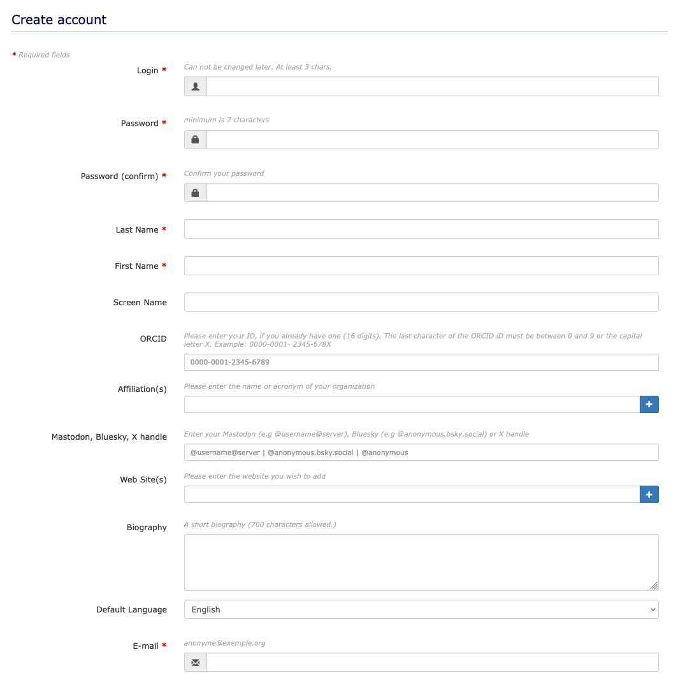
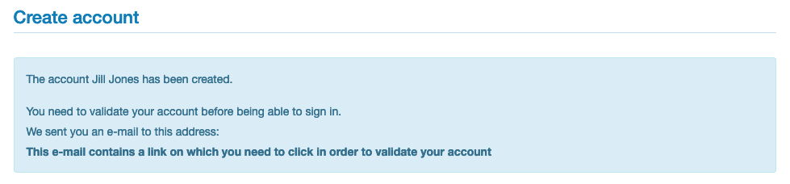
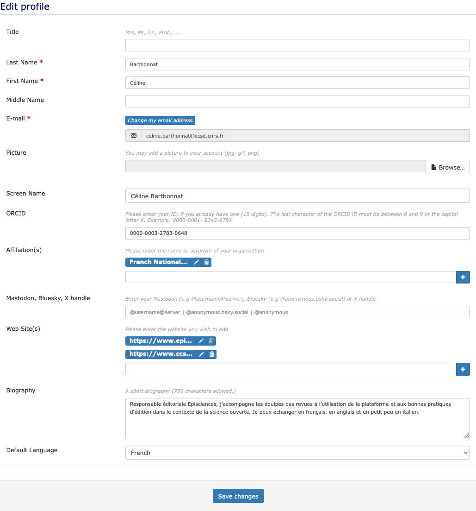
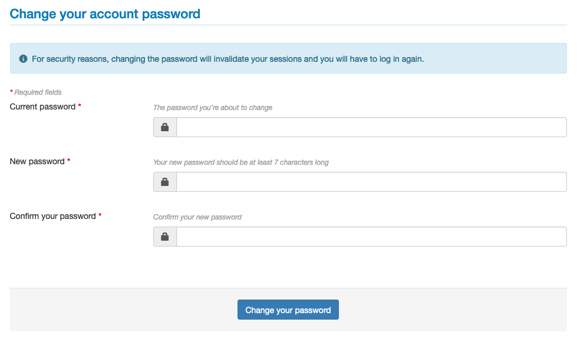
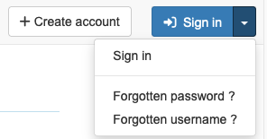

# Account and user profiles
<!-- https://squidfunk.github.io/mkdocs-material/reference/admonitions/ -->
!!! tip

    If you already have an account on HAL, you do not need to create a specific account to reach Episciences. You just have to fill in your login/password of your HAL account.

## Create an account
There are two steps to creating an account:

1. Fill in the information required to create the account in the dedicated form on the journal’s website;
2. Validate the creation of the account by clicking on the activation link received by e-mail.

On the journal’s website, click on "+ Create account" at the top right.

Fields marked with an asterisk are required.

Enter the information:

+ **Login***: this is your user name. It must be at least 3 characters long and cannot be changed afterwards;
+ **Password***: this must be at least 7 characters long;
+ **Password (confirm)***: confirm password;
+ **Last Name***: with a capital letter in the first letter (e.g. Jones);
+ **First Name***: with a capital letter in the first initial (e.g. Jill);
+ **Screen Name**: by default, your first and last name will be displayed;
+ **ORCID**: if you already have one, enter your 16-digit ID here;
+ **Affiliation(s)**: name or acronym of your organisation(s) (only one per line: use the + button to add more lines);
+ **Twitter username or Mastodon**: enter your Twitter account (e.g @anonymous) or Mastodon account (e.g 
  @username@server);
  **Web Site(s)**: enter the website you wish to add (only one per line: use the + button to add more lines);
+ **Default Language**: choose English or French as the language to be displayed in the interface;
+ **E-mail***: indicate here a valid address to which the validation link will be sent.

Check the box “I am human” in order to validate the information.

To finalise the account creation stage, validate it by activating the link received by e-mail. Please note that the account activation e-mail is not sent immediately (it may take some time to receive it). Remember to check that the e-mail has not arrived in the spam folder.

Once the account is created, you can connect to the website.

## Modify your profile
To modify your profile, log in and click on “Edit profile” at the top right.

The following information can be added to your account after its creation:

+ **Title**: Mrs, Mr, Dr, Prof, etc.;
+ **Middle Name**;
+ **Picture**: jpg, .gif or .png format.

You can also add your **ORCID**, fill in your **affiliations** and change the **default language** of the interface.

## Changing your password
To change your password, log in and click on “Change my password” in the top right-hand corner.

It is necessary to enter your current password in order to change it.

The new password must be at least 7 characters long.

## Forgotten your login or password
If you have forgotten your password or login, click on “Forgotten password?” or “Forgotten username?” at the top right of the “Sign in” button.

+ If you have forgotten your **password**, enter your login and click on “Ask for a new password”. You will receive an e-mail with a link to a page where you can create a new password.
+ If you have forgotten your **username** (login), enter the e-mail address associated with your account and click on 
  “Receive my username”. You will receive an e-mail containing your username.

Please note that e-mails are not sent immediately (it may take some time to receive them). Please also check if they have not arrived in the spam folder.