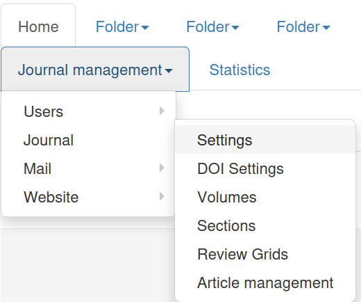
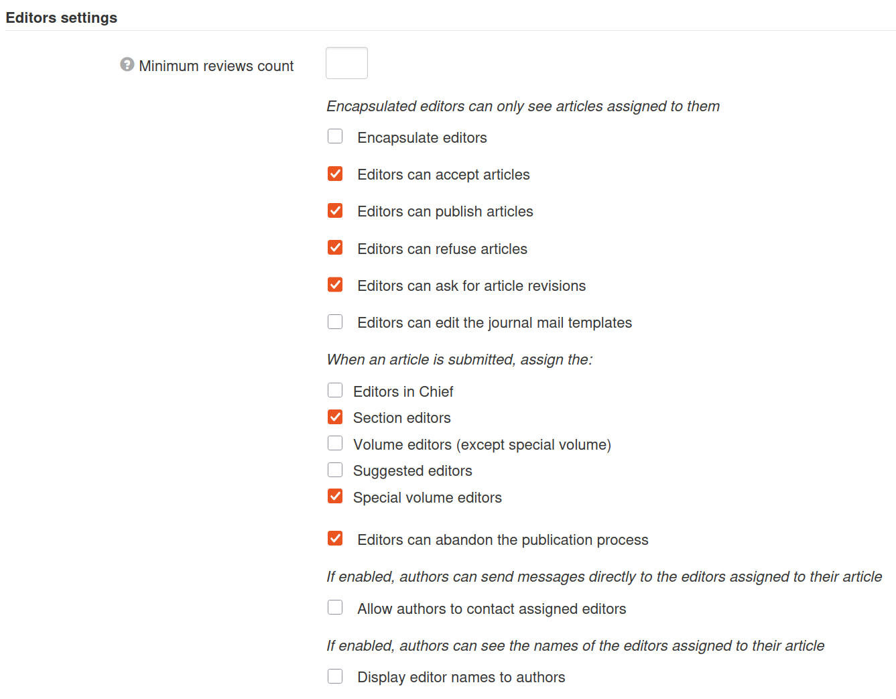
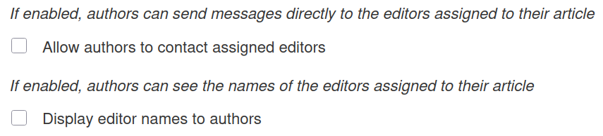
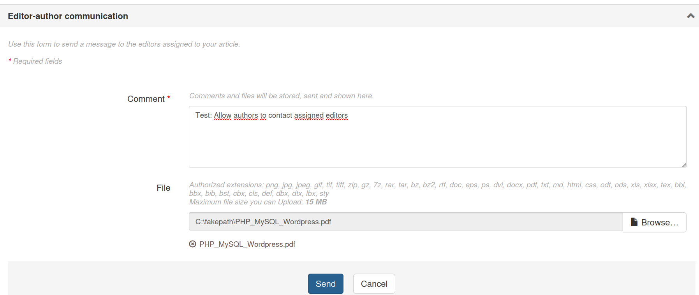
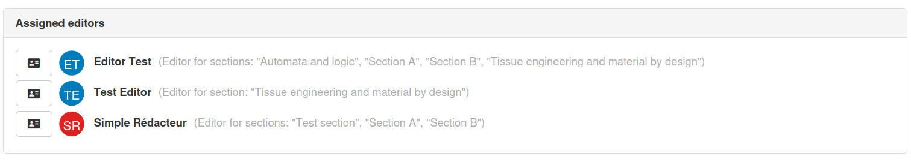
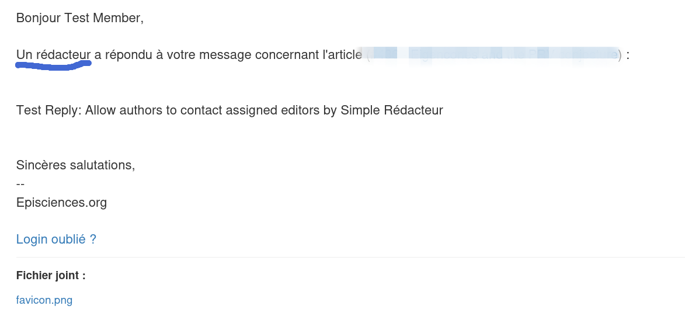
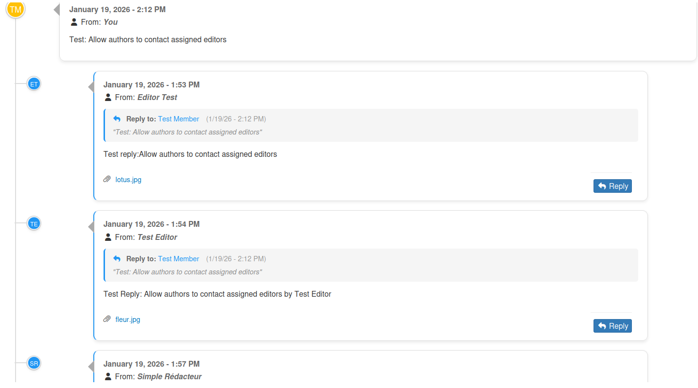
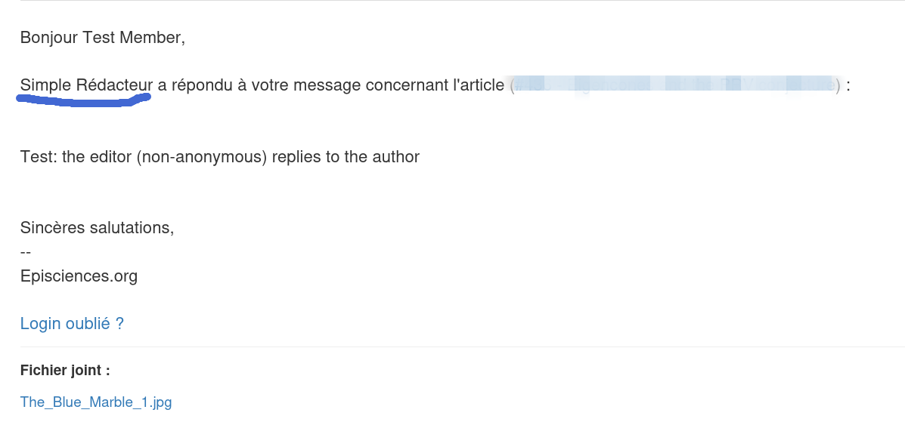
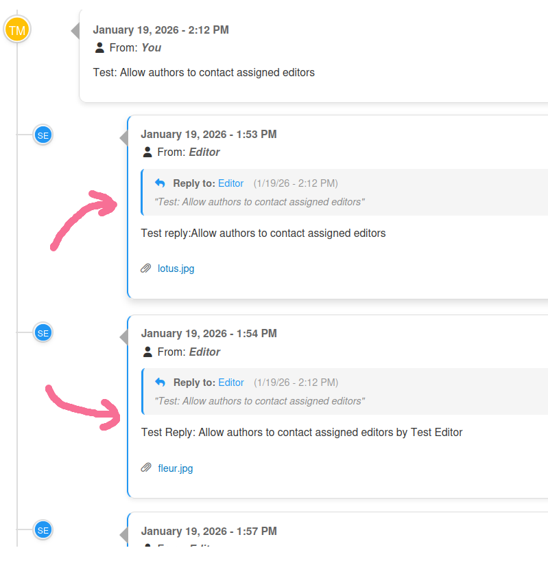

# Author-Editor Communication

Documentation for communication settings between authors and editors in Episciences.

**Required permissions:** Administrator, Editorial Secretary, Editor-in-Chief

## Overview

The author-editor communication system allows authors and editors to exchange messages directly through the Episciences platform. Two settings control this feature:

1. **Allow authors to contact editors**
2. **Display editor names to authors**

---

## Configuration

### Via the administrator interface

1. Log in as administrator
2. Go to **Manage Journal → Journal → Settings**

3. Section **Editor Settings**
4. Check/uncheck the desired options
5. Click **Save Settings**

---

## Available Settings

### 1. Allow authors to contact editors

#### Description

Controls whether authors can send messages to editors assigned to their article.

#### Values

| Value        | Description                              |
| ------------ | ---------------------------------------- |
| **Enabled**  | Authors can contact editors              |
| **Disabled** | Authors cannot contact editors (default) |

#### Behavior

When this setting is enabled:

- An **Author-Editor Communication** block is displayed on the article page for the author
- The author can send a message directly to assigned editors
- The first message sent by the author is called the **root message**

---

### 2. Display editor names to authors

#### Description

Controls whether editor names are displayed to authors or anonymized.

#### Values

| Value        | Description                                 |
| ------------ | ------------------------------------------- |
| **Enabled**  | Real editor names are displayed             |
| **Disabled** | Editors are anonymized (displays: "Editor") |

---

## Setting Combinations

### Option 1: Contact enabled + Names anonymized

| Element            | Display                            |
| ------------------ | ---------------------------------- |
| Avatar on timeline | Initials "SE" (System Episciences) |
| Name in message    | "Editor"                           |
| Email notification | "Editor"                           |

### Example: Anonymized avatar and name

### Email notification with anonymized sender

### Option 2: Contact enabled + Names displayed

| Element            | Display                          |
| ------------------ | -------------------------------- |
| Avatar on timeline | Editor's initials                |
| Name in message    | Editor's full name               |
| Email notification | Editor's full name               |
| Editors block      | List of assigned editors visible |

### Example: Identified avatar and name

### Email notification with sender's name

---

## Conversation Features

### Messages and replies

- The author initiates communication with a **root message**
- Assigned editors receive an email notification
- Editors can reply multiple times
- The author can also reply multiple times
- All replies to a root message are displayed **chronologically** in a block
- Blue borders indicate reply messages

### Attached files

- Authors and editors can attach files to their messages
- Each user can only delete their own attached files

### Visual identification

| Role   | Avatar color |
| ------ | ------------ |
| Editor | Blue         |
| Author | Yellow       |

---

## Email Notifications

### When an author sends a message

Recipients are:

- **Assigned editors** receive a notification
- **Co-authors** also receive a notification

#### Personalized messages for assigned editors

| Language | Message                                                            |
| -------- | ------------------------------------------------------------------ |
| English  | "new message about an article you're managing"                     |
| French   | "nouveau message concernant un article dont vous êtes responsable" |

#### Personalized messages for co-authors

| Language | Message                                                        |
| -------- | -------------------------------------------------------------- |
| English  | "new message about an article you co-authored"                 |
| French   | "nouveau message concernant un article que vous avez co-signé" |

### When an editor replies to a message

Recipients are:

- The **main author** receives a notification
- **Co-authors** also receive a notification

All authors (main author and co-authors) are informed of the editor's reply.

This personalization allows each recipient to immediately understand their role in relation to the article.
