# Author-Editor Communication

This guide explains how to configure and use the communication system between authors and editors in Episciences.

**Required permissions:** Administrator, Editorial Secretary, or Editor-in-Chief

## Overview

The author-editor communication system enables direct messaging between authors and their assigned editors through the Episciences platform. Two settings control this feature:

1. **Author-editor communication** — Enable or disable direct messaging
2. **Display editor names to authors** — Show real names or anonymize editors

---

## Configuration

### Accessing the settings

1. Log in as an administrator
2. Navigate to **Manage Journal → Journal → Settings**

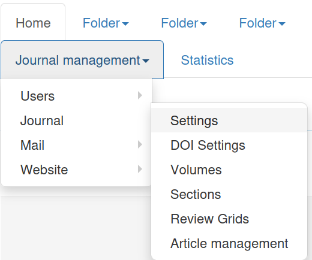

3. Scroll to the **Editor Settings** section
4. Enable or disable the desired options
5. Click **Save Settings**

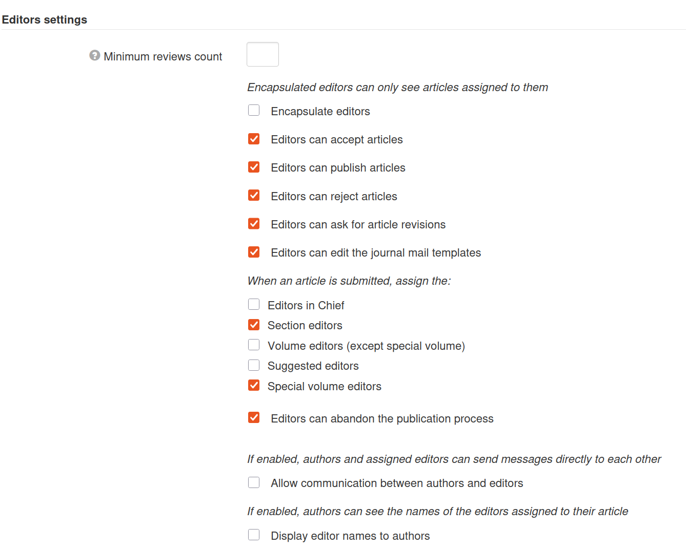

---

## Available Settings

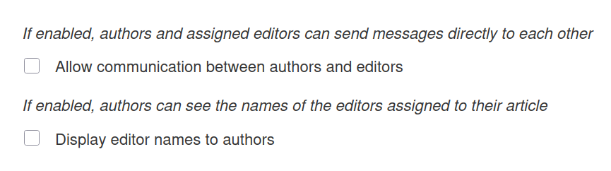

### 1. Author-editor communication

This setting controls whether authors and their assigned editors can exchange messages directly.

| Value        | Description                                                       |
| ------------ |-------------------------------------------------------------------|
| **Enabled**  | Authors and editors can send messages to each other               |
| **Disabled** | Direct messaging is not available (default)                       |

When enabled:

- An **Author-Editor Communication** block appears on the article page for both the author and the assigned editors
- Either party can initiate a conversation by sending the first message (called the **root message**)
- Both sides can send multiple replies within the same conversation thread

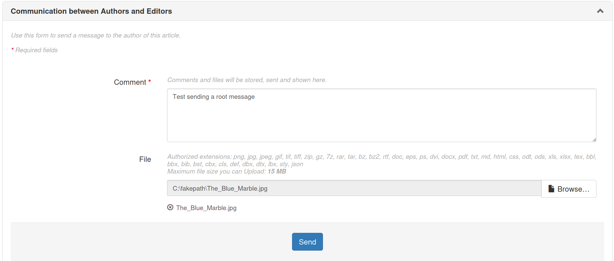

---

### 2. Display editor names to authors

This setting controls whether editor identities are visible to authors or anonymized.

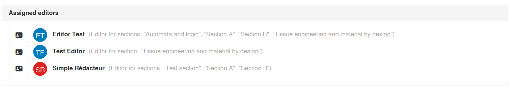

| Value        | Description                                          |
| ------------ | ---------------------------------------------------- |
| **Enabled**  | Real editor names are displayed to authors           |
| **Disabled** | Editors appear anonymously as "Editor" (default)     |

---

## Setting Combinations

The two settings can be combined to achieve different levels of privacy and transparency.

### Messaging enabled + Editor names hidden

When direct messaging is enabled but editor names are hidden:

| Element            | Display                            |
| ------------------ | ---------------------------------- |
| Avatar on timeline | Initials "SE" (System Episciences) |
| Name in message    | "Editor"                           |
| Email notification | "Editor"                           |

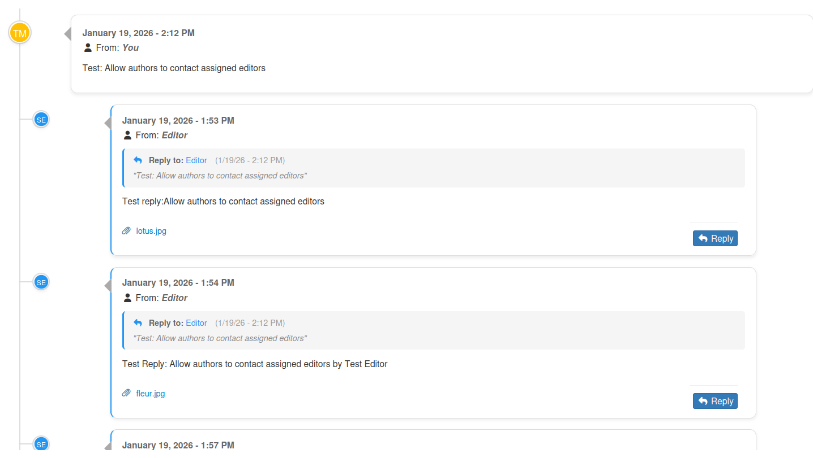

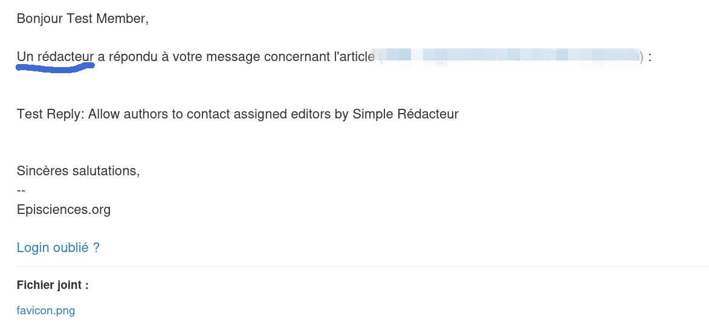

### Messaging enabled + Editor names visible

When both direct messaging and editor names are enabled:

| Element            | Display                          |
| ------------------ | -------------------------------- |
| Avatar on timeline | Editor's initials                |
| Name in message    | Editor's full name               |
| Email notification | Editor's full name               |
| Editors block      | List of assigned editors visible |

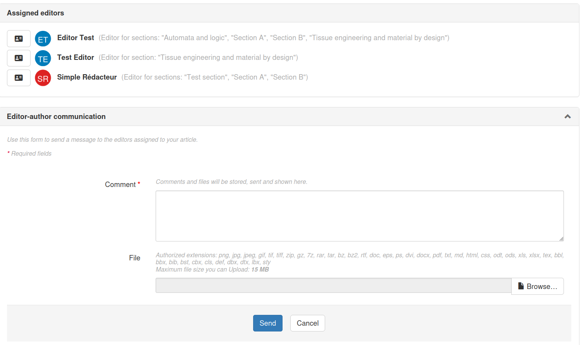

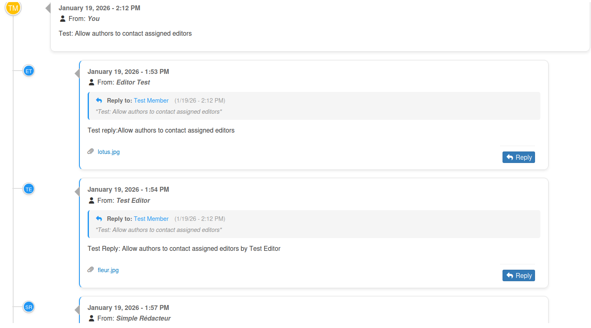

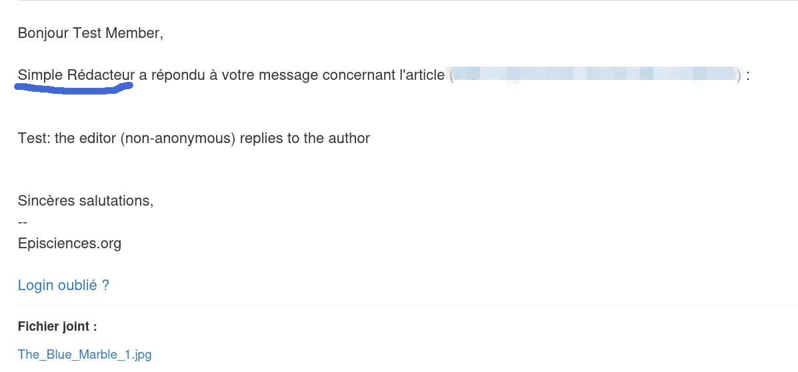

---

## Conversation Features

### Messages and replies

Either the author or an editor can start a conversation by sending a **root message**. From there:

- Both parties can send multiple replies
- All messages are displayed chronologically within the conversation thread
- Replies are visually distinguished with a blue border
- Each new message triggers an email notification to the other party

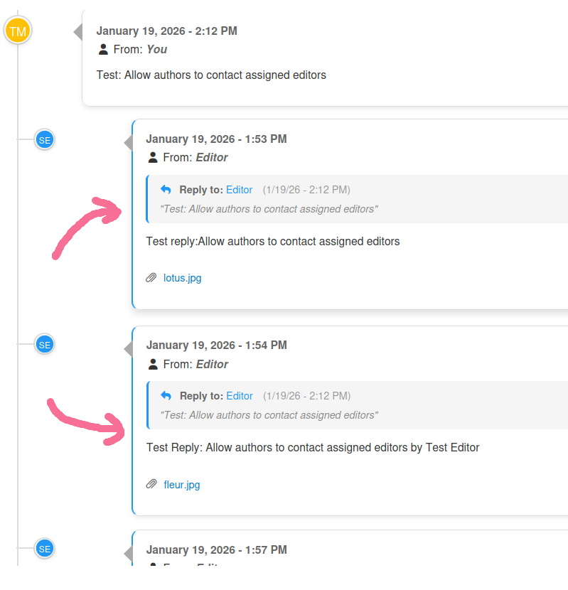

### File attachments

Both authors and editors can attach files to their messages. Users can only delete their own attachments.

### Visual identification

Each role has a distinct avatar color for easy identification:

| Role   | Avatar color |
| ------ | ------------ |
| Editor | Blue         |
| Author | Yellow       |

---

## Email Notifications

Email notifications ensure all relevant parties stay informed about new messages.

### When an author sends a message

The following recipients are notified:

- **Assigned editors** — managing the article
- **Co-authors** — collaborating on the article

Each recipient receives a personalized notification based on their role:

| Recipient         | English message                                    | French message                                                     |
| ----------------- | -------------------------------------------------- | ------------------------------------------------------------------ |
| Assigned editors  | "new message about an article you're managing"     | "nouveau message concernant un article dont vous êtes responsable" |
| Co-authors        | "new message about an article you co-authored"     | "nouveau message concernant un article que vous avez co-signé"     |

### When an editor replies

The following recipients are notified:

- **Main author** — the primary contact for the article
- **Co-authors** — all other authors listed on the article

This role-based personalization helps each recipient immediately understand their relationship to the article and the context of the message.
