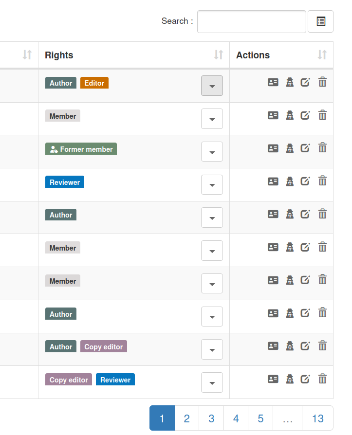
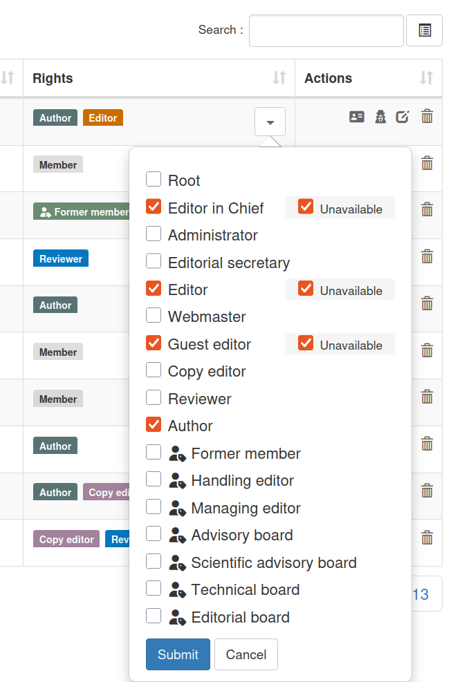
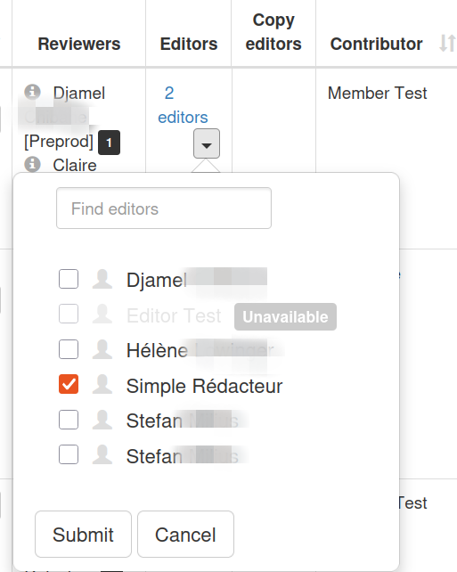
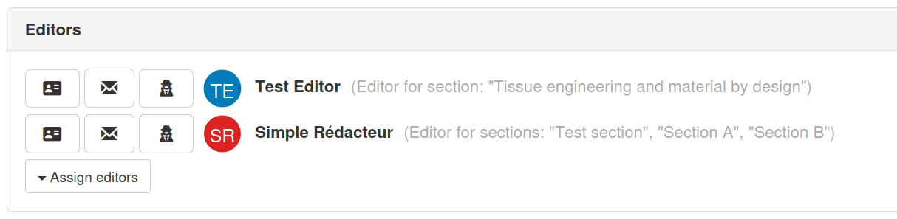
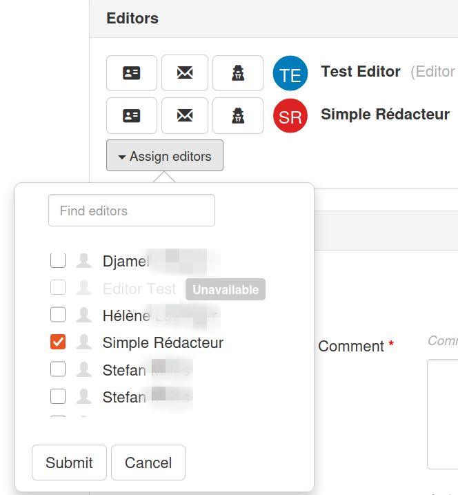
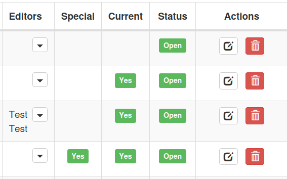
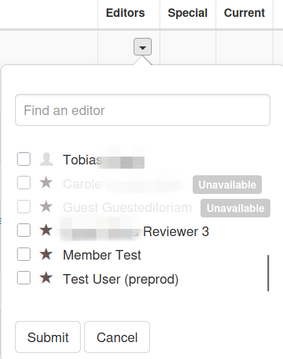

# Editor Availability

**Rights:** Administrator, Editorial secretary

## Overview

This feature allows managing the availability of editors (editors, chief editors, and guest editors) in the Episciences system. Editors can be marked as "unavailable", which:

- Prevents their assignment to new articles
- Visually displays their status with an "Unavailable" badge
- Allows them to be unassigned from existing articles
- **Prevents their reassignment once unassigned** (as long as they remain unavailable)

## Context

Previously, there was no mechanism to indicate that an editor was not available to handle new articles (vacation, workload overload, etc.). This could lead to inappropriate assignments and required manual communication to avoid assigning articles to temporarily unavailable editors.

## Implemented Features

### Core Capabilities

1. **Availability Marking**: Ability to mark an editor as available or unavailable
2. **Visual Indicators**: Display of an "Unavailable" badge for unavailable editors
3. **Assignment Prevention**: Unavailable editors cannot be assigned to new articles
4. **Flexible Unassignment Management**:
    * Ability to unassign an already-assigned unavailable editor
    * **Reassignment Protection**: Once unassigned, an unavailable editor cannot be reassigned until they become available again

### Affected Roles

The feature applies to all three editorial roles:

- **Editor**
- **Chief Editor**
- **Guest Editor**

## User Workflow

### 1. Mark an Editor as Unavailable

1. Go to the "Users" section in administration

2. Click the "▼" button next to the name of a user with an editor role
3. In the popup form, check the "Unavailable" box for the relevant editor role
4. Click "Update roles"

**Note**: The "Unavailable" checkbox only appears for editor roles (Editor, Chief Editor, Guest Editor)

### 2. View Unavailable Editors

Editors marked as unavailable appear with:

- A gray "unavailable" badge next to their name
- A role icon:
    - ⭐ (star) for Guest Editor
    - 👤 (user) for Editor

These badges appear in:

- Article lists (editors column)

- Editor assignment forms for articles

On the article administration page, there is a section to assign editors:

Click the "Assign editors" button:

- Editor assignment forms for volumes (guest editors are specifically for volumes)

  Click the "▼" button in the "Editors" column:

### 3. Assign Editors to an Article or a Volume

When assigning editors to an article/volume:

- Unavailable editors appear grayed out with the "unavailable" badge

- Their checkboxes are **disabled** and cannot be checked

- If an unavailable editor is already assigned, they can be **unchecked** (unassigned)

!!! important
    - Once unchecked, they can no longer be re-checked as long as they remain unavailable
    - The checkbox automatically disables after being unchecked
    - To be able to reassign this editor, they must first be made "Available" in user management

### 4. Make an Editor Available Again

1. Go to the "Users" section in administration
2. Click the "▼" button next to the editor's name
3. Uncheck the "Unavailable" box
4. Click "Update roles"

The editor can now be assigned to new articles.
