# Change Contributor

## Overview

The "Change Contributor" feature allows authorized users to transfer ownership of a paper from one contributor to another.

## Required permissions

Only the following roles can change a paper's contributor:

- **Administrators**
- **Chief Editors**

## How to Change the Contributor

1. Navigate to the paper's administration page
2. In the **Contributor** panel, click the **Change contributor** button

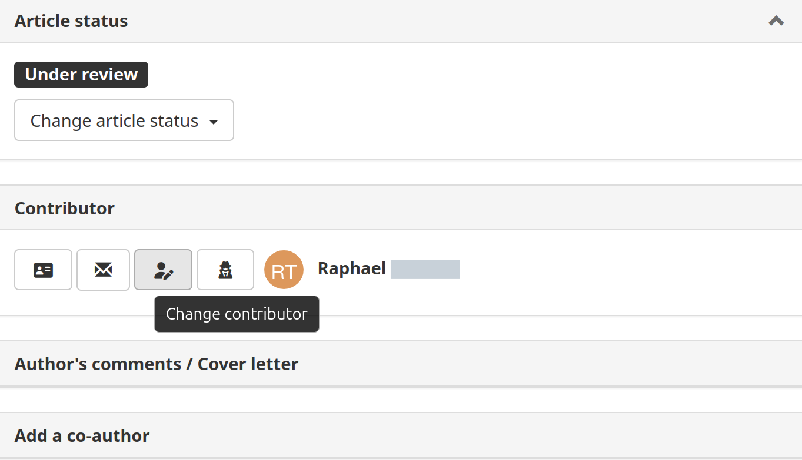
3. A modal dialog opens:
    - Search for the new contributor by name or email
    - Select the user from the autocomplete results
    - Optionally check **"Add former contributor as co-author"** (checked by default)
4. Click **Confirm** to apply the change

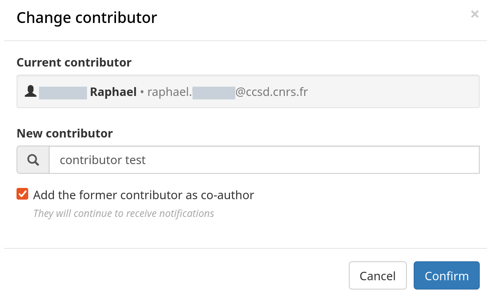

### Option : Add the former contributor as a co-author

When this option is **checked**:
- The former contributor is added as a co-author of the paper

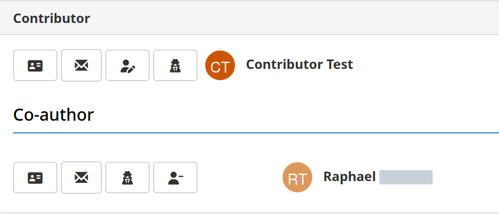

- They will continue to receive notifications about the paper
- They can still view the paper in their author space

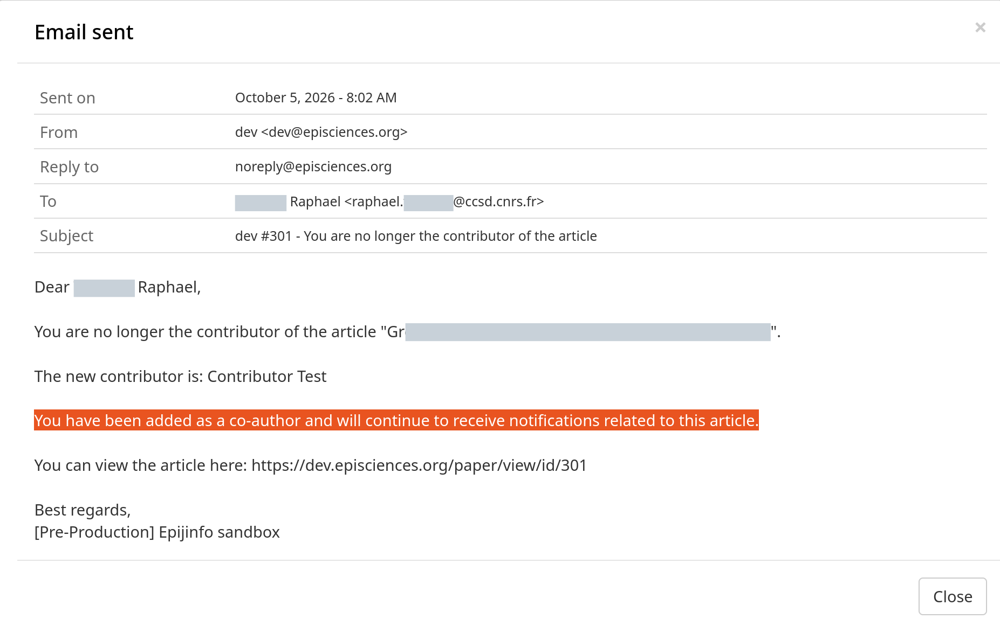

- Notification received by the new contributor:

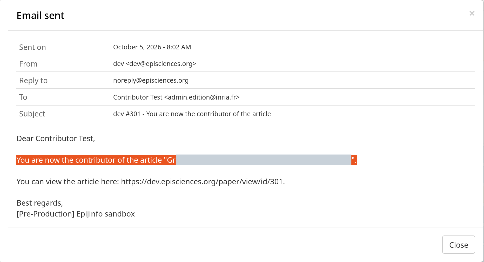

### Option: Do not add the former contributor as a co-author

When this option is **unchecked**:

- The former contributor is not added as a co-author
- The former contributor receives a notification of the change, but will no longer receive notifications about this article afterwards.

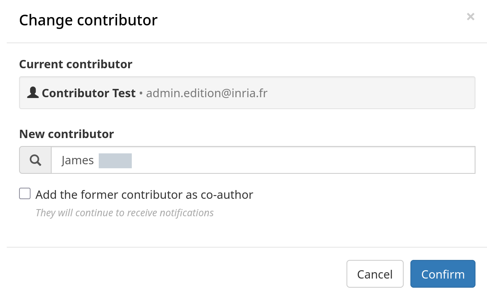

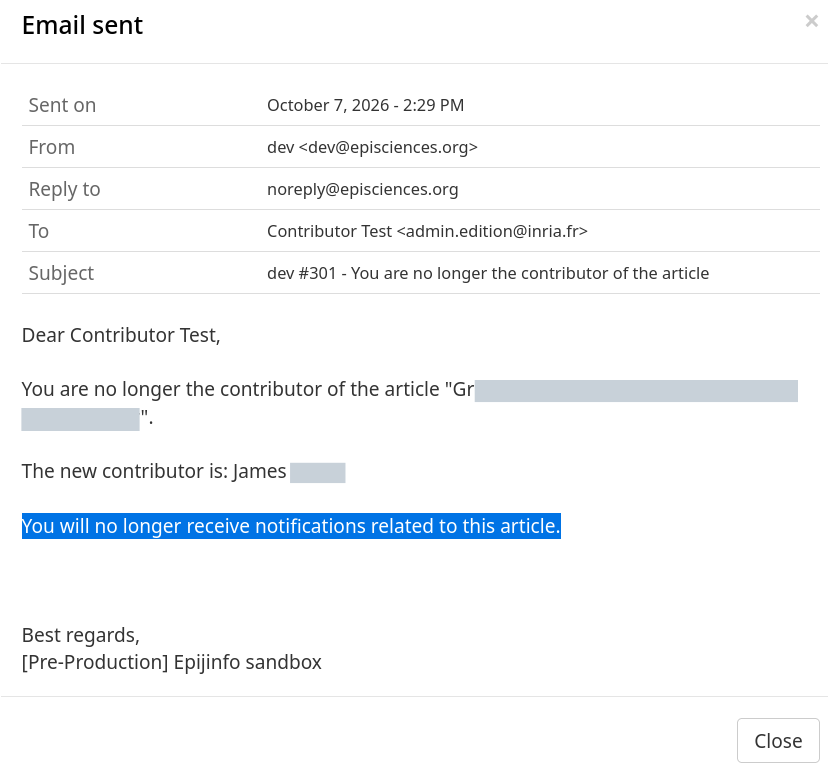

## Co-author Becoming Contributor

A co-author can be selected as the new contributor. When this happens:
- Their co-author role is automatically removed
- They become the main contributor (owner) of the paper

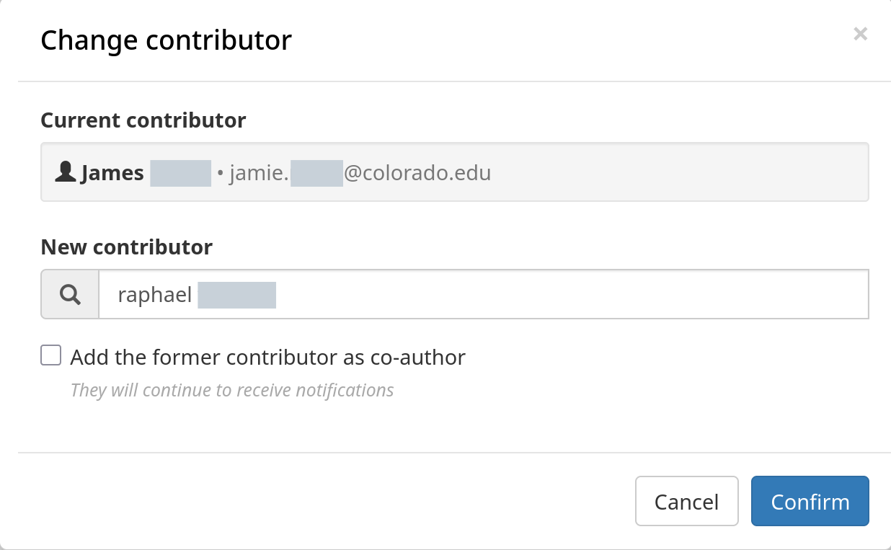

## Activity Log

The action is logged in the paper's history with the following details:

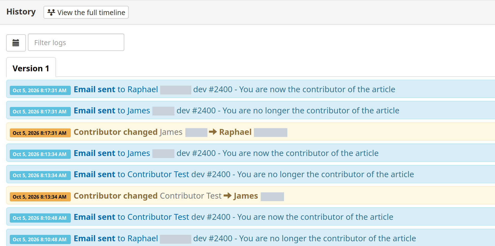

## Timeline Display

In the paper's timeline (history panel), the contributor change appears as:

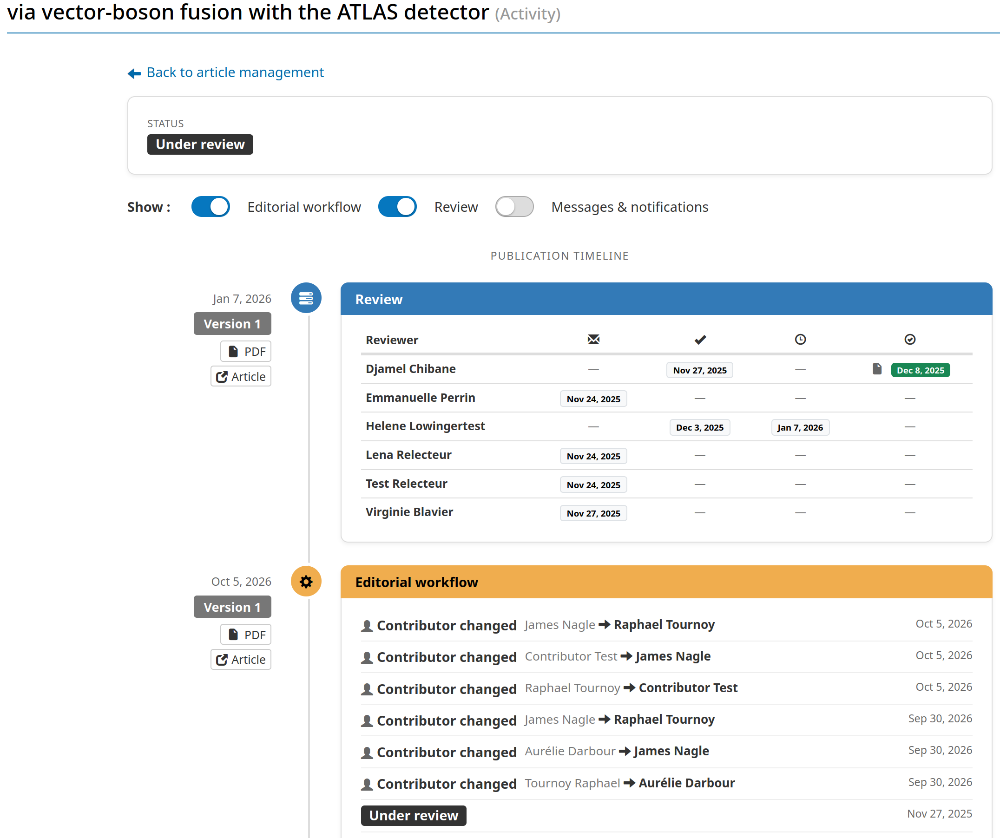

## Email Notifications

Two email notifications are sent when the contributor is changed, you could view temlpate email here:

- New Contributor Notification
- Former Contributor Notification

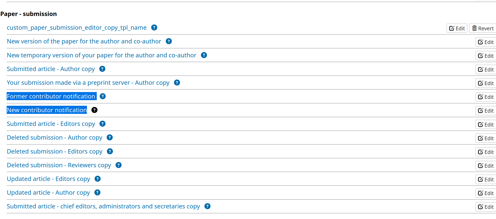