# Managing bibliographical references

> **Rights:** Administrator, Author, Editor, Editor in Chief, Editorial secretary

## The ‘Episciences Citations’ application
Episciences has an application for extracting bibliographic references which is called ‘Episciences Citations’.

### What is ‘Episciences Citations’?
The application automatically extracts and manually manages the bibliographic references contained in documents accepted for publication. Once validated, these references are displayed on the public pages of the documents/articles. They are also added to exports for CrossRef and ZbMath Open.

### How it works
The application extracts bibliographic references from the document’s PDF using the [Grobid](https://grobid.readthedocs.io/en/latest/ "Grobid") (GeneRation Of BIbliographic Data) tool.

### Display
Here is an example of how references taken from an article are displayed ([https://doi.org/10.46298/jtcam.10304](https://doi.org/10.46298/jtcam.10304 "See the article")). 

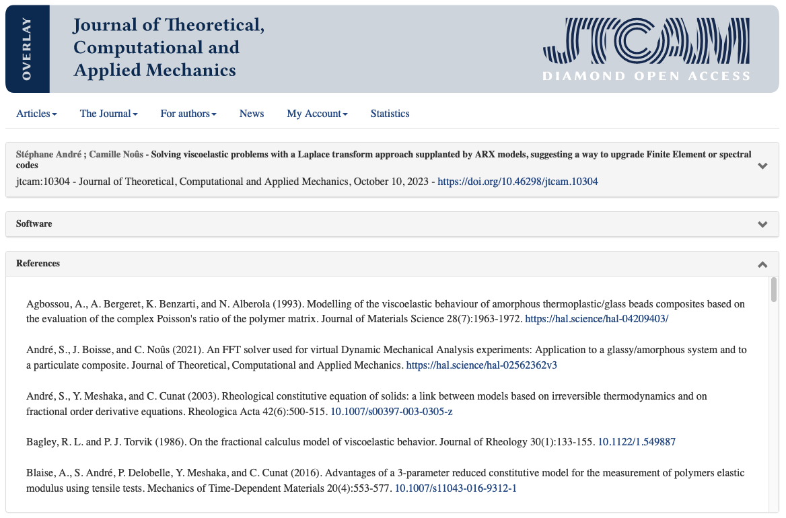

## Managing references
Only people with document management rights (i.e: administrator, author, editor, editor-in-chief, editorial secretary) have access to this function.

Manual modification of extracted references is available for documents with the status ‘Accepted - waiting for final publication’ or ‘Published’.

To check and modify references, go to the article management page.

In the ‘Bibliographic References’ tab, click on ‘Manage’.

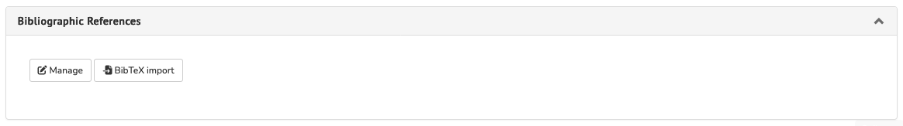

The ‘Episciences Citations’ application opens in a new tab.

The interface has two distinct sections:

- on the left, the PDF in preview mode ;
- on the right, the references identified and extracted automatically by Grobid.

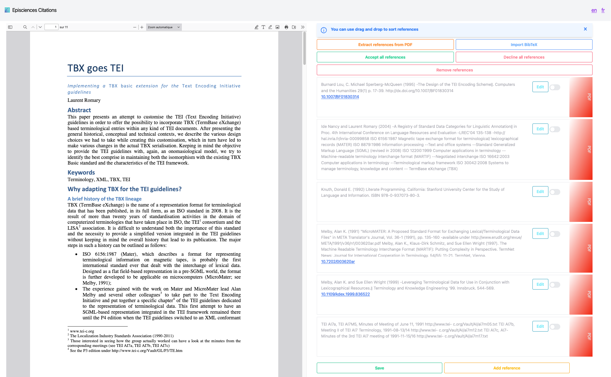

There are several possible actions:

1. Accept all references 
2. Decline all references 
3. Edit a reference 
4. Add a reference 
5. Delete a reference 
6. Sort the references 
7. Extract references from PDF 
8. Import BibTeX

### Accept all references
Click on the ‘Accept all references’ button. The ticks to the right of each reference will turn green. Click on ‘Save’.

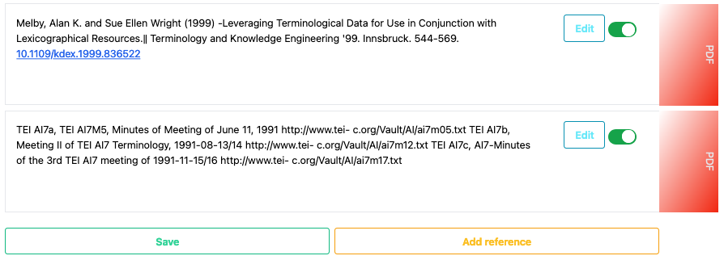

### Decline all references
Click on the ‘Decline all references’ button. The ticks to the right of each reference will be greyed out. Click on ‘Save’.

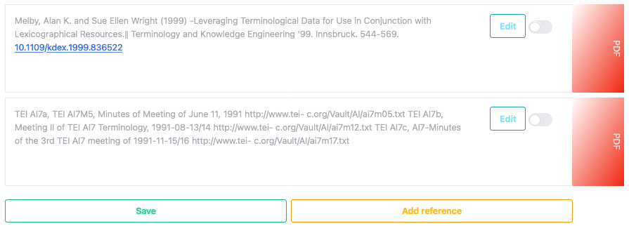

### Edit a reference
To modify a reference, click on the ‘Edit’ button next to the reference.

The reference field can now be edited, allowing you to change the information. A dedicated field allows you to add the DOI of the document or a URL.

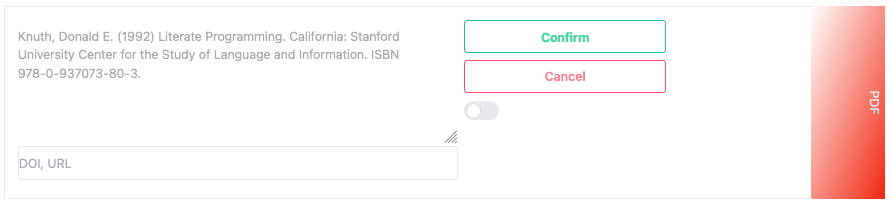

Click on ‘Confirm’ to confirm the corrections.

The modified reference now appears in black and the tick changes to green to confirm the change.

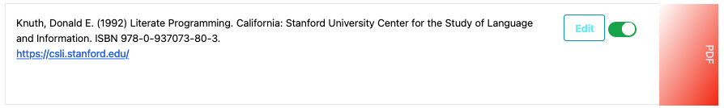

You can change the reference again by clicking on ‘Edit’, as many times as necessary.

Then click on ‘Save’ to save the changes.

### Add a reference
Automatic extraction may miss a reference or merge several references into one (see below).

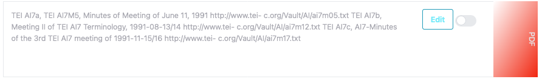

In this case, the ‘Add reference’ option allows you to separate the merged references.

Click on the ‘Add reference’ button. A window opens with two fields to fill in: ‘Reference’ and ‘DOI, URL’.
Note: for the URL to be clickable, it must begin with http or https.

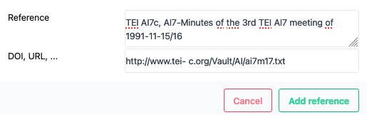

Once you have filled in the reference fields, click on ‘Add reference’.

The new reference is added to the end of the list and automatically validated. The word ‘USER’ on a green background appears on the right-hand side of the reference, to distinguish it from references extracted from the PDF.

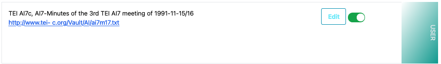

### Delete a reference
Grobid may not be able to extract a reference correctly or a reference may appear as a duplicate. In this case, it is possible to delete the incorrect or duplicate reference.

Click on ‘Remove references’.

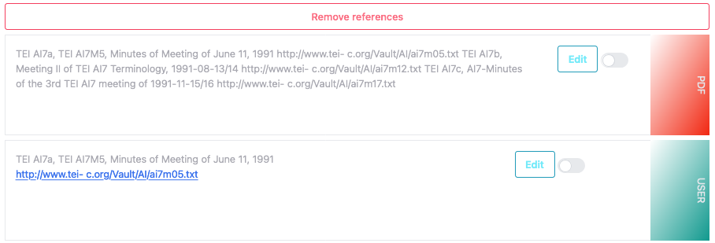

Select the references to be deleted by ticking the boxes to the right of the references.

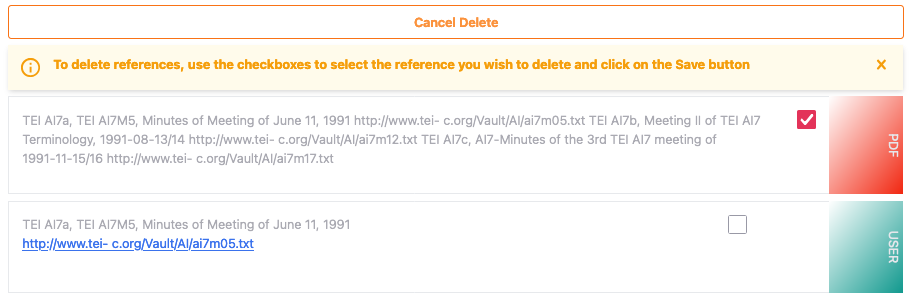

To confirm the deletion of the selected references, click on ‘Save’ at the bottom of the page.

### Sort the references
To move an accepted reference, click and hold the block and drag it up or down. Release the block at the desired location and click ‘Save’.

### Confirm references
To validate your work on the references and return to the document management page, click on ‘Save’ and then close the ‘Episciences Citations’ tab.

To display the references on the document management page, you need to refresh the page.

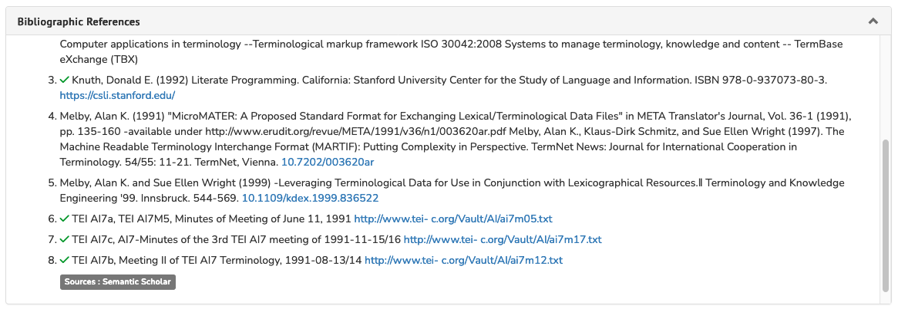

Validated references are preceded by a green tick. This means that only these references will appear on the document’s public page.

Links (DOI, URL) added in the dedicated field are clickable.

### Import BibTeX
On the document page, in the ‘Bibliographic References’ tab, click on ‘BibTeX import’.

The ‘Episciences Citations’ application opens in a new tab. Click on the ‘Import BibTeX’ button at the top right: a window will open allowing you to load a .bibtex file.

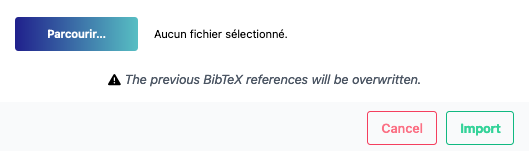

## View references
The references are now visible in the ‘Bibliographic References’ tab on the document’s public page.

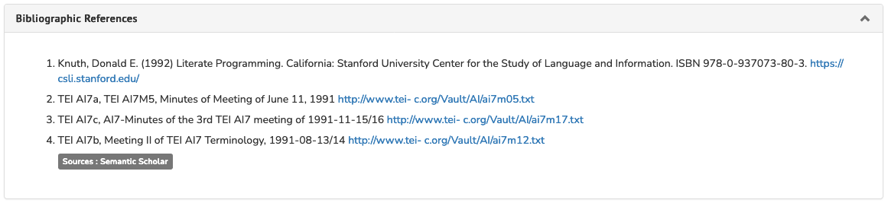
