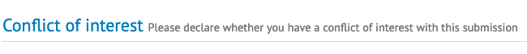
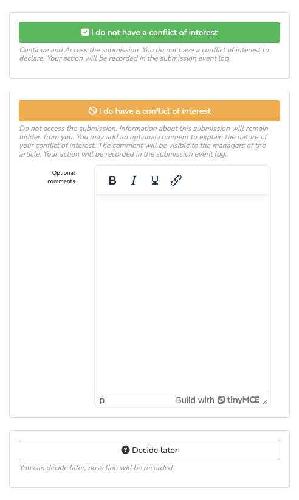
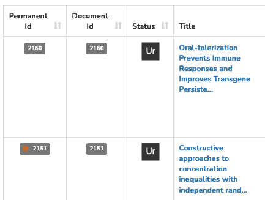
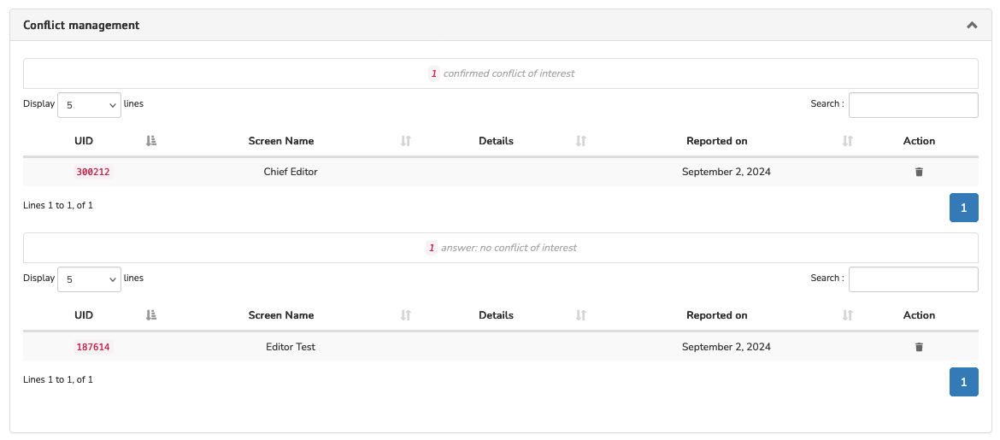

# Conflict of interest

> **Rights**: Administrator, Editor, Editor in Chief, Editorial secretary, Guest editor

##Purpose
It is possible to activate an option to allow editors to declare a conflict of interest before the assessment.

## Journal setting
To activate this option, go to: Journal management > Journal > Settings > Additional settings.

Check the box “Enable declaring COI” and save settings.

This option must remain active throughout the editorial process of an article (it is not possible to activate it on request and then deactivate it after submission).

Please note that: 

- If this option is enabled, all editors-in-Chief, editors and editorial secretaries must make this declaration for 
each submission;
- The names of reviewers will be hidden on the article management page.

## Reporting a conflict of interest
When the person responsible for the submission (editor, editor-in-chief, guest editor or editorial secretary) goes to the monitoring page, they do not have immediate access to the submission management page. They must first declare whether they have a conflict of interest.

There are three possibilities: 

1. “I do not have a conflict of interest” (green button), allows access to the full submission page.
2. “I have a conflict of interest” (orange button), prevents access to the full submission page: the editor returns to 
   the submission page. If the editor wishes to specify the reason for the conflict of interest, they can fill in the “Optional comments” field before clicking on the button.
3. “Decide later” (white button), allows the editor to return to the submission presentation page.

In the dashboard, if at least one conflict has been reported for the item, an orange icon will appear to the left of the permanent identifier.

## Deleting a conflict of interest
Only editors, editorial secretaries or administrators can delete a conflict of interest.
To remove a conflict of interest from a submission, go to the submission page. In the Conflict management tab, click the trash can icon corresponding to the conflict of interest you wish to remove.

