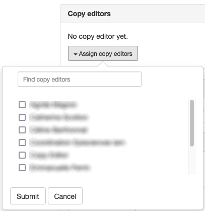
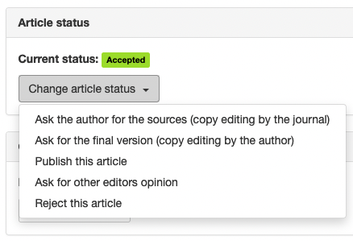
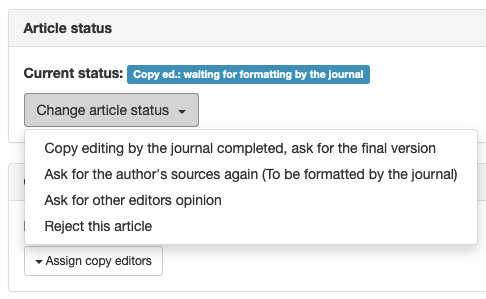
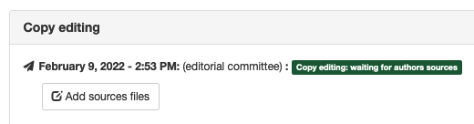
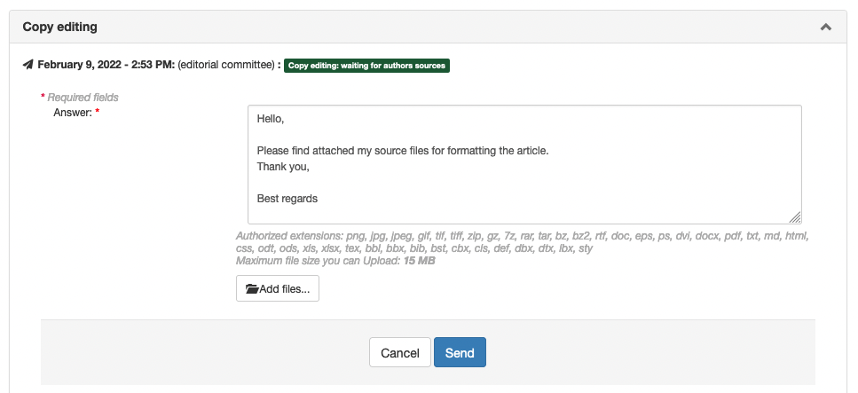
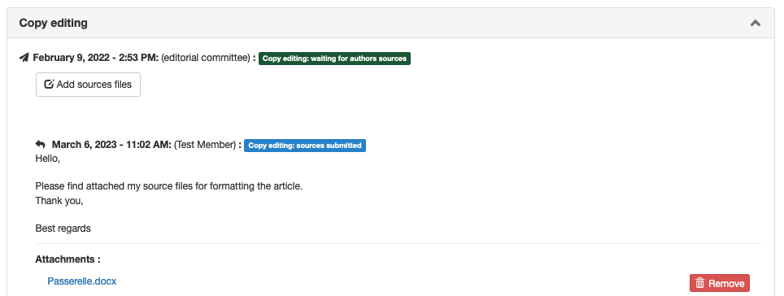
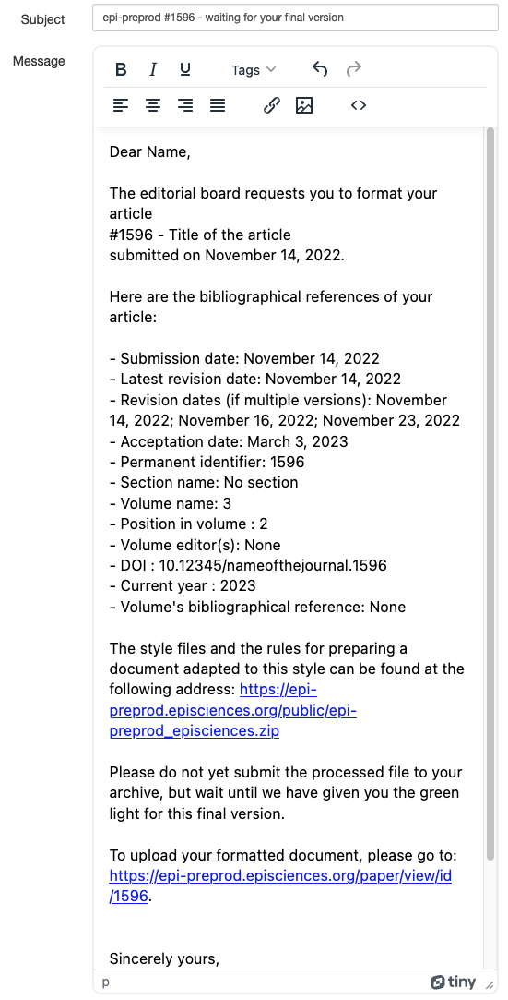

# Copy editing
> **Rights**: Author, Copy editor

Copy editing is a step that takes place after the article has been accepted.

This stage allows you to entrust the final formatting either:
- to a person with a dedicated role (copy editor);
- to the author.

Copy editing can also be done by the following roles:
- administrator
- editor in chief
- editorial secretary
- editor (for their assigned articles)

## The role of the copy editor
The copy editor role can be assigned to one or more people. To add this role to one or more users, go to: Journal management > Users > List.

The person with the copy editor role should then be added to the articles on which they have to work.

## Activity of the copy editor
The first choice to be made on an accepted article is to select the type of workflow desired:
- **Option 1**: the journal does the formatting. The author provides the sources to the copy editor who will edit the final version;
- **Option 2**: the author formats the final version themself.

### Option 1: The journal takes care of the copy editing
Choose the option “Ask the author for the sources (copy editing by the journal)”.

A window allows you to customise the message to be sent to the author to ask him/her to deposit their sources on the journal’s website.

As soon as the author has uploaded their sources, an e-mail is sent to the copy editor allowing them to retrieve the files from the site. If the files are not suitable, it is possible to request other sources from the author. To do this, in “Article status”, select “Ask for the author’s sources again (To be formatted by the journal)”.

If everything is correct, upload the files, proceed with the formatting and validate by selecting “Copy editing by the journal completed, ask for the final version”. This sends a message to the author.

The message contains a link allowing the author to submit, after deposit in the open repository, the final version of their manuscript which will then be published by the journal.

The work of copy editing is then complete.

#### Adding sources by the author
To upload the sources files, click on the “Add source files” button.

The predefined message can be changed.

Once you have selected the file(s), click on “Send” to send them. A summary of the e-mail and the files sent will be displayed.

If necessary, further shipments are possible with other files. Each time, a notification is sent to the copy editor.

### Option 2: The author takes care of the copy editing
Choose the option “Ask for the final version (copy editing by the author)”.

A window allows you to customise the message to be sent to the author. The message is pre-filled according to a template that can be customised by the journal, which automatically adds the information the author needs, as well as elements allowing the manuscript to be styled for its final version.

The information in the message should allow the author to have access to all the data needed to format the article.

> **Important** The site administrator must have previously created a .zip archive (named according to the format: 
> short_journal_title.zip) in the “Resources” directory (Journal management > Website > Resources). This archive contains the files to be used for the formatting, for example the different graphic elements, the style sheet, etc.

C’est ensuite à l’auteur de téléverser ses sources.

#### Uploading of formatted version by the author
The author uploads their formatted version to the site.

Once the file has been selected, click on “Send” to send it. A summary of the e-mail and the file sent is displayed.

If necessary, other subsequent transmissions are possible with other files. Each time, a notification is sent to the copy editor.

The copy editor receives an email notification when the author has uploaded their formatted version. It is then possible to proceed to the stage of accepting the author version or requesting another formatted version.

### Acceptance
If the submitted version is not suitable, the copy editor can contact the author to request changes.

If the version is suitable, accept the author’s version: in “Article status”, select “Accept as final version”.

This sends a message to the author to deposit this validated version on the open repository.

The message also contains a link allowing the author to submit, after deposit in the open repository, the final version of their manuscript which will then be published by the journal.

The work of copy editing is then complete.