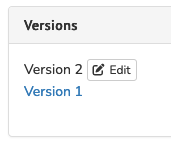

# FAQ
## What are the document version numbering conventions?
There are 2 types of version numbering for documents: 

1. Versions from the open repository;
2. Intermediate versions from Episciences.

### 1. Versions from the open archive
Version numbers are corresponding to the numbers of the versions submitted by the author. Thus they follow the numbering scheme of the open repository where the article comes from.

Example :

- Version 5
- Version 2

The first version submitted to the journal was the article Version 2 (V2). Then, due to a modification requested by an editor, the next version submitted by the author is the number 5 (V5) from the open repository. Versions 3 and 4 do exist on the open repository but they were not submitted to the journal. This is why we see a “gap” between V2 and V5.

### 2. Intermediate versions from Episciences
Intermediate versions (articles updated directly on the website of the journal but not coming from an open repository) are numbers with dots.

Example : 

- Version 2
- version 1.02
- version 1.01
- Version 1

Versions 1.01 and 1.02 are working versions, derived from Version 1: they do not come from an open repository. They were updated directly on the journal website by the author.

## Pointing to the latest version
Sometimes the published version is not the latest version online in the open repository.

To point directly to the latest version deposited on the open repository, go to the Versions tab on the article management page.

Click on “Edit” then select the latest version.

Update is automatic.

## Stopping the addition of the arXiv stamp
arXiv offers a feature for omitting the arXiv stamp, for example if it creates a layout problem for published versions of journals.

If you wish to remove the arXiv stamp, you can do so by adding a 00README.XXX file with the content ‘nostamp’.

Source: [https://info.arxiv.org/help/00README.html#nostamp](https://info.arxiv.org/help/00README.html#nostamp)