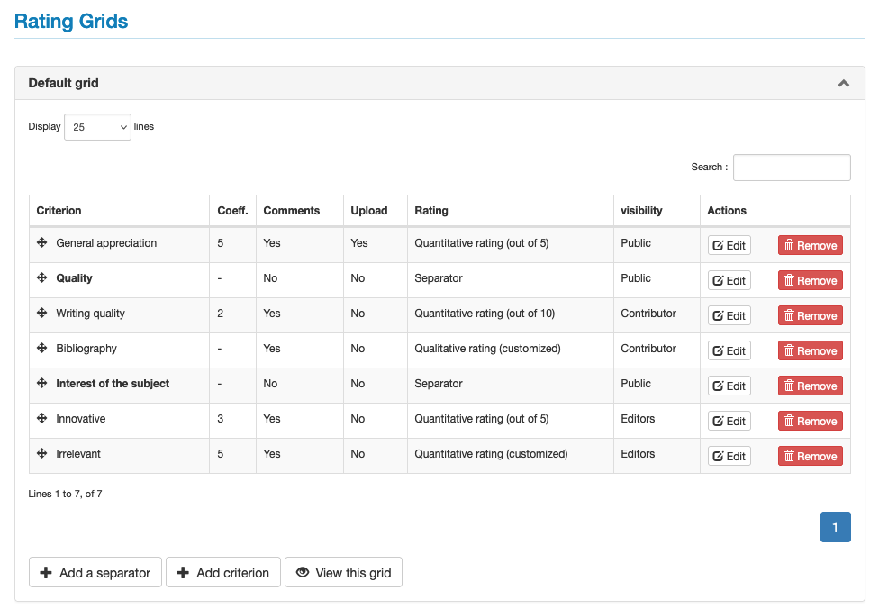
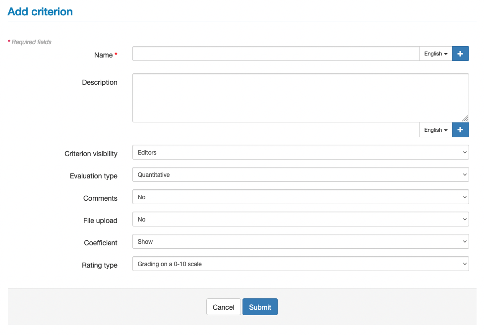
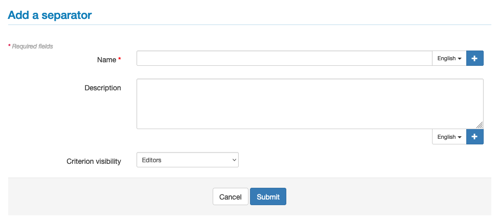
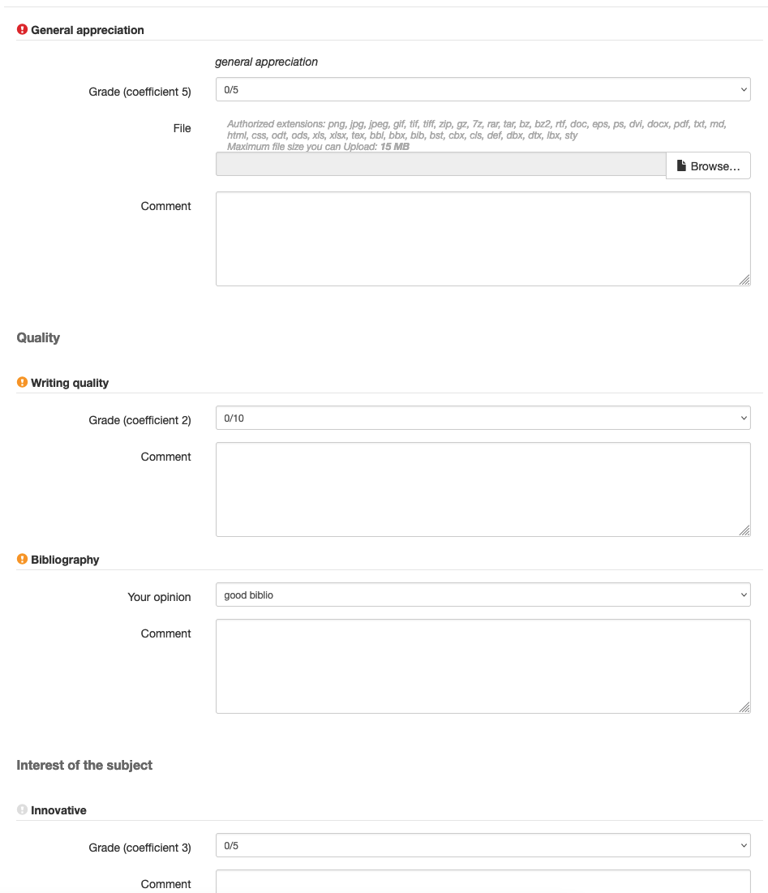
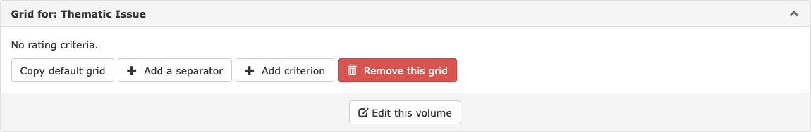

# Rating grids

> **Rights**: Administrator, Editor, Editor in Chief, Editorial secretary

A proofreading grid can be developed to guide proofreaders through a series of predefined points to be examined. The results of the reviews can then be standardised.

To build a rating grid, go to the menu: Journal management > Journal > Rating Grids.

A rating grid is composed of a name and a set of criteria.

## Default grid

A proofreading grid is proposed by default. Other grids can be added, depending on the needs, for example to distinguish between current volumes and conference proceedings volumes.

The default grid can be modified. Each criterion can be modified or deleted.

## Create a proofreading grid

### Add criterion

A proofreading grid is composed of as many criteria as necessary. To define a criterion, click on “Add criterion”.

Fields marked with an asterisk are required:

- **Name\***: if the journal site is in several languages, the name must be entered for each language. Click on + to display an additional field.
- **Description**: to be used to define the criteria proposed to the reviewers. If the journal site is in several languages, the description must be entered for each language. Click on + to display an additional field.
- **Criterion visibility**: select Public/Contributor/Editors. By default, the criterion is only visible to editors.
- **Evaluation type**: the evaluation can be quantitative, qualitative or free. If “Qualitative” or “Free” is selected, “yes” should be selected in the “Comments” field or in “File upload”.
- **Comments**: yes/no. If “yes” is selected, the reviewer can add a comment on this criterion.
- **File upload**: yes/no. If the choice is “yes”, the reviewer can upload the original annotated text.
- **Coefficient**: a coefficient can be assigned to the criterion. The highest number corresponds to the highest weighting level. The sum of the coefficients of the different criteria will determine a final score.
- **Rating type**:
  - when the selected evaluation type is “Quantitative”, three types of scoring are proposed (scoring out of 10, out of 5 or personalised);
  - when the selected evaluation type is “Qualitative”, it is possible to choose between a “standard rating (yes, no, maybe)” or a “customized rating”. For the latter, different values can be added, e.g. poor, average, good, excellent.

Once the fields have been completed, click on “Validate” to save the criteria.

### Add a separator

To organise the criteria of the grid, one or more separators can be added. The separators allow you to structure the grid in different parts, for example: “Quality”, “Interest of the subject”, etc. To create a separator, click on “Add a separator”.

Fields marked with an asterisk are required:

- **Name\***: if the journal site is in several languages, the name must be entered for each language. Click on + to display an additional field.
- **Description**: if the journal site is in several languages, the description must be entered for each language. Click on + to display an additional field.
- **Criterion visibility**: select Public/Contributor/Editors. By default, the criterion is only visible to editors.

Once the fields have been completed, click on “Validate” to save the separator.

### View the grid

By clicking on “View this Grid”, the grid as it will be proposed to the reviewers is displayed.

A coloured icon indicates the visibility of the criterion:

- red: the answer to this criterion can be seen publicly on the article page;
- orange: the answer to this criterion can be seen by the author;
- grey : the answer to this criterion can only be seen by the editors.

## Linking a grid to a volume

First of all, you need to [create a volume](https://doc.episciences.org/volumes/ "Create a volume").

Then go to Journal management > Journal > Review grid where all the existing grids are located.

Go to the bottom of the page “Create a new grid for this volume” and choose the volume concerned from the drop-down list containing all volumes not associated with a specific grid (remember: without a specific grid, a volume uses the default grid).

Click on the button “Create this grid”: the new grid appears among the other grids (you may need to scroll down the page). The default grid is empty, so you need to add new criteria or copy the default grid. The grid can then be modified by adding or subtracting criteria, part separators, etc.

Please note: the grid used to evaluate an article is the one in place at the time the article is submitted (subsequent modifications to this grid will not be taken into account for this article).
