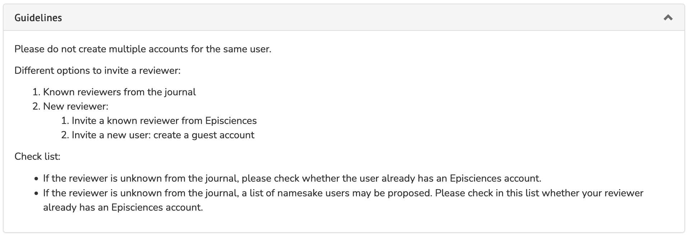
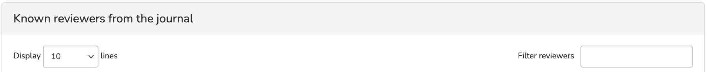
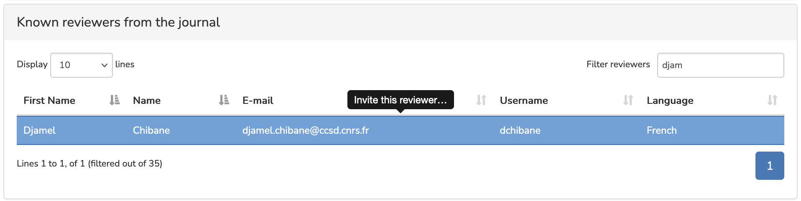
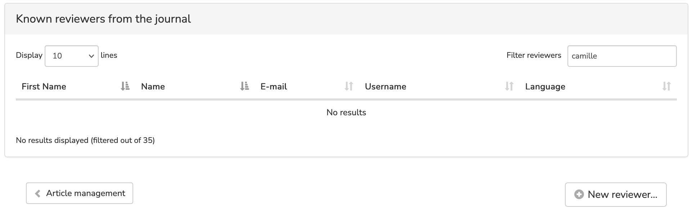
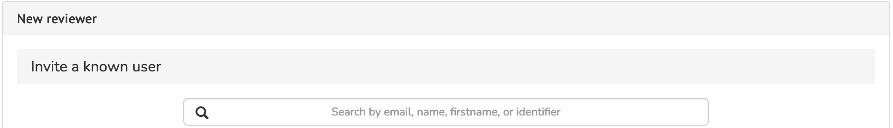
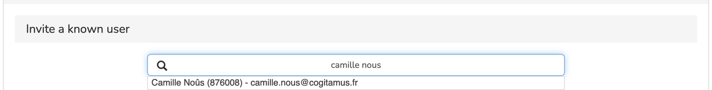
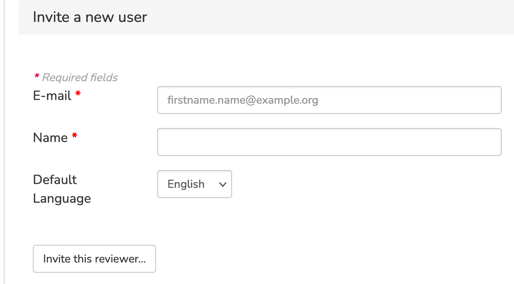

# Inviting a reviewer

> **Rights:** Editor, Editor in Chief, Editorial secretary, Guest editor

Once a submission has been submitted and checked that it corresponds to the editorial line of the publication, the next step is to have it peer-reviewed. To do this, you will need to invite the reviewers.

On the submission management page, go to the ‘Reviewers’ tab.

Click the ‘Invite a reviewer’ button.
Before selecting a reviewer, please read the ‘Guidelines’ tab.

It is important to avoid creating multiple accounts for the same user. To do this, check that the reviewer does not already have an account with the journal.
In the ‘Known reviewers from the journal’ tab, enter the name of the reviewer in the ‘Filter reviewers’ box.

## The reviewer already has an account on the journal’s website
If the reviewer already has an account, select their name to invite them to review the article.

## The reviewer does not have an account on the journal’s website
If the search returns no results, click on the ‘New reviewer’ button in the bottom right-hand corner.

If the reviewer is unknown to the journal, enter their name or email address in the ‘Invite a known user’ field to check that they do not already have an account on another CCSD platform (i.e. that they have a HAL or Sciencesconf account).

### The reviewer has a CCSD account
If the reviewer has one or more CCSD accounts, select the desired account. The email inviting the reviewer to review the submission will open.

An account for the reviewer will be created on the journal when the reviewer logs in to the site with their CCSD credentials using the link sent in the invitation (the reviewer does not need to create a new account).

{
If you skip this step, you will be creating a temporary account. The reviewer who logs in with their CCSD account will not be able to accept the review because the system will think they are a different person.
{}

### The reviewer does not have a CCSD account
If the reviewer does not have a CCSD account, fill in the ‘Invite a new user’ form with their email address, full name and the language you wish to use for correspondence (English or French).

The invitation of a new user, previously unknown to the CCSD authentication service, allows the creation of a temporary account which the user can activate by creating an account on the journal's website using the link sent with the invitation.
