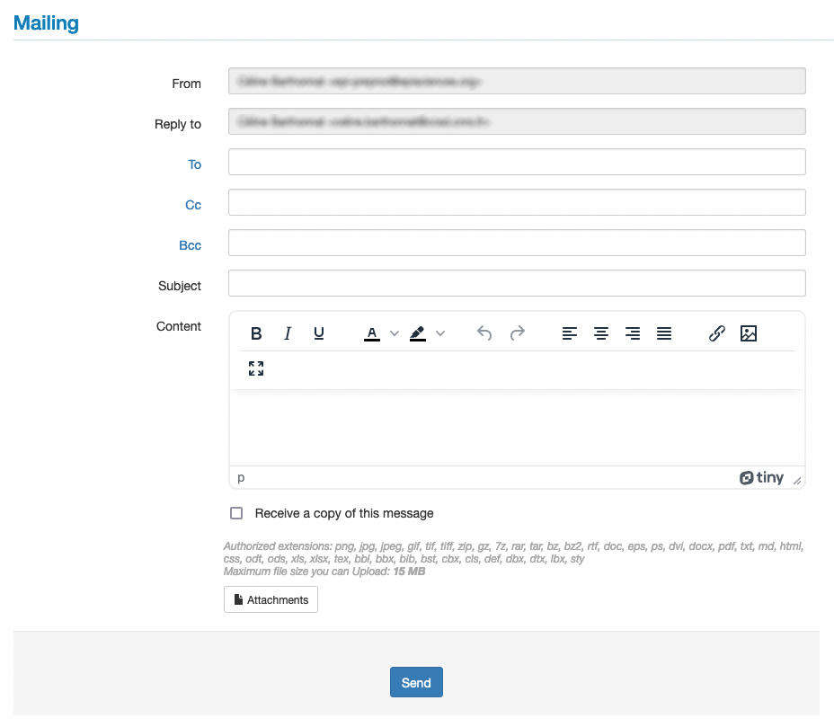
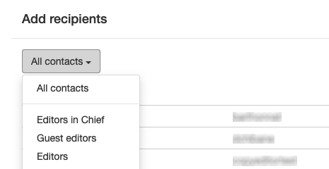
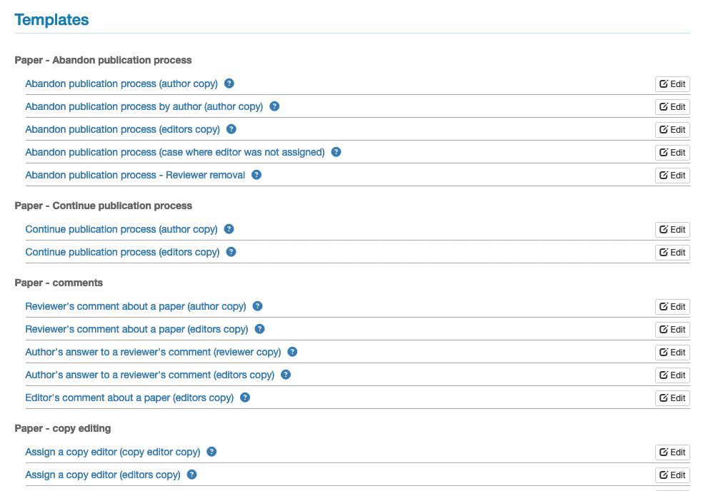
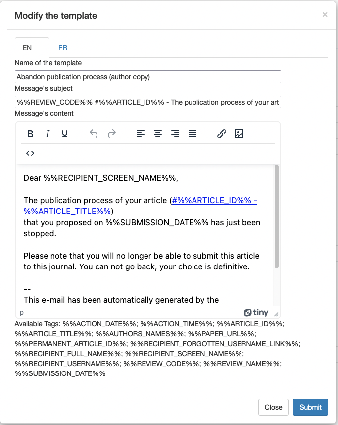

# Mailing module
> **Rights**: Administrator, Editor, Editor in Chief, Editorial secretary, Webmaster

## Mailing
To manage the sending of emails to certain roles, go to: Journal management > Mail > Mailing.

A message can be sent to a specific recipient or to a group of recipients selected according to their role in the journal. The selectable roles are: editor in chief, editors, guest editors, editorial secretary, webmasters, proofreaders.

To select the recipient(s), click on “To”, “Cc” or “Bcc” and then on “All contacts”.

## Templates
A number of pre-configured emails (templates) are available on the site.

To consult and modify these templates, go to: Journal management > Mail > Templates.

To modify a template, click on the “Edit” button.

The name of the template, its subject and its content can be customised.

To customise the templates, see the list of variables to be inserted in the templates.

## History
All messages sent via the site (automatic notifications as well as emails), are accessible via the history available in Journal management > Mails > History.

By default, exchanges are displayed by date sent, with the most recent exchanges displayed first.