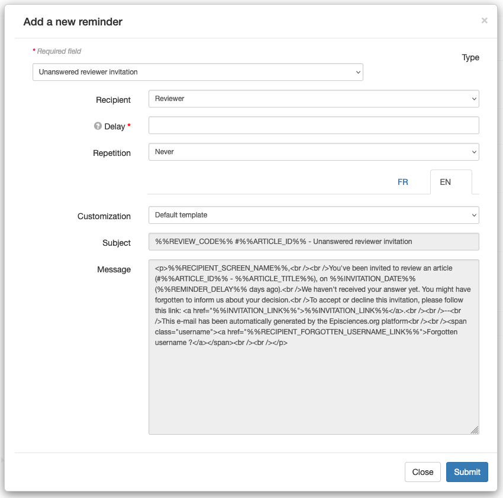
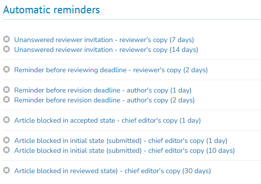

# Automatic reminders
> **Rights**: Administrator, Editor, Editor in Chief, Editorial secretary

Before setting the reminders, you can set notifications sent if the article’s state changes (submitted, updated or refused).

To create and set up the reminders, go to: Journal management > Mail > Automatic reminders.

Nine types of reminder are available:
1. **Unanswered proofreader invitation**: to remind a proofreader who has not responded to an invitation;
2. **Reminder before proofreading delivery date**: to remind a proofreader who has accepted the invitation of the deadline;
3. **Reminder after proofreading delivery date**: allows you to remind a proofreader who has accepted the invitation but who has missed the deadline.
4. **Reminder before revision deadline**: to remind the author or the editorial board that the revision deadline is 
   imminent.
5. **Reminder after revision deadline**: to remind the author or the editorial board that the revision deadline is 
   outdated.
6. **Not enough reviewers**: to remind the editorial board to assign the article more reviewers. To set a minimum 
   reviews count go to Journal management > Journal > Settings > Editors settings.
7. **Article blocked in accepted state**: to remind the editors to complete the copy-editing process. 
8. **Article blocked in initial state (submitted)**: to remind the editors to accept or refuse an article after its 
   submission.
9. **Article blocked in reviewed state**: to remind the editors to accept or refuse an article after its reviewing.

To set up, click on “Add a new reminder”. A screen appears with a list of parameters to be defined for the desired dunning types.

Fields marked with an asterisk are required.

+ **Type**: Select the type of dunning from the drop-down list. You can choose from the following:

  + Unanswered reviewer invitation 
  + Reminder before reviewing deadline 
  + Reminder after reviewing deadline 
  + Reminder before revision deadline 
  + Reminder after revision deadline 
  + Not enough reviewers 
  + Article blocked in accepted state
  + Article blocked in initial state 
  + Article blocked in reviewed state

+ **Recipient**: Select the relevant role from the drop-down list. You can choose one of the following:
  + Editor in Chief 
  + Editor 
  + Reviewer: for this recipient, deadlines are determined by other deadlines set in  Journal management > Journal > Settings > Review settings.
  + Author

+ **Delay***: enter a number corresponding to the number of days (the reminder will be sent X days after the deadline set in the journal).

+ **Repetition**: select the frequency of the reminders from the drop-down list. Choice of:
  + Never
  + Daily
  + Weekly
  + Every two weeks 
  + Monthly

+ **Customization**: select “Default template” (cannot be changed) or “Custom template” in order to be able to change the subject of the mail and the text of the message.

Click on “Submit” to save your changes. An automatic dunning is created. It is possible to modify it.

Automatic reminders are sent every day at 00:00.

The messages can be viewed in the mail history: Journal management > Mail > History.