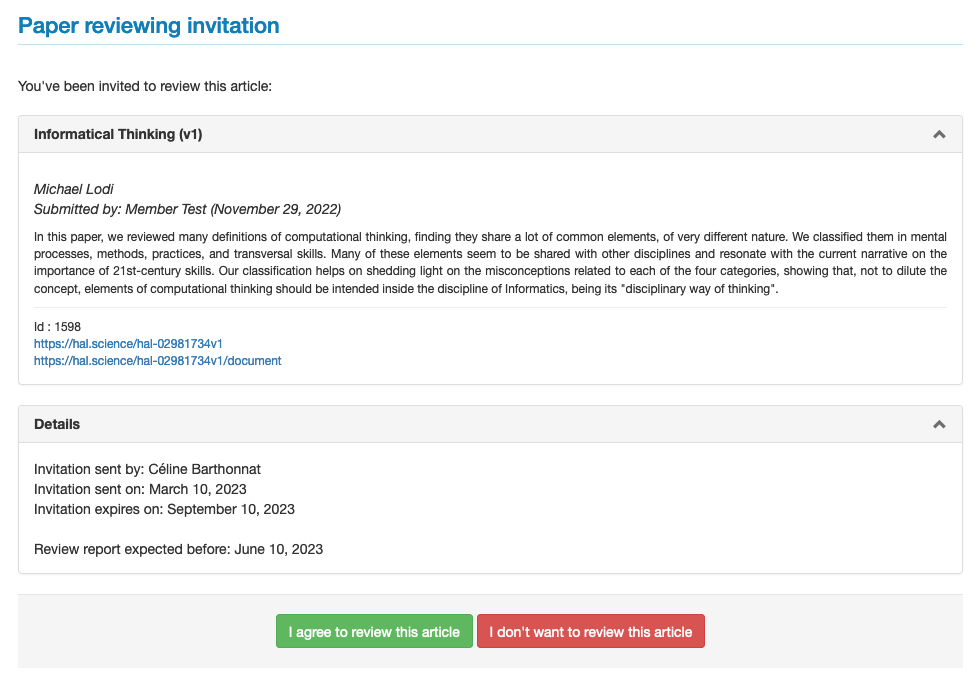
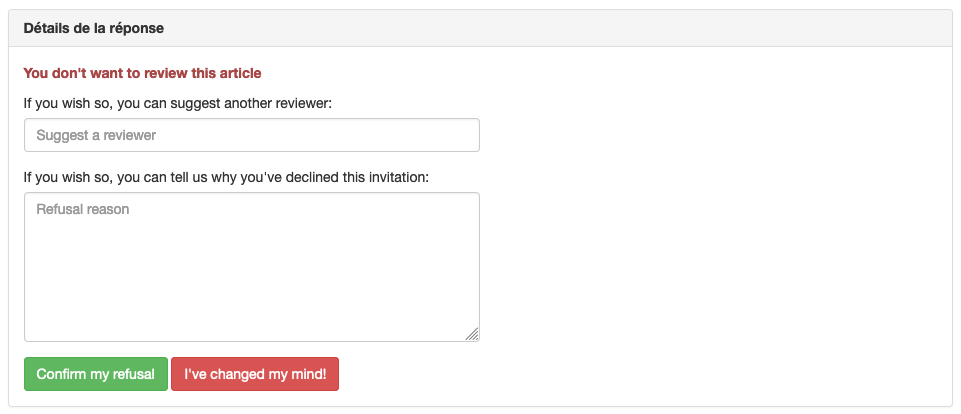
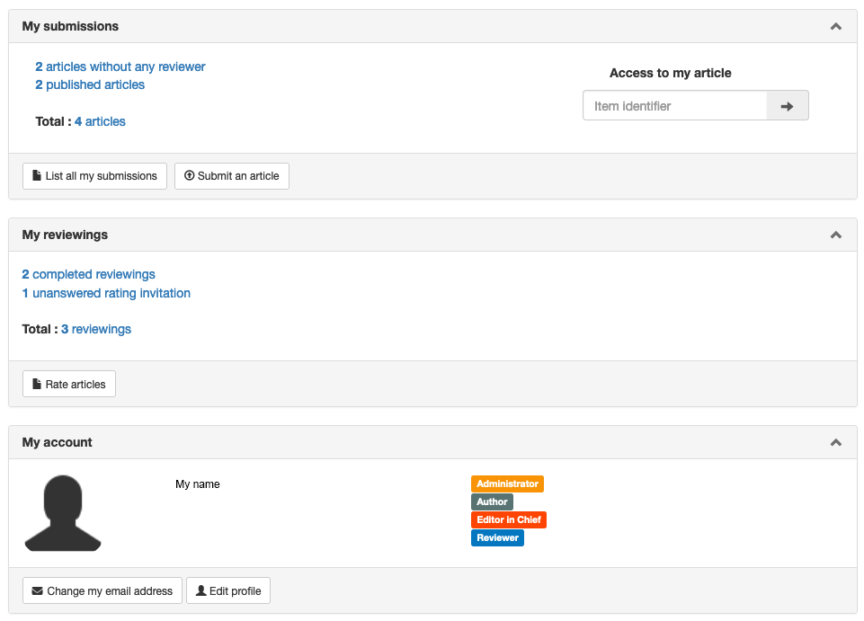
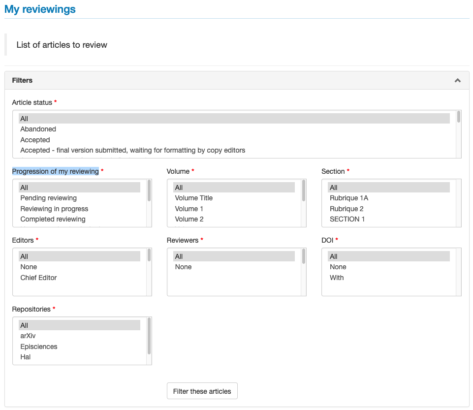
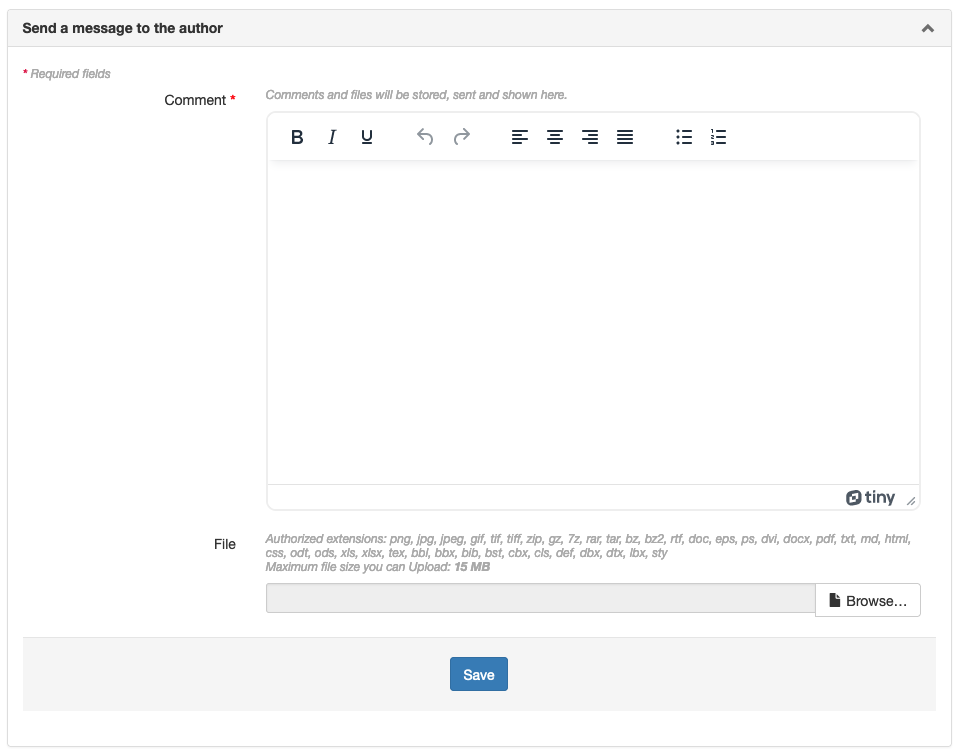

# Reviewer guidelines

> **Rights**: Reviewer

## Invitation to review an article
The reviewer receives an invitation by e-mail. The message contains the title of the article, a link to the article in the open repository and a link to the response form allowing the reviewer to accept or reject the review.

The invitation is time-limited: the response time is specified in the e-mail.

By clicking on the link, the response form to the invitation is displayed:

Click on the required answer.

## Decline the invitation
To decline the invitation, click on “I don’t want to review this article”.

It is then possible to suggest the name of another reviewer and to specify the reasons for the refusal.

In some cases, the journal may ask to declare whether the reviewer has competing interests with the article under review. If this is the case, it is considered a reason for rejection.

Click on “Confirm my refusal” to save the answer.

A “I've changed my mind!” button allows you to return to the invitation response form.

## Accept the invitation
After clicking on “I agree to review this article”, an email is sent to the reviewer allowing him/her to access the evaluation of the article on the site.

## Connexion
Log in with your username and password on the journal’s website.

Note: it is not necessary to open several accounts on Episciences if the reviewer is requested by several journals hosted on the platform.

## Dashboard
The dashboard displays the current actions on the site: reviews but also articles if the user has submitted any.

Click on “Rate articles” to access the articles.

The “My reviewings” page lists the articles for which the user has received an invitation.

Each article has a status: pending reviews appear at the top of the table.

The user can filter by article status, review status, volume, section, editors, DOI and repositories.

## Processus
By clicking on the title of the article, a new page opens to access the article to be reviewed and the form to be filled in for the evaluation.

There are two ways to access the article:
1. **Download the file** ;
2. **Visit the article page**: allows you to consult and download the article on the open archive site where it has been deposited. There may be several versions of the text, as well as annexed documents (dataset, video file, slide show, etc.).

### Filling in the rating grid
Each journal has its own rating grid, the different criteria of which consist of scores or items to be selected from a drop-down menu.

Depending on the journal, the reviewer can complete the grid with a comment and upload a file for the author: this file can be the annotated article, or any information that the reviewer seems useful to communicate to the author.

The exchanges between the reviewer and the author are saved on the platform. By default, the reviewer is anonymous. If he/she wishes, he/she can lift the anonymity by adding his/her name in the “Comment” space.

### Validation of reviewing
During the assessment, two options are available:
1. **Save evaluation**: save the information entered during the review if the review is not completed.
2. **Complete the evaluation**: allows you to validate the information entered and to send it to the editor in charge of the article.