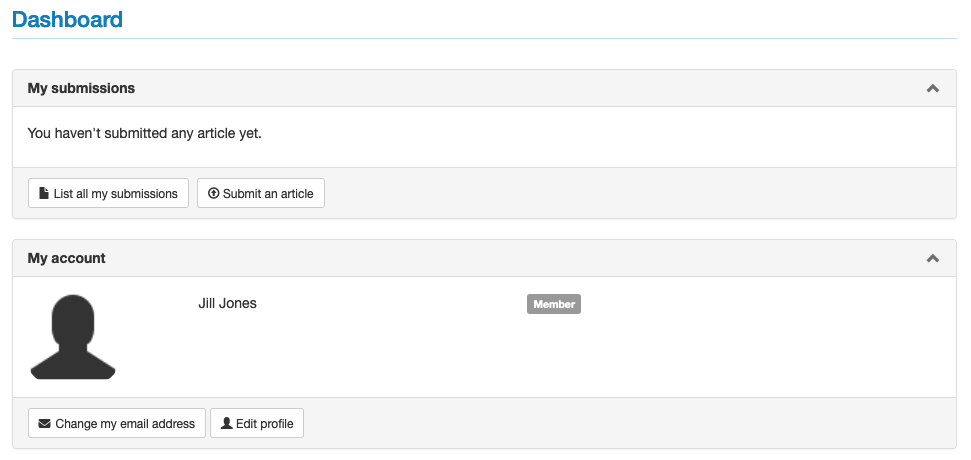
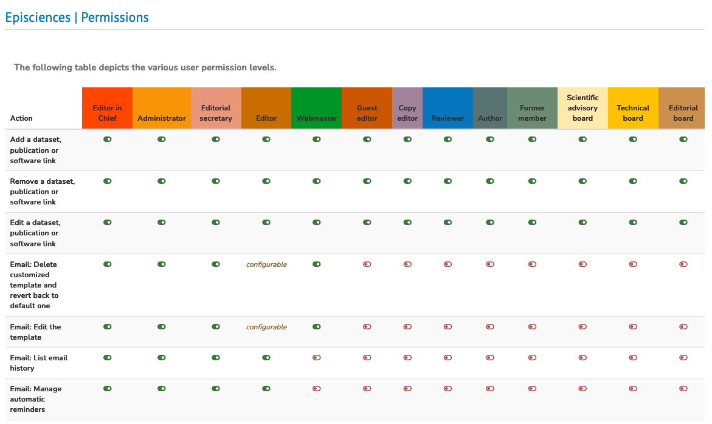

# User roles

> **Rights**: Editor in Chief, Administrator, Editorial secretary, Editor, Webmaster, Guest editor, Copy editor, Reviewer, Author, Member

There are **ten roles** in Episciences, each with rights associated with features.

The roles associated with the profile are displayed in the top right-hand corner when you hover the mouse over your username and in the Dashboard section.

Please note: the semantics of roles in Episciences is not necessarily adapted to the organisation of each journal. Thus, a user can have several roles in a journal, to be assigned according to the functionalities he/she has to use.

The roles with the most rights are indicated by an asterisk.

+ **Member**: default role assigned to anyone who creates an account on the journal’s website.
+ **Author**: can submit an article.
+ **Editor**: can assign an article to a section or volume, assign reviewers, make suggestions (accept or reject an 
  article). His/her rights depend on the journal’s settings.
+ **Editor-in-chief***: has all rights to the journal. He/she manages users and assigns roles to them. He/she manages 
  the reviewers and the articles. He/she can also configure or modify the journal’s website.
+ **Guest editor**: has the same rights as the editor but only on a section or volume.
+ **Proofreader**: allows the proofreader to review the article for which he/she has been asked and to enter an 
  evaluation. Depending on the journal’s settings, this role allows communication with the author.
+ **Copy editor**: manages the copy editing process, alone or in conjunction with the author, to produce a final 
  version for publication in the journal.
+ **Editorial secretary***: makes an initial selection of the articles submitted. He/she can refuse an article (if it 
  does not correspond to the journal’s editorial line, for example) but cannot accept it automatically. He/she can manage users (creation of accounts).
+ **Webmaster**: responsible for the journal’s website. This includes setting up the general configuration of the site 
  and access to the style sheet.
+ **Administrator***: has all the rights to the journal, including setting the site parameters.

The functionalities linked to each role are summarised in a table, accessible in connected mode: My Account > Permissions

