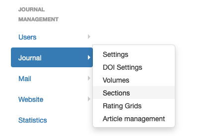

## Sections
To create and manage sections, go to the menu: Journal management > Journal > Sections.

Several sections can be open at the same time. An author can submit an article to any section.

During the proofreading process, an article may be assigned to another section by the editor (not possible after publication).

An article cannot be submitted to a "closed" section.

The number of sections is not limited.

To create a section, click on "Create a new section".

The metadata of a section:

- **Name*** (required field): title of the section
- **Description**: will not be displayed on the site
- **Status**: open/closed

If the journal site is in multiple languages, the section name and its description must be entered for each language. Click on + to display the field.