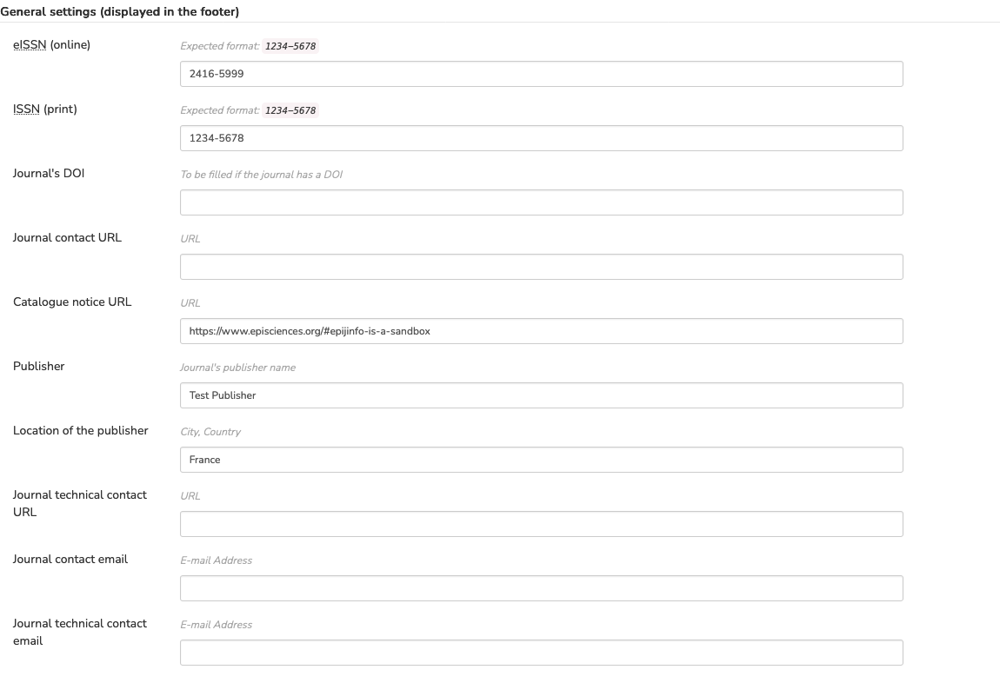
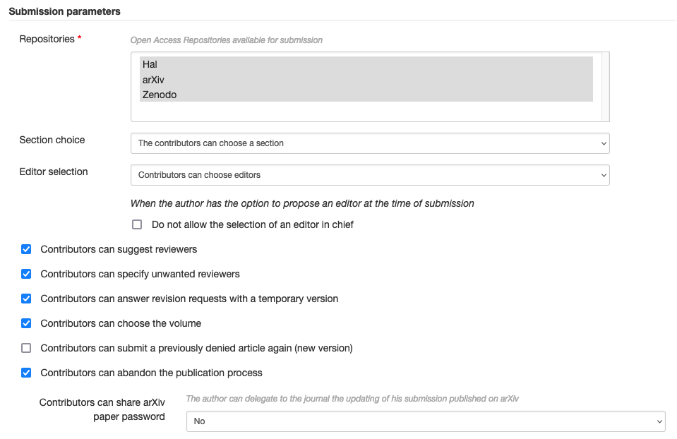
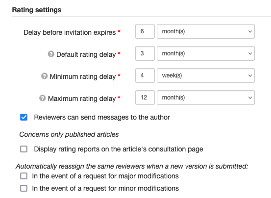
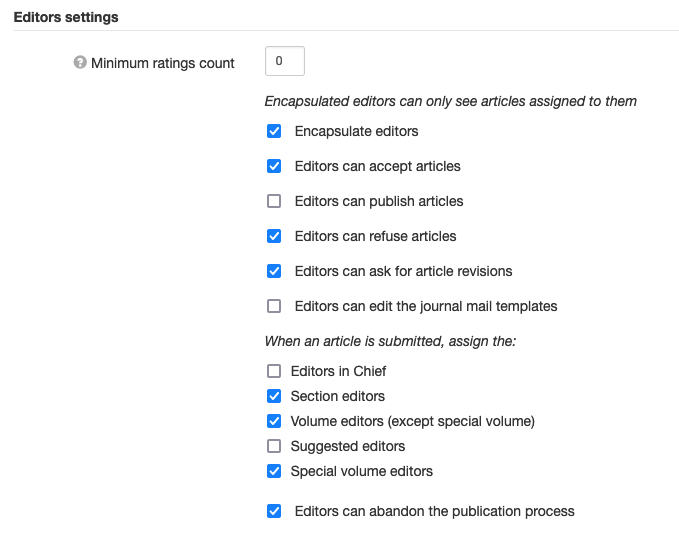

# Journal settings

> **Rights**: Administrator

To customize the journal settings, go to the menu: Journal management > Journal > Settings.

Fields marked with an asterisk are required.

## General settings (displayed in the footer)

+ **ISSN (online)**: To be completed with the e-ISSN of the journal (XXXX-XXXX)
+ **ISSN (print)**: To be completed with the ISSN of the journal (XXXX-XXXX)
+ Your journal’s **DOI**: To be filled in if the journal has a DOI
+ **Journal contact URL**: Enter a URL here
+ **Journal technical contact URL**: Enter a URL here
+ **Journal contact email**: Enter an e-mail address here
+ **Journal technical contact email**: Enter an e-mail address here

## Submission parameters

**Repositories***: Select the repository(ies) available(s) for article submission. To select more than one: hold down the Ctrl key and click.

Other parameters can be activated:

**Section choice**:
+ Contributors **can’t** choose a section;
+ Contributors **can** choose a section;
+ Contributors **have to** choose a section.

**Editor selection**:
+ Contributors **can’t** choose editors;
+ Contributors **can** choose editors;
+ Contributors **have to** choose editors;
+ Contributors **have to** choose one and only one editor.

When the author has the option to propose an editor at the time of submission, it is possible to select this option: “Do not allow the selection of an editor in chief”.

It is also possible to allow contributors to:
+ **suggest reviewers** (this parameter does not automatically assign the manuscript to a reviewer, it is only a suggestion);
+ specify unwanted reviewers;
+ answer revision requests with a temporary version;
+ choose the volume;
+ submit a previously denied article again (new version);
+ abandon the publication process.

A new option allows the author to delegate to the journal the updating of their submission published on arXiv:
+ Contributors can share arXiv paper password: No/Optional/Required.

## Rating settings

For each option, indicate a number of day(s)/week(s)/month(s).

+ **Delay before invitation expires***
+ **Default rating delay***: Delay before the reviewer has to send the rating report. The deadline is calculated from the date when the invitation was sent.
+ **Minimum rating delay***: When handling an article, editors can set a custom rating delay for each reviewer. This delay cannot be lesser than the Minimum rating delay.
+ **Maximum rating delay***: When handling an article, editors can set a custom rating delay for each reviewer. This delay cannot be greater than the Maximum rating delay.

Automatic dunning is calculated from these parameters.

Others options:
+ Reviewers can send messages to the author;
+ Display rating reports on the article's consultation page (this option concerns only published articles).

Automatically reassign the same reviewers when a new version is submitted:
+ In the event of a request for major modifications;
+ In the event of a request for minor modifications.

## Editors settings

**Minimum ratings count**: indicate here the minimum number of reviews before an article can be accepted.

**Others options**:
+ Encapsulate editors: Encapsulated editors can only see articles assigned to them.
+ Editors can accept articles
+ Editors can publish articles
+ Editors can refuse articles
+ Editors can ask for article revisions
+ Editors can edit the journal mail templates

When an article is submitted, assign the:
+ Editors in Chief
+ Section editors
+ Volume editors (except special volume)
+ Suggested editors
+ Special volume editors

+ Editors can abandon the publication process

## Notification settings
Enable emails to be sent to certain roles (administrators, editors in chief, editorial secretaries) when an article is submitted, updated or rejected.

## Special issues settings
Allows you to assign an access code to enable submission in special volumes and also to partition the reviewers of a special volume.

## Copy editing
Allows partitioning of copy editors, i.e. giving them access only to items assigned to them.

## Additional settings
+ Allows reviewers to **declare a conflict of interest** (COI) before the assessment.
+ Allows you to change certain things on an already accepted article.
+ **Statistics visibility**: hidden (default option)/public/administrators only
+ **Redirection address**: Select the address that will receive the failed emails.