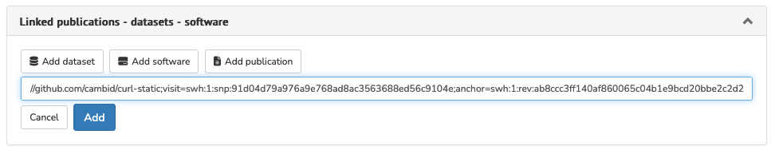

# Linking publications/data/software

> **Rights**: Author

In order to promote and encourage the reproducibility of science, Episciences facilitates the link between an article and a dataset or software. The author who submits a document to a journal can add the identifier provided by the platform on which the data or software is stored, thus facilitating access to these resources, both for the reviewers who evaluate the submissions, and for the readers if the article is published.

This documentation page explains step-by-step how to link software. The procedure is similar for linking a dataset or a publication.

## Linking software
Before linking a software to a document submitted to an Episciences journal, it is advisable to deposit it in HAL or in Software Heritage in order to allow its permanent archiving.

If the software is not available in a repository (github or other) or if we wish to have rich metadata to describe it, it is possible to deposit it in HAL. If the software is already available in a repository, we recommend using Software Heritage.

### Submit software to HAL
The deposit of a software via HAL allows its sustainable archiving in Software Heritage. The complete procedure of the deposit is detailed in the documentation HAL, [Deposit software source code](https://doc.archives-ouvertes.fr/en/deposit-2/deposit-software-source-code/ "Deposit software source code").

### Deposit software in Software Heritage
The procedure for archiving software is available on the Software Heritage website, [Save and reference research software](https://www.softwareheritage.org/save-and-reference-research-software/ "Save and reference research software").

### Link the software to Episciences publication
Once the document has been submitted, you can link it to a software application.

To do this, go to “My Account” > “My submissions”.

Click on the title of the document you want and then, in the “Linked publications - datasets - software” tab, click on “Add software”.

> On Software Heritage, the SoftWare Hash IDentifier (SWHID) is in the red “Permalinks” tab on the right of the screen.

Choose the code corresponding to “Directory” (which will display the preview on the item) then click on “Copy identifier”.

Enter the SWHID then click on “Add”.

A preview of the software as archived in Software Heritage is displayed (provided you have selected the code corresponding to “Directory”).

> Please note: software can be added at any time. It will be visible to the reviewers, who will be able to review the document with access to the code.

## Citing software in your publication
On the Software Heritage website you will find full documentation on how to cite software in a publication: [Citing software with style](https://www.softwareheritage.org/2020/05/26/citing-software-with-style/ "Citing software with style").