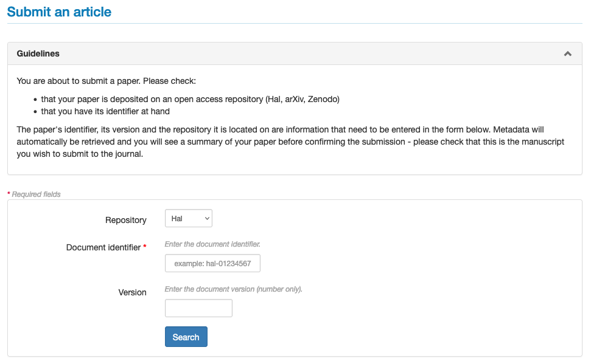
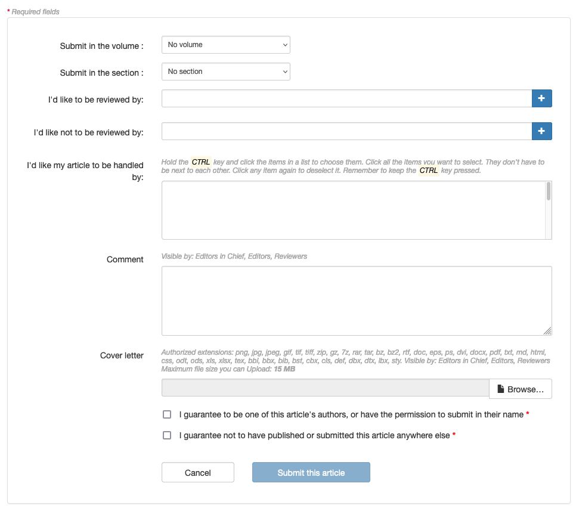
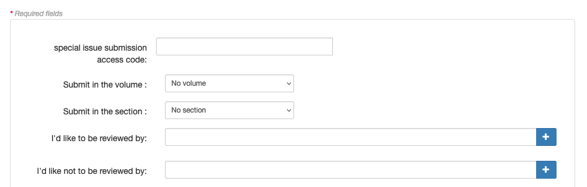
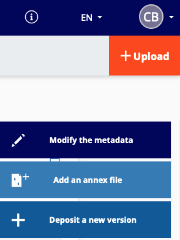
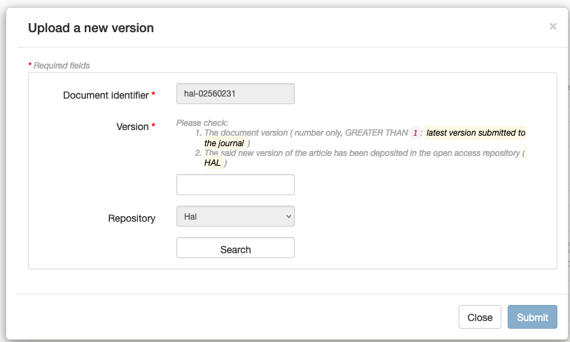
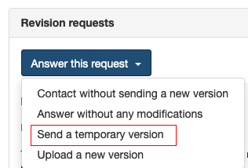
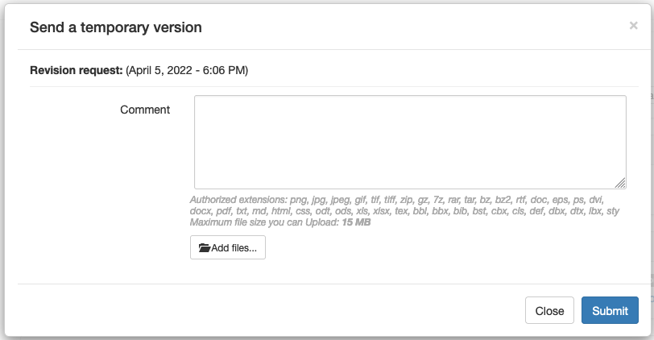

# Article submission

> **Rights**: Author

## Prerequisite
The HAL account is used to connect to the journals’ websites. In case of a first deposit or if you do not have a HAL account, you must create an account.

Submitting an article to a journal is a two-step process:
1. deposit of the article proposal (preprint) in an open archive (arXiv, HAL, Zenodo or CWI);
2. submission of the preprint on the Episciences website of the journal.

## Logging in to the site
To connect to a journal’s website, click on the “Sign in” button at the top right.

Once logged in, click on the “Submit an article” tab.

+ **Repository**: select the open repository in which the article to be submitted to the journal is located; 
+ **Document identifier**: indicate the document identifier on the open repository (e.g. hal-0000000 for HAL; 0000.0000 
  for arXiv; 10.5281/zenodo.0000000 or 0000000 for Zenodo);
+ **Version**: specify the version of the document to be submitted.

The metadata (first and last names of the authors, title, abstract and keywords) are retrieved by the system.

Depending on the settings of the site, it is possible to propose the article for a volume or a dedicated section, to suggest names of reviewers or to attach a cover letter.

The free field “Comment” allows you to add a note to the editorial team of the journal (this comment will be visible to the editors, writers and reviewers).

In order to be able to submit the article, it is necessary to certify:
+ you are the author of this article or you are commissioned by one of the authors in the case of an article written by several authors; 
+ not to have published or submitted this article elsewhere.

Click on “Submit this article” to validate the submission.

## Submit an article to a special issue
If you have been invited to contribute to a special issue, an access code has been sent to you by e-mail. The procedure is the same as for submitting an article, but you must first enter the access code in the corresponding field.

After entering the access code, the corresponding issue is displayed.

Finalise the submission procedure by clicking on “Submit this article”.

## Request for modifications
After evaluation of the article, the author may receive a request for modification from the journal. The author is then invited to rework the article and submit a new version.

- Option 1: deposit of the reworked article in the open repository

Connect on HAL and go on the initial deposit. Click on the button “+ Deposit a new version” in the right hand side.

Once the new version has been moderated, log in to Episciences and go to the article’s page. In the “Revision requests” section, in “Answer this request”, select “Upload a new version”.

The document identifier and the repository of the submitted article are proposed by default. Indicate the new version to be taken into account.

The new version is sent for review.

- Option 2: Submit a temporary version (the modified version is not present in the repository)

This option is best used for minor modifications.

Log in to Episciences and go to the article’s page. In the “Revision requests” section, in “Answer this request”, select "Send a temporary version".

Download the temporary version. A comment can also be added to specify the changes made to this version.

This version is only present on Episciences and not visible in the open repository. When the article is validated, the final version must be uploaded to the repository in order to obtain the status “accepted” (see option 1).

The published article can be consulted on the journal’s website. Its bibliographic references are automatically updated in the open repository.

In case of need, you can contact the technical support at the following address: support [at] episciences.org