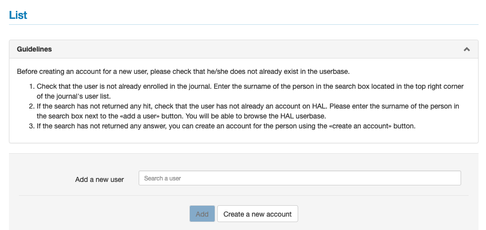
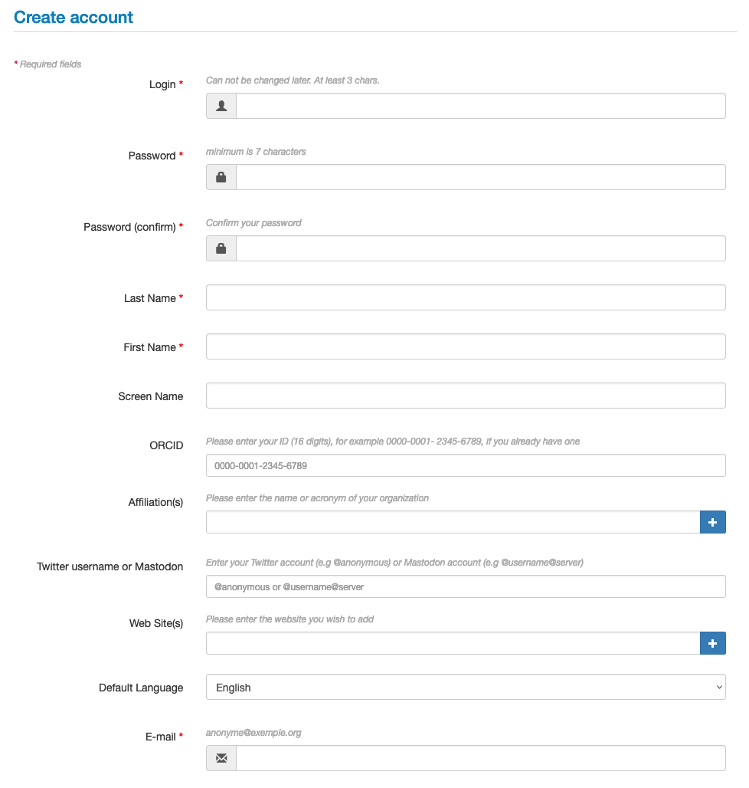
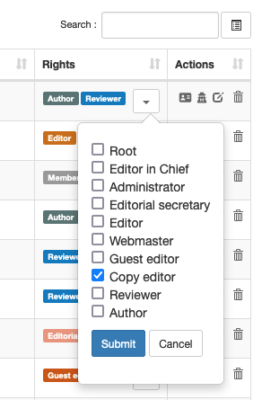

# Managing users

> Rights: Administrator, Editor in Chief, Editorial secretary

To manage the users of the journal (create an account, add roles, etc.), go to the menu: Journal management > Users > List.

**Good practice**

Before creating an account for a new user, please check that the user does not already exist in the user database. To check that the user does not already have rights in the journal, enter the person’s name in the search field at the top right of the user list.

It is possible to invite new users (authors, reviewers or editors) to the journal site. To do this, enter the name of the user to be added in the dedicated field. If the search does not return any results, it is possible to create an account for the user by clicking on the “Create a new account” button.

Required fields for account creation:
- **Login**: at least 3 characters. Attention: the login cannot be changed once the account has been created.
- **Password**: minimum 7 characters
- **Password (confirm)**
- **Last Name**
- **First name**
- **E-mail**: indicate here a valid email address, a confirmation email will be sent to validate the account creation

It is recommended that users create their own account (choice of login and password). Once the account is created, the user can be selected from the list.

By default, all users have the rights of member, which allows them to submit an article. Other rights can be added by the editor.

To add one or more rights, go to the “Rights” column and select the rights from the list.

