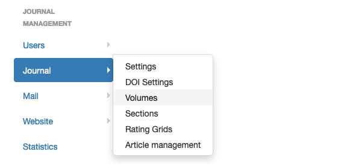
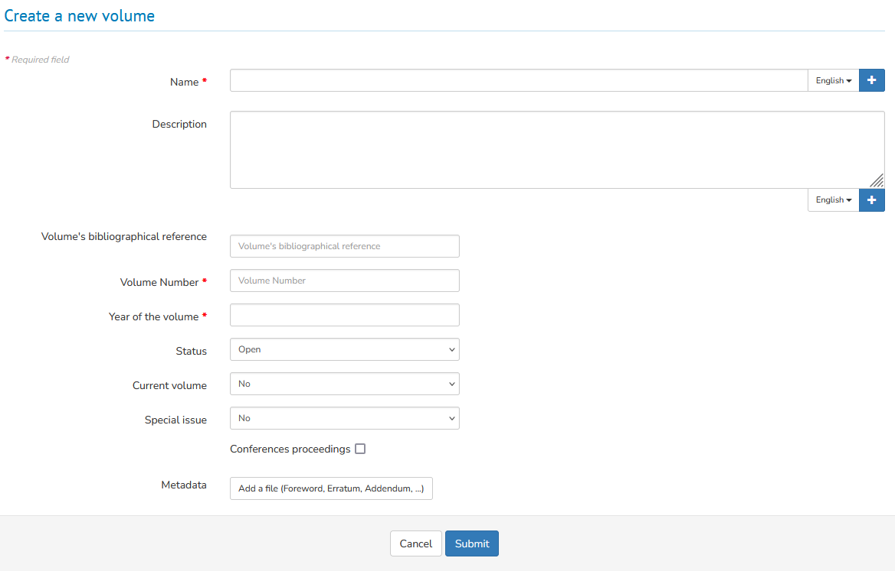
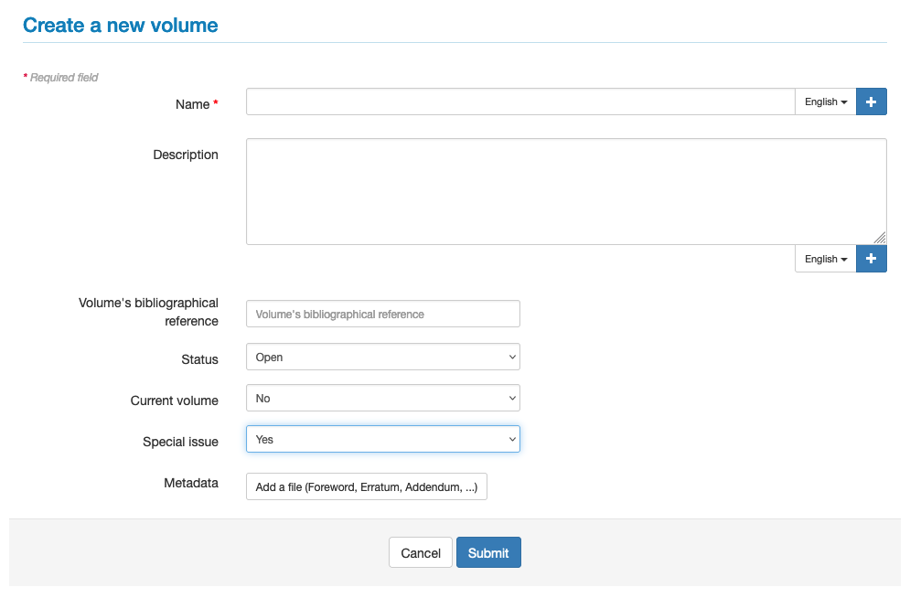
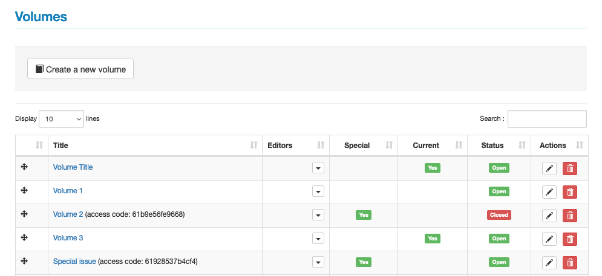
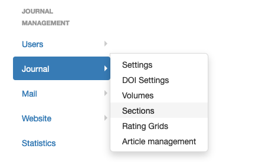
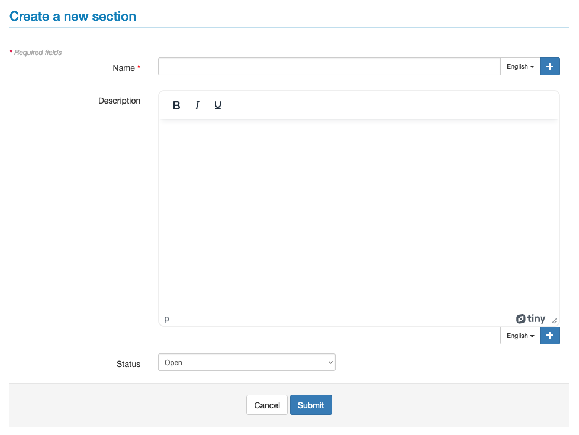

# Volumes and sections

> **Rights**: Administrator, Editor in Chief, Editorial secretary

It is possible to create volumes and sections.

Volumes are similar to journal issues and can be used to collect thematic articles.

## Volumes
To create and manage volumes, go to the menu: Journal management > Journal > Volumes.

Several volumes may be open at the same time. Authors may submit to any open volume. Before publication, the editor may change the volume of an article.

An article cannot be submitted to a closed volume.

After publication, an article cannot be assigned to another volume.

To create a volume, click on "Create a new volume".

A volume is composed of 7 elements:
- **Name*** (required field): title of the volume
- **Description**: description of the volume
- **Volume’s bibliographical reference**: indicate here the identifier of the volume (e.g. 18 ; vol. 2 ; vol.24:1). This reference is used in the mail templates.
- **Status** (open/closed): an open status allows articles to be added as they come in.
- **Current volume** (yes/no): by selecting the "yes" option and the "open" status, this volume is proposed at the time of submission
- **Special issue** (yes/no): volume accessible only by access code
- **Metadata**: allows you to add a PDF file, such as an editorial, an erratum, an addendum, thanks, a tribute, etc.

If the journal site is in multiple languages, the volume name and its description must be entered for each language. Click on + to display the field.

##  Special issue
The operation of a special issue is linked to the special issue settings defined in Journal > Settings > Special issues settings:

- **Restrict submission in special issues with an access code**: if the item is ticked, an access code is associated with the volume. This code is sent to contributors to invite them to submit an article in the special volume.
- **Encapsulate reviewers**: if the item is ticked, the reviewers of a volume will not be visible elsewhere in the journal. A partitioned reviewer is a reviewer who is only allowed to review articles for the special volume. The proofreader will only see articles that are tagged to the special volume and not other articles in the journal.
- **Editors can reassign handled articles to another editor**: an editor, to whom the editor-in-chief has assigned the management of an article, can designate other editors.

To create a special issue, go to the menu: Journal management > Journal > Volumes then "Create a new volume".

Fill in the details and select "Yes" for "Special issue".

If in Journal > Settings > Special issues settings you have selected the item "Restrict submission in special issues with an access code", the code is displayed in the list of volumes.

This code is sent to contributors inviting them to submit an article to the special issue.

## Sections
To create and manage sections, go to the menu: Journal management > Journal > Sections.

Several sections can be open at the same time. An author can submit an article to any section.

During the proofreading process, an article may be assigned to another section by the editor (not possible after publication).

An article cannot be submitted to a "closed" section.

The number of sections is not limited.

To create a section, click on "Create a new section".

The metadata of a section:
- **Name*** (required field): title of the section
- **Description**: will not be displayed on the site
- **Status**: open/closed

If the journal site is in multiple languages, the section name and its description must be entered for each language. Click on + to display the field.