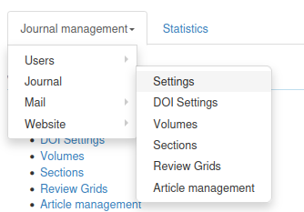
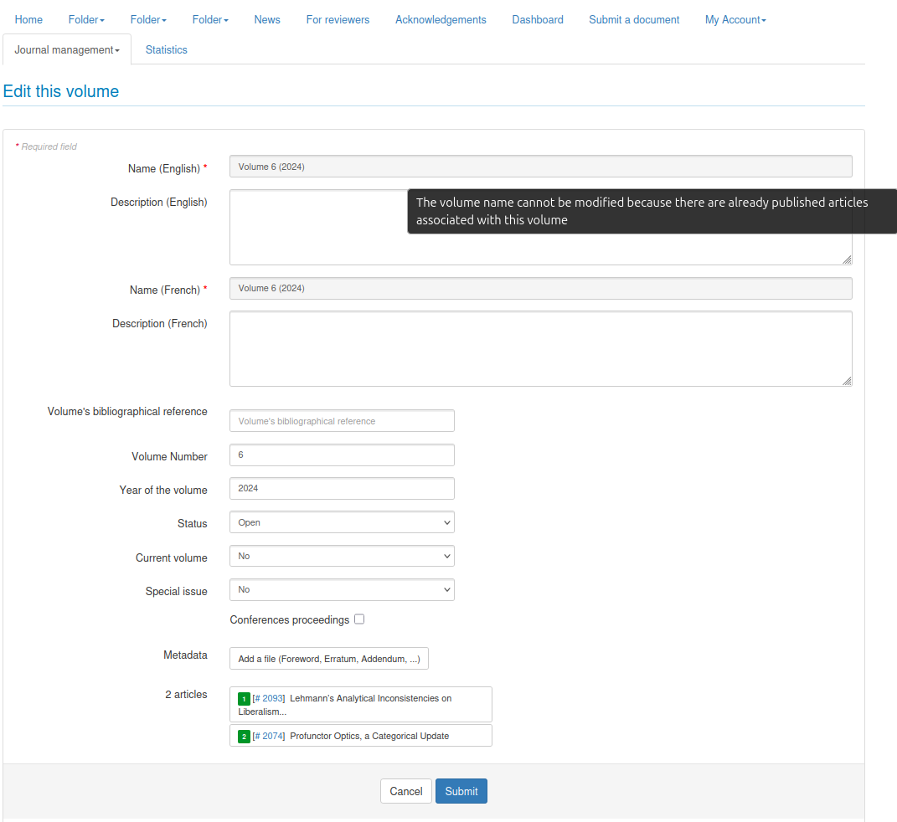

# Volume Settings

**Rights:** Administrator, Editorial secretary, Editor

## Context

Previously, editing a volume title was systematically blocked as soon as the volume contained published articles. This restriction was rigid and did not allow adaptation to the specific needs of certain journals.

Now, a new feature allows configuring at the journal level whether volume titles can be edited when they contain published articles.

To change the settings, go to Journal management → Journal → Settings

## Implemented Features

### New Journal Parameters

Two new configuration parameters have been added to the "Volume Settings" section in the journal administration interface:

## 1. Parameter "Allow displaying empty volumes"

### Description

This parameter controls the display of empty volumes (without articles) on the journal's public website.

### Behavior

#### When the parameter is disabled (default value: 0)

- Volumes without published articles are **not displayed** on the public website
- Only volumes containing at least one published article are visible
- Avoids displaying volumes in preparation or unused
- Improves user experience by showing only relevant content

#### When the parameter is enabled (value: 1)

- **All volumes** are displayed on the public website, even if they are empty
- Allows showing the complete volume structure of the journal
- Useful for journals that wish to announce upcoming volumes
- Provides complete transparency on editorial organization

### Use Cases

- **Parameter disabled**: Recommended for most journals that only wish to display published content
- **Parameter enabled**: Useful for journals that organize their publications by predefined thematic issues and wish to announce future volumes

## 2. Parameter "Allow editing volume title with published articles"

This parameter allows editing the title of a volume containing published articles.

### Behavior

#### When the parameter is disabled (default value: 0)

- The title of a volume **cannot** be edited if the volume contains published articles
- Behavior identical to the previous system

#### When the parameter is enabled (value: 1)

- The title of a volume can be edited even if it contains published articles
- Provides increased flexibility for volume management

!!! note "Important Notes"
    - These parameters are **disabled by default** to maintain compatibility with existing behavior
    - Each journal can enable or disable these parameters independently