# Managing the website
> **Rights**: Administrator, Editor in Chief, Editorial secretary, Webmaster

The design of the website can be customised to give the journal a specific visual identity.

To customise the journal, go to: Journal management > Website.

Six configurable options are available:

* **General**: define the interface languages (English and/or French);
* **Style**: define the display options of the site;
* **Header**: add a banner;
* **Menu**: create and manage information pages (ethical charter, publishing policies, evaluation process, credits, etc.);
* **News**: add specific information (calls for papers, conference announcements, reviews of the journal, etc.);
* **Resources**: storage of the various text and image files of the site (e.g. logos, banner, copyright assignment contract, etc.). 

## General
The “General” option allows you to define the interface languages. Currently, there are two possible choices: French and English.

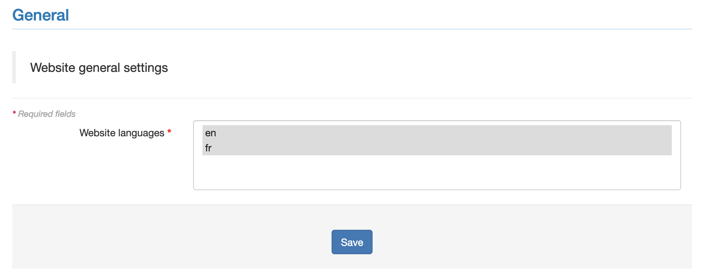

Select the desired languages by clicking on their labels (click and press Ctrl or Cmd to select the second language, if your site is bilingual).

Click on “Save” to save the chosen settings.

Please note: if you choose to implement both languages, you will need to translate the entire interface into these two languages (titles and contents of the pages you have created).

## Style
The “Style” option allows you to define the display of the site. You can choose:
- the orientation of the menu (horizontal or vertical);
- the width of the main zone;
- the display or not of the breadcrumb trail;
- the type of customisation (one-click, simple or advanced).

### Menu orientation
You can choose between a vertical menu (which is displayed on the left of the page) or a horizontal menu (which is displayed at the top of the page, below the title bar). You can also choose the “folded” option for each of these two orientations.

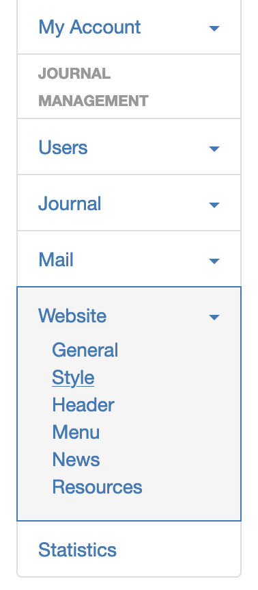

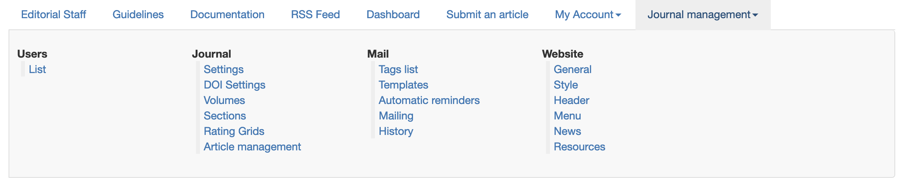

### Width of the main zone
Two possibilities are proposed here:
- Default (fixed 940px);
- Responsive (adjusted to the screen side).

### Show breadcrumb trail
The breadcrumb trail makes it possible to know at any time which page of the site you are on.

The breadcrumb trail is displayed at the top of the page either directly under the banner (in the case of a vertical menu) or under the menu (in the case of a horizontal menu).

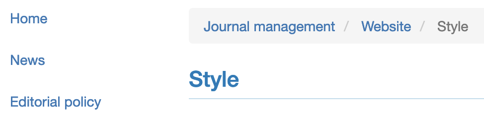

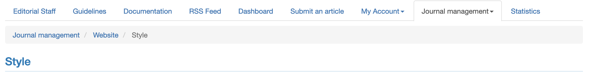

### Customisation type
There are three ways to customise your site: one-click, simple or advanced.

By selecting the “1-click” option, you can choose between two predefined templates (template 1 and template 2).

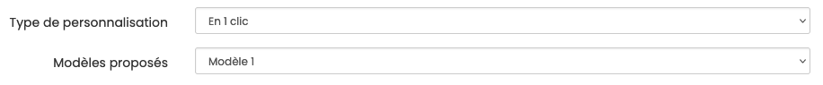

By selecting the “Simple” option, you can configure the background colours of the page, the colours of the main area, the text and links, choose the font and size of the text, titles, etc.

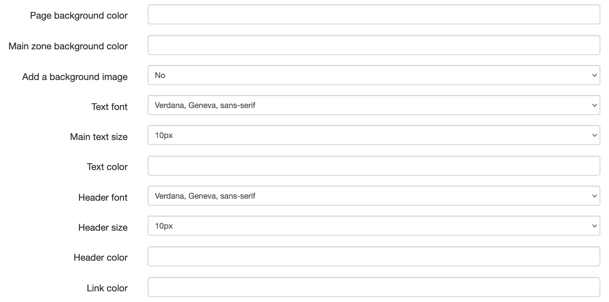

By selecting the “Advanced” option, you can directly edit the CSS.

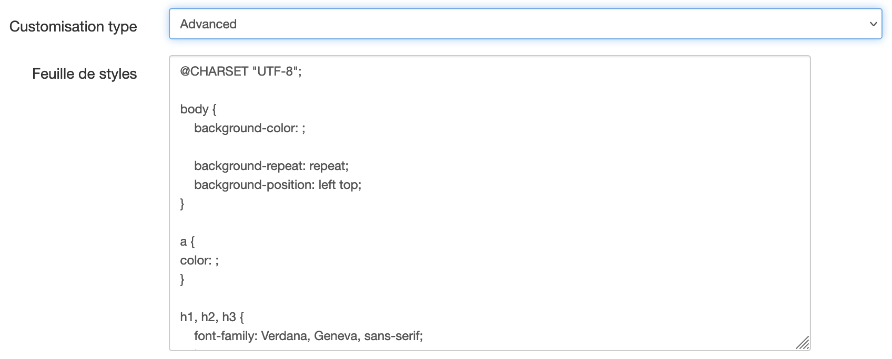

You can call on the Episciences team to help you choose the right fonts and colours to make your site accessible.

## Header
The “Header” option allows you to customise the banner. Here you can upload files (images, logos, etc.) that will appear in the header of the site.

Click on the “Add a logo” button. If you wish to enter a text in the header, select “Text” in the drop-down menu of the “Type” field. Enter the title of your magazine and its alignment (left, centered or right). If your site is bilingual, remember to specify the title in both languages.

If you have chosen advanced customisation, you can add a style by specifying the CSS classes and styles to be assigned to the title.

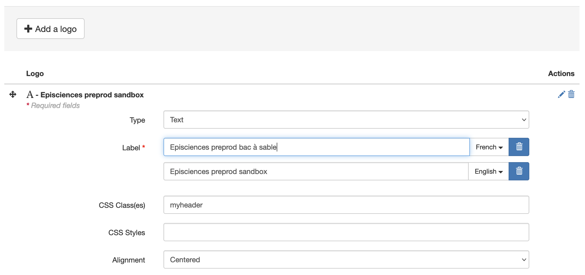

If you wish to add an image, select “Image” from the drop-down menu in the “Type” field and upload the file after selecting it with “Browse”.

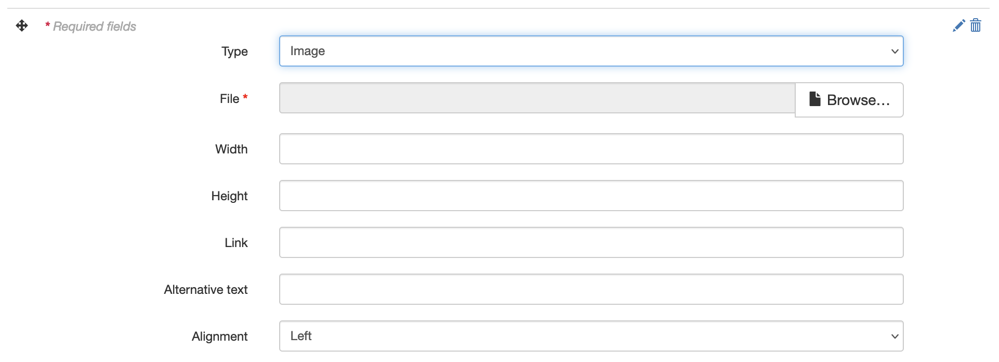

Click on “Save” to save the settings.

## Menu
The “Menu” option allows you to create and manage the pages of the site, especially the information pages.

There are nine types of pages:

- **Homepage**: a single page, homepage of the site;
- **Custom page**: to create information pages (ethical charter, publishing policies, evaluation process, credits, etc.);
- **Link**: to create a link to an external page (e.g. the publisher's site, Episciences documentation, etc.);
- **File**: to display a document in the browser or to link it to a page;
- **News**: allows you to add specific information;
- **RSS feed**: allows you to obtain the latest published articles (papers.rss);
- **Browse by** author, by date, by section, all volumes, latest articles, etc.
- **Search an article**: form to search for an article on the site;
- **Editorial Staff members**: page that automatically generates the list of members according to their role in the site.

### Create a page
To create a page, select its type from the drop-down menu and then click on the “Add page” button.

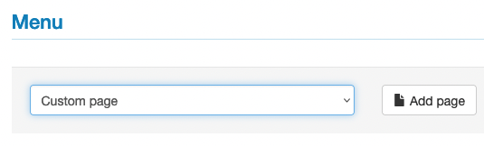

Give your page a short title: this will act as a permalink and will appear in the URL.

If your site is bilingual, remember to specify the title of the page in both languages.

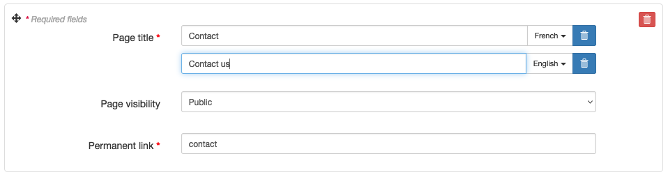

If you enter “contact” in the “Permanent link” field, the page name will be: journalsname.episciences.org/contact

You can decide whether the pages are public, private (Members only) or only visible to certain roles (Custom).

### Create a folder
It is possible to create folders to group several pages together. To create a folder, click on “Add folder”.

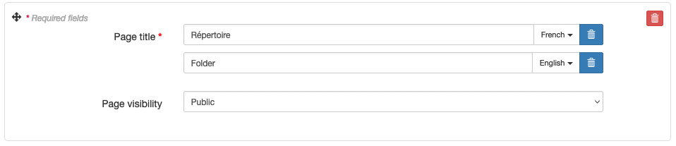

If your site is bilingual, remember to specify the title of the folder in both languages.

An example of a menu where the different pages have been organised into folders: “The journal” for the pages presenting the functioning of the publication (Editorial line, Committees, Operating charter, Evaluation process, etc.), “Contribute” for the pages intended for authors wishing to publish in the journal (Ethical charter, Submission procedures, Recommendations to authors, etc.) and “Information” for the pages presenting the general presentation of the journal (Calls for contributions, Publication policies, Credits).

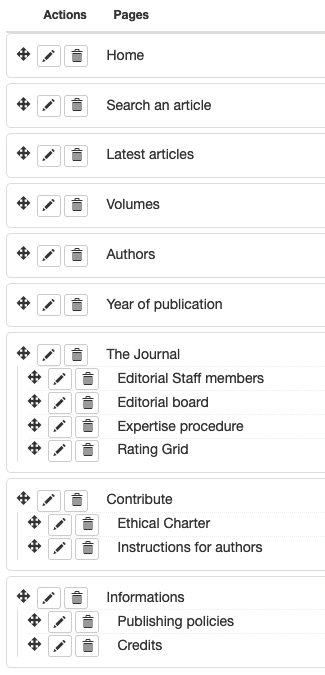

### Edit a page
To add or edit content on a page, go to the page and click on “Edit content page”.

## News
The “News” option allows you to add information to the news page. This page must have been created beforehand in the menu.

To add a news item, click on the “Add news” button.

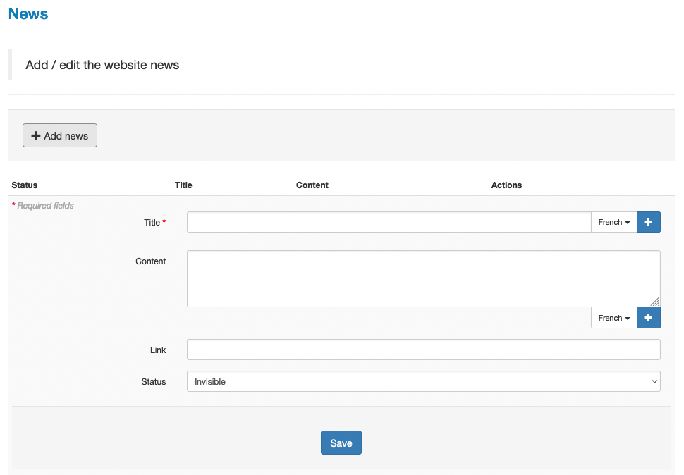

The news entry form has four fields. Fields marked with an asterisk are required.

- **Title***: title of your news item;
- **Content**: description of the news item;
- **Link**: url of the page where you can get more information;
- **Status**: Invisible / Online. The invisible status allows you to unsee the news without deleting it (to keep it in archives for example).

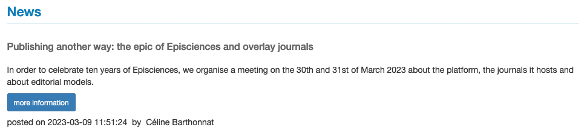

## Resources
The “Resources” option lists all the resources (text files, images, etc.) deposited on the site.

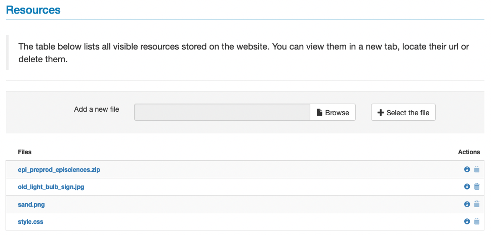