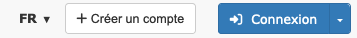
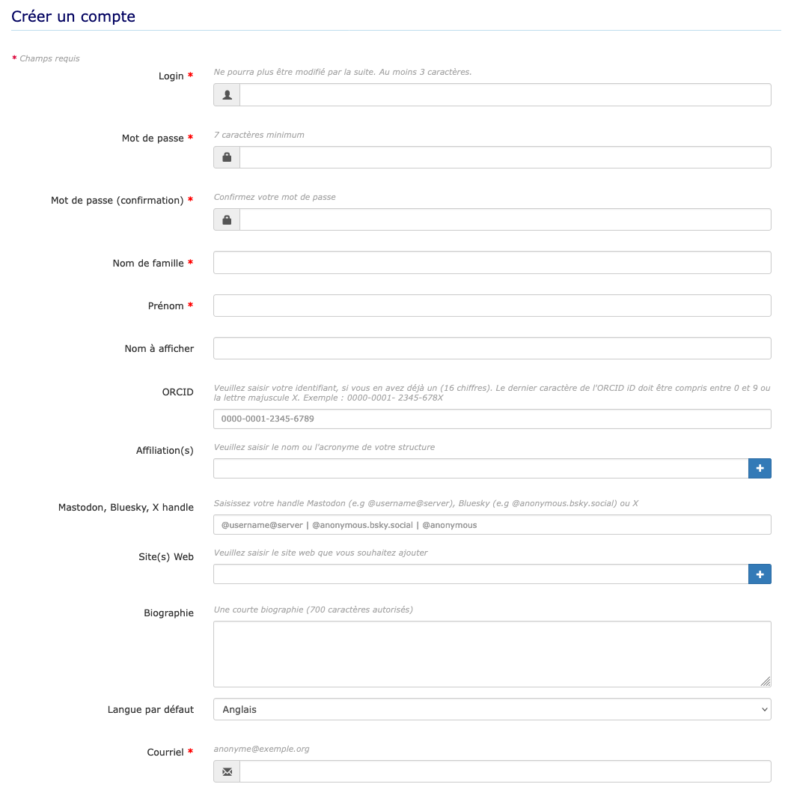
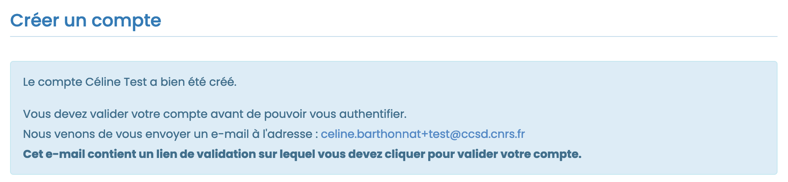
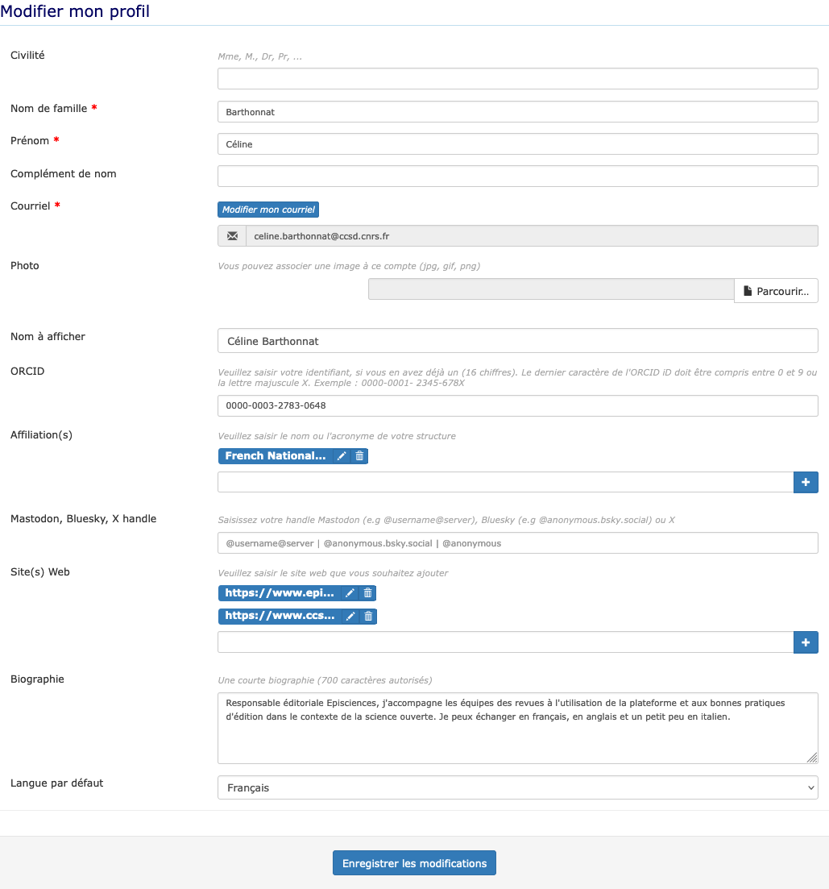
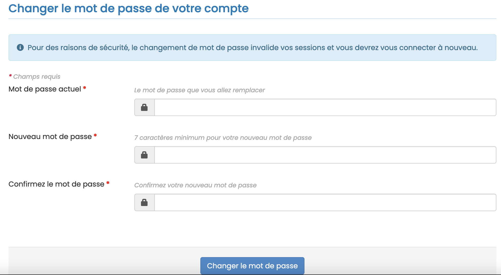
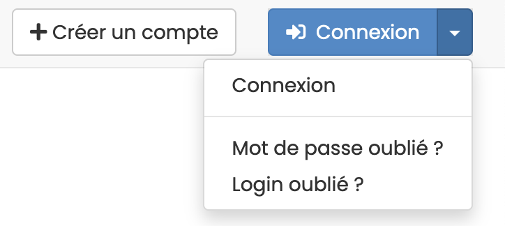

# Compte et profil

!!! tip

    Si vous avez déjà un compte sur HAL, vous n’avez pas besoin de vous créer un compte spécifique pour accéder à Episciences. Il vous suffit de renseigner vos login/mot de passe de votre compte HAL.

## Créer un compte
La création d’un compte se fait en deux étapes :

1. renseigner les informations nécessaires à la création du compte dans le formulaire dédié sur le site de la revue ;
2. valider la création du compte en cliquant sur le lien d’activation reçu par mail.

Sur le site de la revue, cliquer sur “+ Créer un compte” en haut à droite.

Les champs marqués d’un astérisque sont obligatoires.

Saisir les informations :

+ **login*** : il s’agit de votre nom d’utilisateur. Il doit comporter au minimum 3 caractères et ne pourra pas être modifié par la suite ;
+ **mot de passe*** : il doit comporter au minimum 7 caractères ;
+ **mot de passe (confirmation)*** : confirmer le mot de passe ;
+ **nom de famille*** : avec une majuscule à l’initiale (ex : Dupont) ;
+ **prénom*** : avec une majuscule à l’initiale (ex : Camille) ;
+ **nom à afficher** : par défaut, vos prénom et nom seront affichés ;
+ **ORCID** : si vous en avez déjà un, saisissez ici votre identifiant à 16 chiffres ;
+ **affiliation(s)** : nom ou acronyme de votre/vos structures (une seule par ligne : utilisez le bouton + pour ajouter des lignes supplémentaires) ;
+ **Mastodon, Bluesky, X handle** : si vous souhaitez ajouter votre compte sur l’un de ces réseaux sociaux ;
+ **site(s) web** : si vous souhaitez ajouter un site web, par exemple votre page personnelle ou votre CV HAL (un site 
  web par ligne. utilisez le + pour en ajouter un autre) ;
+ **biographie** : une courte présentation de vous-même (700 caractères maximum) ;
+ **langue par défaut** : choisir anglais ou français comme langue de navigation sur le site ;
+ **courriel*** : indiquer ici une adresse valide sur laquelle sera envoyée le lien de validation.

Cocher la case “Je suis un humain” afin de pouvoir valider les informations.

Pour finaliser l’étape de création de compte, valider celle-ci en activant le lien reçu par mail. À noter que le 
mail d’activation de compte n’est pas envoyé immédiatement (sa réception peut prendre un peu de temps). Pensez à 
vérifier que le mail n’est pas arrivé dans les courriels indésirables.

Une fois le compte créé, vous pouvez vous connecter au site.

## Modifier son profil
Pour modifier son profil, se connecter puis cliquer sur “Modifier mon profil” en haut à droite.

Les informations suivantes peuvent être ajoutées à votre compte après sa création :

+ **civilité** : Mme, M., Dr, Pr, etc. ;
+ **complément de nom** ;
+ **photo** : au format .jpg, .gif ou .png).

Vous pouvez également ajouter votre **ORCID**, renseigner vos **affiliations**, vos comptes **Mastodon, Bluesky, X 
handle**, vos **sites web**, votre **biographie** et modifier la **langue par défaut** 
de l’interface.

## Modifier son mot de passe
Pour modifier son mot de passe, se connecter puis cliquer sur “Modifier mon mot de passe” en haut à droite.

Il est nécessaire d’indiquer son mot de passe actuel pour pouvoir le modifier.

Le nouveau mot de passe doit comporter 7 caractères minimum.

## Login ou mot de passe oublié
En cas d’oubli de votre mot de passe ou de votre login, cliquez sur “Mot de passe oublié ?” ou “Login oublié ?” en haut à droite du bouton “Connexion”.

+ Si vous avez oublié votre **mot de passe**, saisissez votre login puis cliquer sur “Demander un nouveau mot de passe”. Vous recevrez un courriel contenant un lien vers une page où vous pourrez vous créer un nouveau mot de passe.
+ Si vous avez oublié votre **login** (nom d’utilisateur), saisissez l’adresse mail associée à votre compte. Vous recevrez un courriel contenant votre nom d’utilisateur.

À noter que les mails ne sont pas envoyés immédiatement (leur réception peut prendre un peu de temps). Pensez 
également à vérifier s’ils ne sont pas arrivés dans les courriels indésirables.
