# Communication Auteur-Rédacteur

Documentation des paramètres de communication entre auteurs et rédacteurs dans Episciences.

**Droits requis :** Administrateur, Secrétaire de rédaction, Rédacteur en chef

## Vue d'ensemble

Le système de communication auteur-rédacteur permet aux auteurs et aux rédacteurs d'échanger des messages directement via la plateforme Episciences. Deux paramètres contrôlent cette fonctionnalité :

1. **Autoriser les auteurs à contacter les rédacteurs**
2. **Afficher les noms des rédacteurs aux auteurs**

---

## Configuration

### Via l'interface administrateur

1. Connectez-vous en tant qu'administrateur
2. Allez dans **Gérer la revue → Revue → Paramètres**

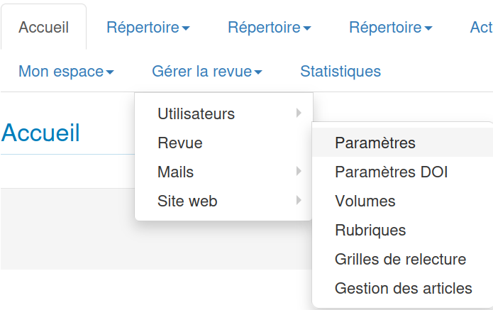

3. Section **Paramètres des rédacteurs**
4. Cochez/décochez les options souhaitées
5. Cliquez sur **Enregistrer les paramètres**

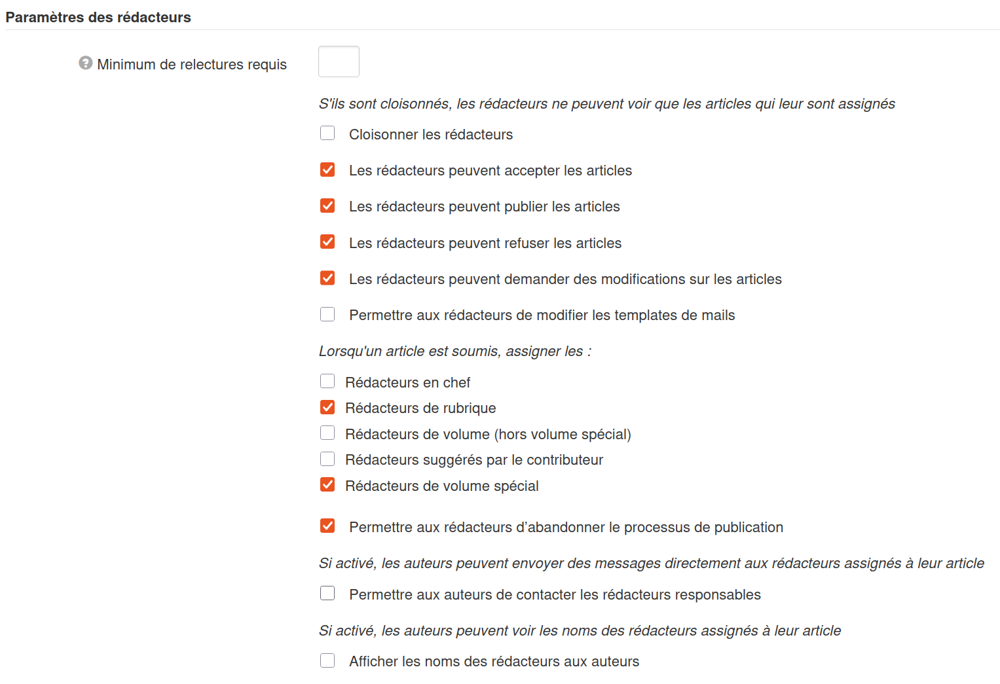

---

## Paramètres disponibles

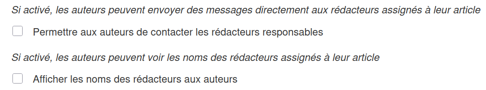

### 1. Autoriser les auteurs à contacter les rédacteurs

#### Description

Contrôle si les auteurs peuvent envoyer des messages aux rédacteurs assignés à leur article.

#### Valeurs

| Valeur        | Description                                                      |
| ------------- | ---------------------------------------------------------------- |
| **Activé**    | Les auteurs peuvent contacter les rédacteurs                     |
| **Désactivé** | Les auteurs ne peuvent pas contacter les rédacteurs (par défaut) |

#### Comportement

Lorsque ce paramètre est activé :

- Un bloc **Communication auteur-rédacteur** s'affiche sur la page de l'article pour l'auteur
- L'auteur peut envoyer un message directement aux rédacteurs assignés
- Le premier message envoyé par l'auteur est appelé **message racine**

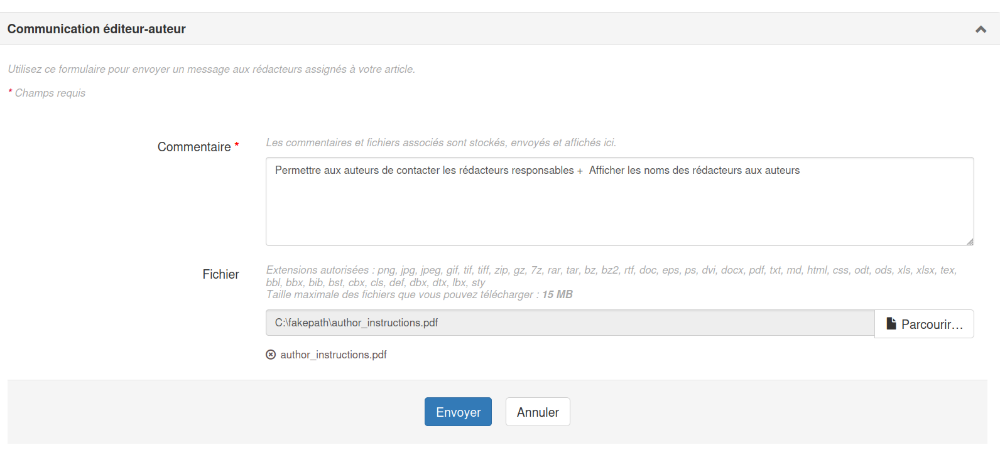

---

### 2. Afficher les noms des rédacteurs aux auteurs

#### Description

Contrôle si les noms des rédacteurs sont affichés aux auteurs ou s'ils sont anonymisés.

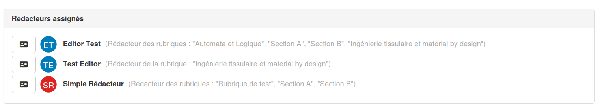

#### Valeurs

| Valeur        | Description                                              |
| ------------- | -------------------------------------------------------- |
| **Activé**    | Les noms réels des rédacteurs sont affichés              |
| **Désactivé** | Les rédacteurs sont anonymisés (affichage : "Rédacteur") |

---

## Combinaisons des paramètres

### Option 1 : Contact activé + Noms anonymisés

| Élément                   | Affichage                           |
| ------------------------- | ----------------------------------- |
| Avatar sur la chronologie | Initiales "SE" (System Episciences) |
| Nom dans le message       | "Rédacteur"                         |
| Email de notification     | "Rédacteur"                         |

### Exemple : Avatar et nom anonymisés

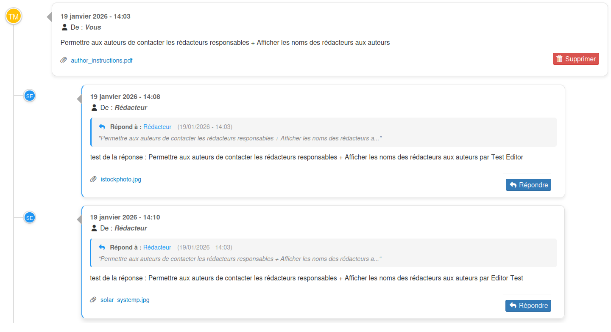

### Notification par email avec expéditeur anonymisé

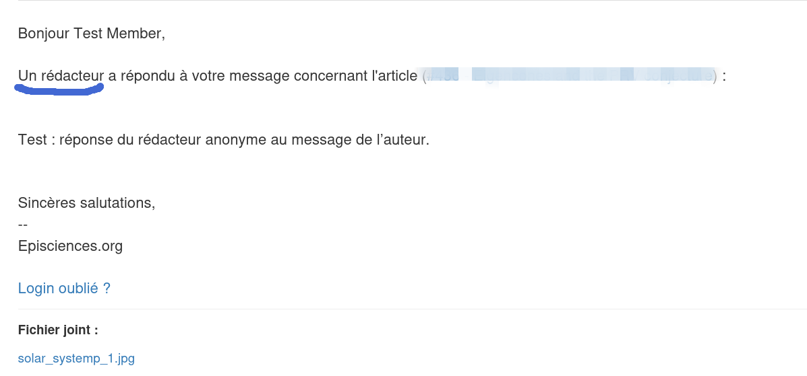

### Option 2 : Contact activé + Noms affichés

| Élément                   | Affichage                             |
| ------------------------- | ------------------------------------- |
| Avatar sur la chronologie | Initiales du rédacteur                |
| Nom dans le message       | Nom et prénom du rédacteur            |
| Email de notification     | Nom et prénom du rédacteur            |
| Bloc rédacteurs           | Liste des rédacteurs assignés visible |

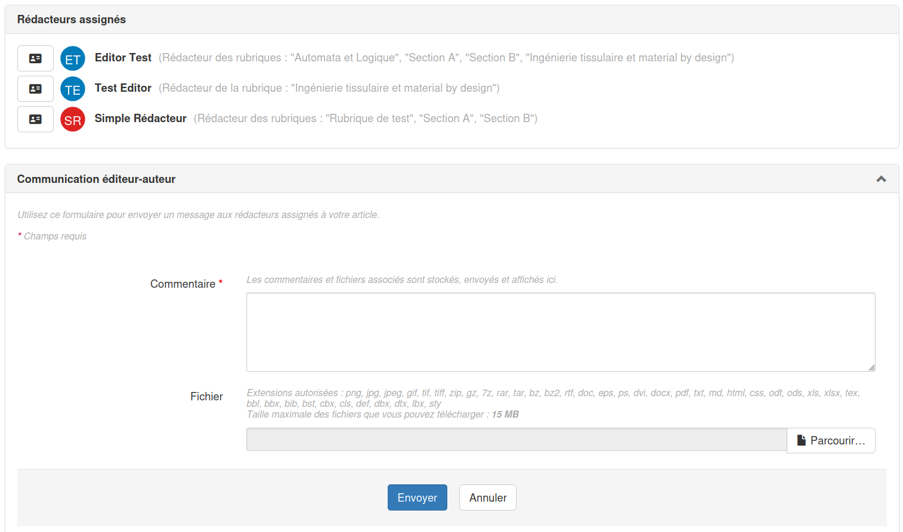

### Exemple : Avatar et nom identifiés

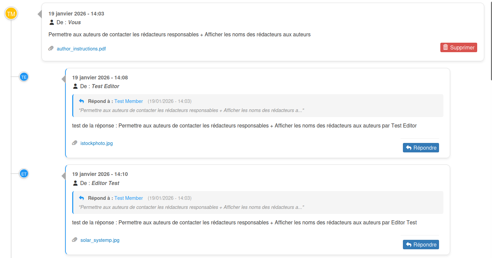

### Notification par email avec nom de l'expéditeur

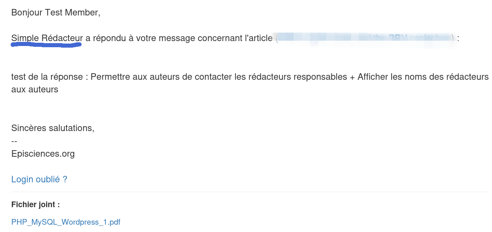

---

## Fonctionnalités de la conversation

### Messages et réponses

- L'auteur initie la communication avec un **message racine**
- Les rédacteurs assignés reçoivent une notification par email
- Les rédacteurs peuvent répondre plusieurs fois
- L'auteur peut également répondre plusieurs fois
- Toutes les réponses à un message racine sont affichées **chronologiquement** dans un bloc
- Les bordures bleues indiquent les messages de réponse

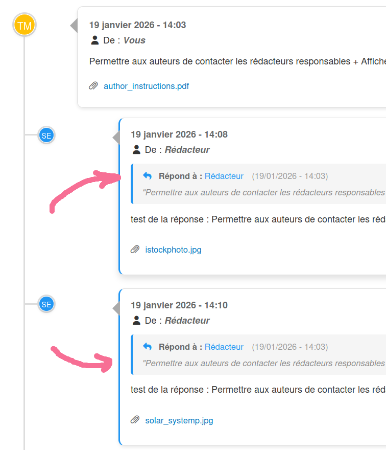

### Fichiers attachés

- Les auteurs et rédacteurs peuvent joindre des fichiers à leurs messages
- Chaque utilisateur peut supprimer ses propres fichiers attachés uniquement

### Identification visuelle

| Rôle      | Couleur de l'avatar |
| --------- | ------------------- |
| Rédacteur | Bleu                |
| Auteur    | Jaune               |

---

## Notifications par email

### Lorsqu'un auteur envoie un message

Les destinataires sont :

- Les **rédacteurs assignés** reçoivent une notification
- Les **co-auteurs** reçoivent également une notification

#### Messages personnalisés pour les rédacteurs assignés

| Langue   | Message                                                            |
| -------- | ------------------------------------------------------------------ |
| Français | "nouveau message concernant un article dont vous êtes responsable" |
| Anglais  | "new message about an article you're managing"                     |

#### Messages personnalisés pour les co-auteurs

| Langue   | Message                                                        |
| -------- | -------------------------------------------------------------- |
| Français | "nouveau message concernant un article que vous avez co-signé" |
| Anglais  | "new message about an article you co-authored"                 |

### Lorsqu'un rédacteur répond à un message

Les destinataires sont :

- L'**auteur principal** reçoit une notification
- Les **co-auteurs** reçoivent également une notification

Tous les auteurs (auteur principal et co-auteurs) sont informés de la réponse du rédacteur.

Cette personnalisation permet à chaque destinataire de comprendre immédiatement son rôle par rapport à l'article.
