# Communication Auteur-Rédacteur

Ce guide explique comment configurer et utiliser le système de communication entre auteurs et rédacteurs dans Episciences.

**Droits requis :** Administrateur, Secrétaire de rédaction ou Rédacteur en chef

## Vue d'ensemble

Le système de communication auteur-rédacteur permet l'échange de messages directs entre les auteurs et leurs rédacteurs assignés via la plateforme Episciences. Deux paramètres contrôlent cette fonctionnalité :

1. **Communication auteur-rédacteur** — Activer ou désactiver la messagerie directe
2. **Afficher les noms des rédacteurs aux auteurs** — Afficher les noms réels ou anonymiser les rédacteurs

---

## Configuration

### Accéder aux paramètres

1. Connectez-vous en tant qu'administrateur
2. Naviguez vers **Gérer la revue → Revue → Paramètres**

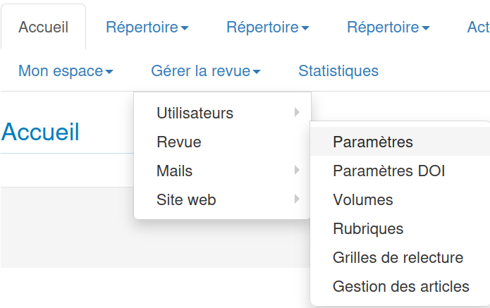

3. Faites défiler jusqu'à la section **Paramètres des rédacteurs**
4. Activez ou désactivez les options souhaitées
5. Cliquez sur **Enregistrer les paramètres**

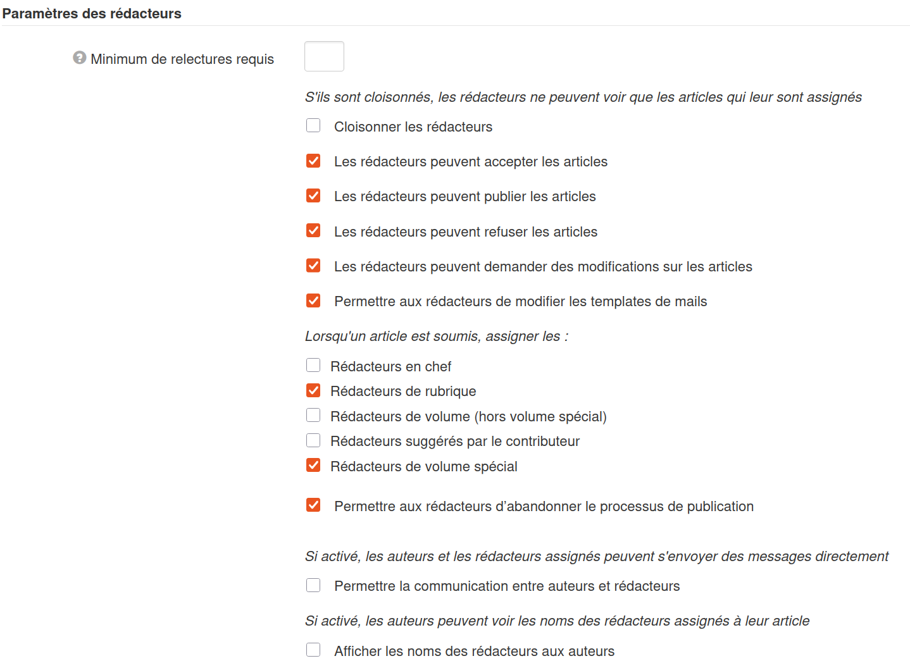

---

## Paramètres disponibles

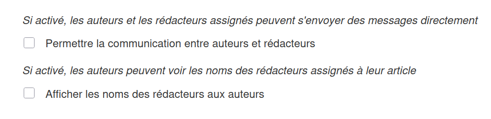

### 1. Communication auteur-rédacteur

Ce paramètre contrôle si les auteurs et leurs rédacteurs assignés peuvent échanger des messages directement.

| Valeur        | Description                                        |
| ------------- | -------------------------------------------------- |
| **Activé**    | Les auteurs et rédacteurs peuvent s'envoyer des messages |
| **Désactivé** | La messagerie directe n'est pas disponible (par défaut)  |

Lorsque ce paramètre est activé :

- Un bloc **Communication auteur-rédacteur** apparaît sur la page de l'article pour l'auteur et les rédacteurs assignés
- L'une ou l'autre partie peut initier une conversation en envoyant le premier message (appelé **message racine**)
- Les deux parties peuvent envoyer plusieurs réponses dans le même fil de conversation

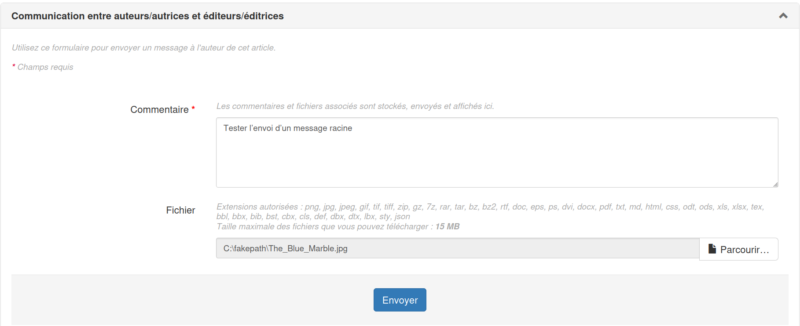

---

### 2. Afficher les noms des rédacteurs aux auteurs

Ce paramètre contrôle si l'identité des rédacteurs est visible par les auteurs ou anonymisée.

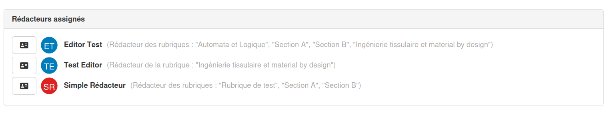

| Valeur        | Description                                                   |
| ------------- | ------------------------------------------------------------- |
| **Activé**    | Les noms réels des rédacteurs sont affichés aux auteurs       |
| **Désactivé** | Les rédacteurs apparaissent anonymement comme "Rédacteur" (par défaut) |

---

## Combinaisons des paramètres

Les deux paramètres peuvent être combinés pour obtenir différents niveaux de confidentialité et de transparence.

### Messagerie activée + Noms des rédacteurs masqués

Lorsque la messagerie directe est activée mais que les noms des rédacteurs sont masqués :

| Élément                   | Affichage                           |
| ------------------------- | ----------------------------------- |
| Avatar sur la chronologie | Initiales "SE" (System Episciences) |
| Nom dans le message       | "Rédacteur"                         |
| Email de notification     | "Rédacteur"                         |

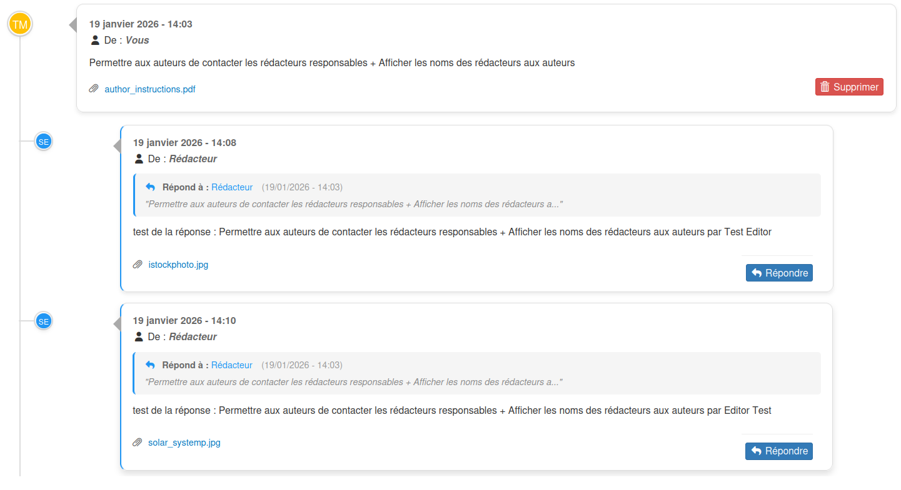

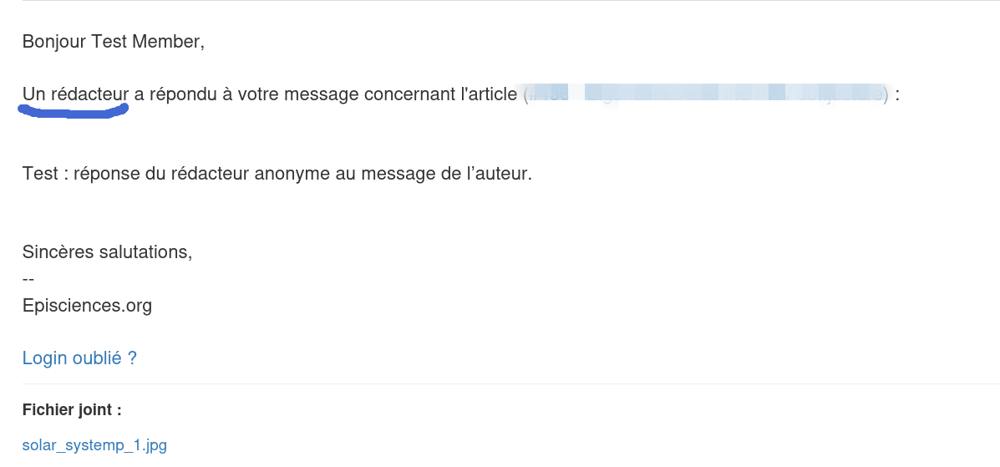

### Messagerie activée + Noms des rédacteurs visibles

Lorsque la messagerie directe et les noms des rédacteurs sont tous deux activés :

| Élément                   | Affichage                             |
| ------------------------- | ------------------------------------- |
| Avatar sur la chronologie | Initiales du rédacteur                |
| Nom dans le message       | Nom complet du rédacteur              |
| Email de notification     | Nom complet du rédacteur              |
| Bloc rédacteurs           | Liste des rédacteurs assignés visible |

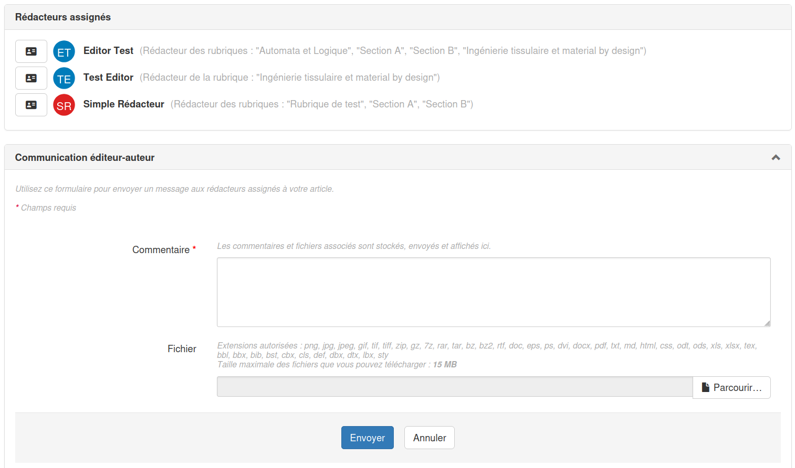

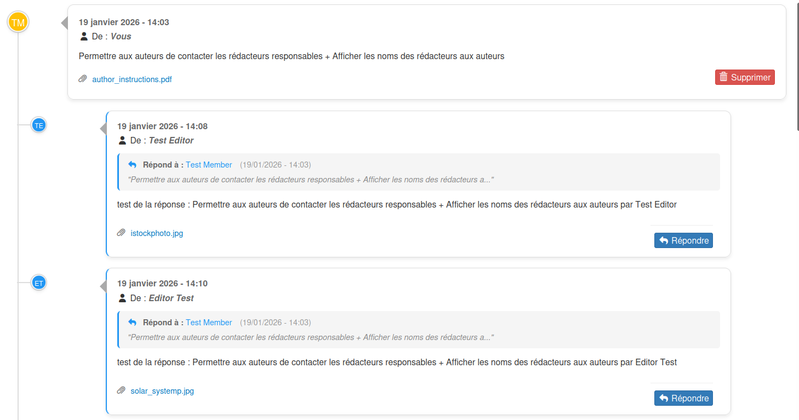

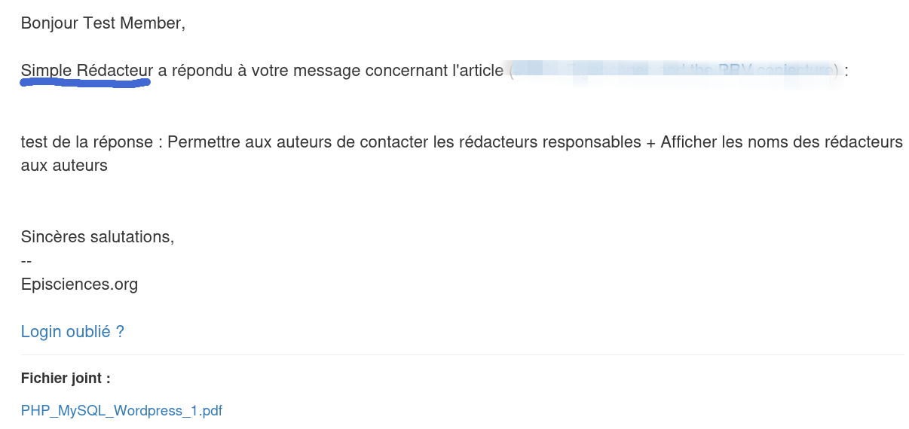

---

## Fonctionnalités de la conversation

### Messages et réponses

L'auteur ou un rédacteur peut initier une conversation en envoyant un **message racine**. Ensuite :

- Les deux parties peuvent envoyer plusieurs réponses
- Tous les messages sont affichés chronologiquement dans le fil de conversation
- Les réponses sont visuellement distinguées par une bordure bleue
- Chaque nouveau message déclenche une notification par email à l'autre partie

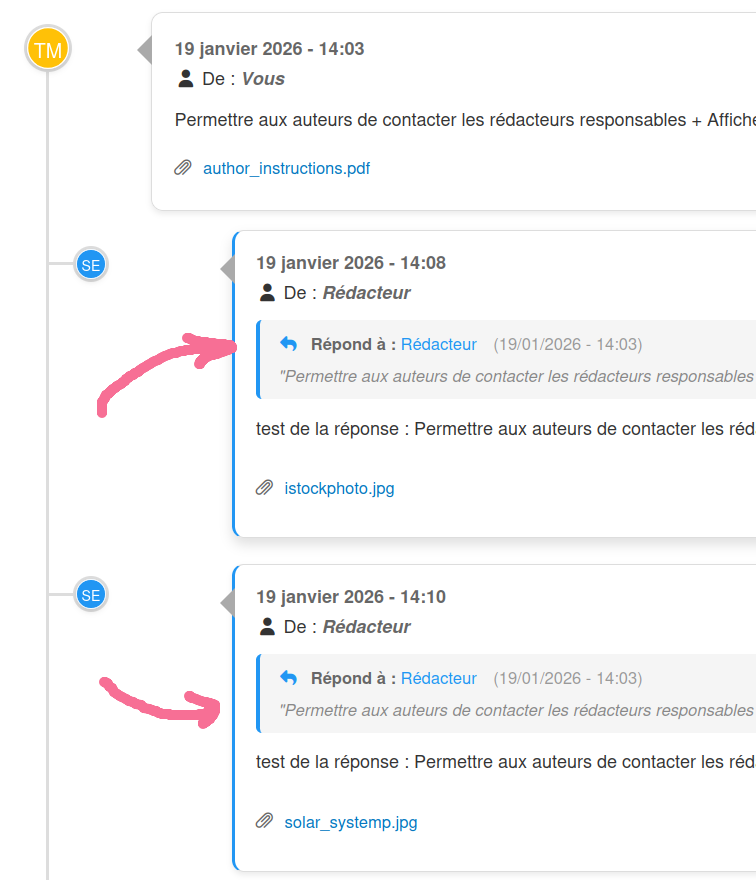

### Fichiers joints

Les auteurs et les rédacteurs peuvent joindre des fichiers à leurs messages. Chaque utilisateur ne peut supprimer que ses propres fichiers joints.

### Identification visuelle

Chaque rôle possède une couleur d'avatar distincte pour faciliter l'identification :

| Rôle      | Couleur de l'avatar |
| --------- | ------------------- |
| Rédacteur | Bleu                |
| Auteur    | Jaune               |

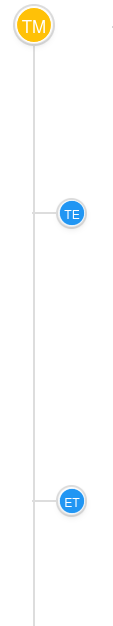

---

## Notifications par email

Les notifications par email permettent à toutes les parties concernées de rester informées des nouveaux messages.

### Lorsqu'un auteur envoie un message

Les destinataires suivants sont notifiés :

- **Rédacteurs assignés** — responsables de l'article
- **Co-auteurs** — collaborateurs de l'article

Chaque destinataire reçoit une notification personnalisée selon son rôle :

| Destinataire        | Message en français                                                | Message en anglais                                 |
| ------------------- | ------------------------------------------------------------------ | -------------------------------------------------- |
| Rédacteurs assignés | "nouveau message concernant un article dont vous êtes responsable" | "new message about an article you're managing"     |
| Co-auteurs          | "nouveau message concernant un article que vous avez co-signé"     | "new message about an article you co-authored"     |

### Lorsqu'un rédacteur répond

Les destinataires suivants sont notifiés :

- **Auteur principal** — le contact principal de l'article
- **Co-auteurs** — tous les autres auteurs listés sur l'article

Cette personnalisation selon le rôle aide chaque destinataire à comprendre immédiatement sa relation avec l'article et le contexte du message.
