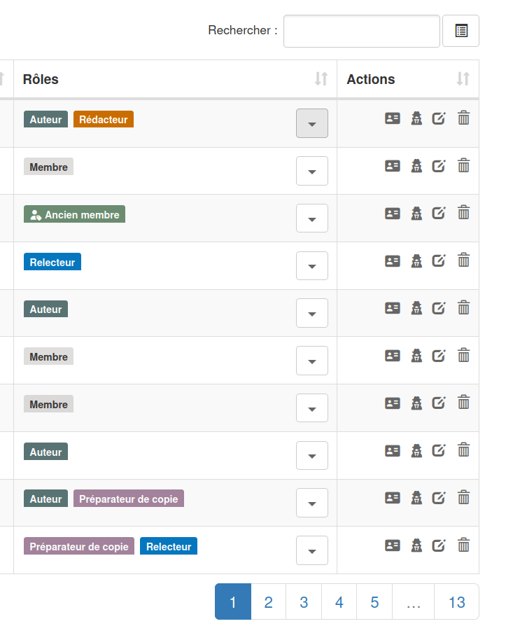
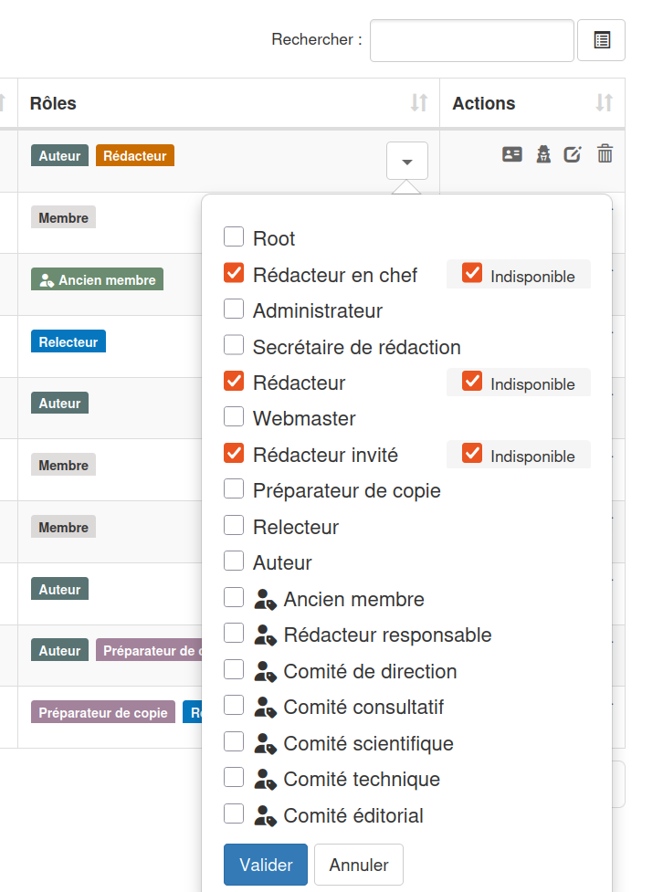
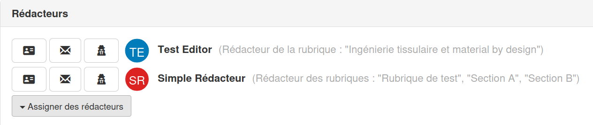
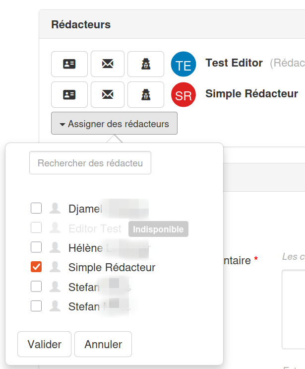
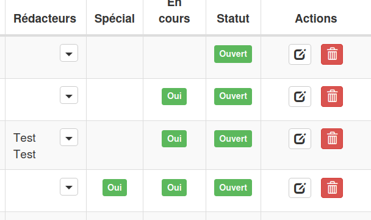

# Disponibilité des rédacteurs

**Droits :** Administrateur, Secrétaire de rédaction

## Vue d'ensemble

Cette fonctionnalité permet de gérer la disponibilité des rédacteurs (rédacteur, rédacteur en chef et rédacteur invité) dans le système Episciences. Les rédacteurs peuvent être marqués comme "indisponibles", ce qui :

- Empêche leur assignation à de nouveaux articles
- Affiche visuellement leur statut avec un badge "Indisponible"
- Permet de les désassigner des articles existants
- **Empêche leur réassignation une fois désassignés** (tant qu'ils restent indisponibles)

## Contexte

Auparavant, il n'existait aucun mécanisme pour indiquer qu'un rédacteur n'était pas disponible pour traiter de nouveaux articles (congés, surcharge de travail, etc.). Cela pouvait conduire à des assignations inappropriées et nécessitait une communication manuelle pour éviter d'assigner des articles à des rédacteurs temporairement indisponibles.

## Fonctionnalités implémentées

### Capacités principales

1. **Marquage de disponibilité** : possibilité de marquer un rédacteur comme disponible ou indisponible
2. **Indicateurs visuels** : affichage d'un badge "Indisponible" pour les rédacteurs non disponibles
3. **Prévention d'assignation** : les rédacteurs indisponibles ne peuvent pas être assignés à de nouveaux articles
4. **Gestion flexible de désassignation** :
    - possibilité de désassigner un rédacteur indisponible déjà assigné
    - **protection contre la réassignation** : une fois désassigné, un rédacteur indisponible ne peut pas être réassigné tant qu'il n'est pas redevenu disponible

### Rôles concernés

La fonctionnalité s'applique aux trois rôles d'édition :

- **Rédacteur**
- **Rédacteur en chef**
- **Rédacteur invité**

## Workflow utilisateur

### 1. Marquer un rédacteur comme indisponible

1. Aller dans la section "Utilisateurs" de l'administration

2. Cliquer sur le bouton "▼" à côté du nom d'un utilisateur ayant un rôle de rédacteur
3. Dans le formulaire popup, cocher la case "Indisponible" pour le rôle de rédacteur concerné
4. Cliquer sur "Valider"

**Note** : La case "Indisponible" n'apparaît que pour les rôles de rédacteur (Rédacteur, Rédacteur en chef, Rédacteur invité)

### 2. Visualiser les rédacteurs indisponibles

Les rédacteurs marqués comme indisponibles apparaissent avec :

- Un badge gris "Indisponible" à côté de leur nom
- Une icône de rôle :
    - ⭐ (étoile) pour Rédacteur invité
    - 👤 (utilisateur) pour Rédacteur

Ces badges apparaissent dans :

- Les listes d'articles (colonne Rédacteurs)

- Les formulaires d'assignation de rédacteurs aux articles

Sur la page d'administration de l'article, une section permet d'assigner les rédacteurs :

Cliquer sur le bouton "Assigner des rédacteurs" :

- Les formulaires d'assignation de rédacteurs aux volumes (les rédacteurs invités sont spécifiquement pour les volumes)

  Cliquer sur le bouton "▼" dans la colonne "Rédacteurs" :

### 3. Assigner des rédacteurs à un article ou un volume

Lors de l'assignation de rédacteurs à un article/volume :

- Les rédacteurs indisponibles apparaissent en grisé avec le badge "Indisponible"

- Leurs cases à cocher sont **désactivées** et ne peuvent pas être cochées

- Si un rédacteur indisponible est déjà assigné, il peut être **décoché** (désassigné)

!!! important
    - Une fois décoché, il ne peut plus être re-coché tant qu'il reste indisponible
    - La case à cocher se désactive automatiquement après avoir été décochée
    - Pour pouvoir réassigner ce rédacteur, il faut d'abord le rendre "Disponible" dans la gestion des utilisateurs

### 4. Rendre un rédacteur à nouveau disponible

1. Aller dans la section "Utilisateurs" de l'administration
2. Cliquer sur le bouton "▼" à côté du nom du rédacteur
3. Décocher la case "Indisponible"
4. Cliquer sur "Mettre à jour les rôles"

Le rédacteur peut maintenant être assigné à de nouveaux articles.
