# Changer le contributeur

## Présentation

La fonctionnalité "Changement de contributeur" permet aux utilisateurs autorisés de transférer la propriété d'un article d'un contributeur à un autre.

## Permissions requises pour changer le contributeur

Seuls les rôles suivants peuvent changer le contributeur d'un article :

- **Administrateurs**
- **Rédacteurs en chef**

## Procédure

1. Accédez à la page d'administration de l'article
2. Dans le panneau **Contributeur**, cliquez sur le bouton **Changer le contributeur**
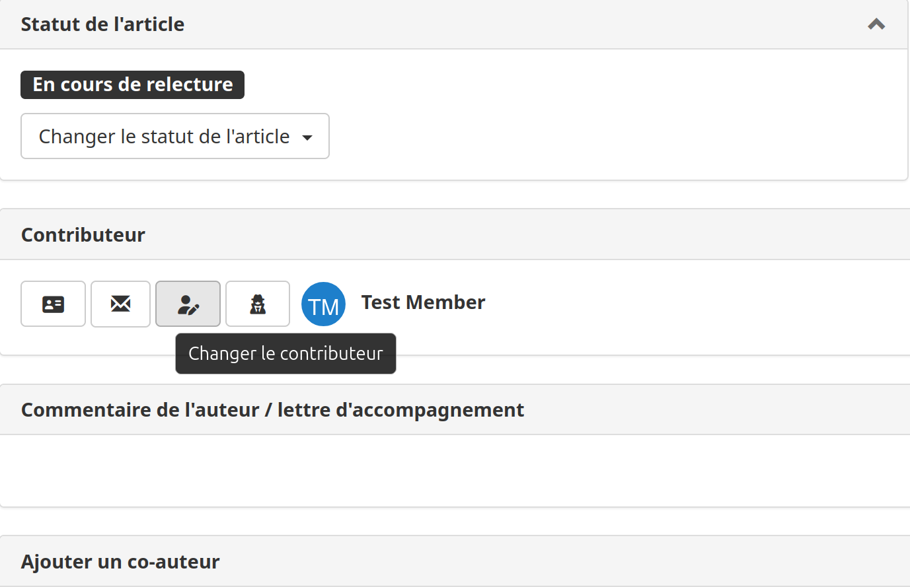
3. Une fenêtre modale s'ouvre :
    - Recherchez le nouveau contributeur par nom ou email
    - Sélectionnez l'utilisateur dans les résultats de l'autocomplétion
    - Cochez éventuellement **"Ajouter l'ancien contributeur comme co-auteur"** (coché par défaut)
4. Cliquez sur **Confirmer** pour appliquer le changement
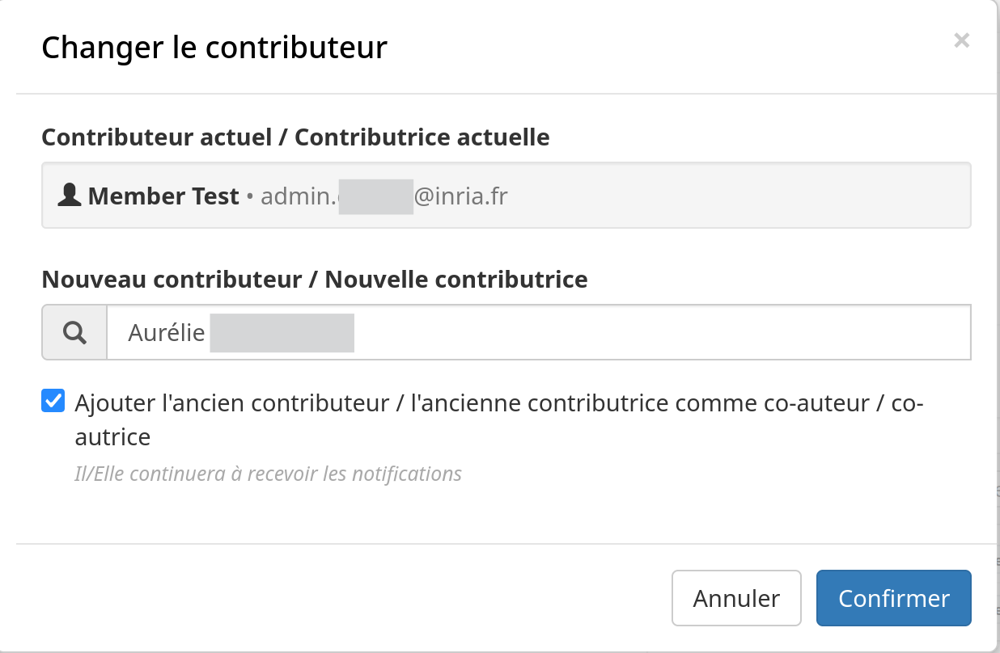

## Option Ajouter l'ancien contributeur comme co-auteur

Lorsque cette option est **cochée** :

- L'ancien contributeur est ajouté comme co-auteur de l'article

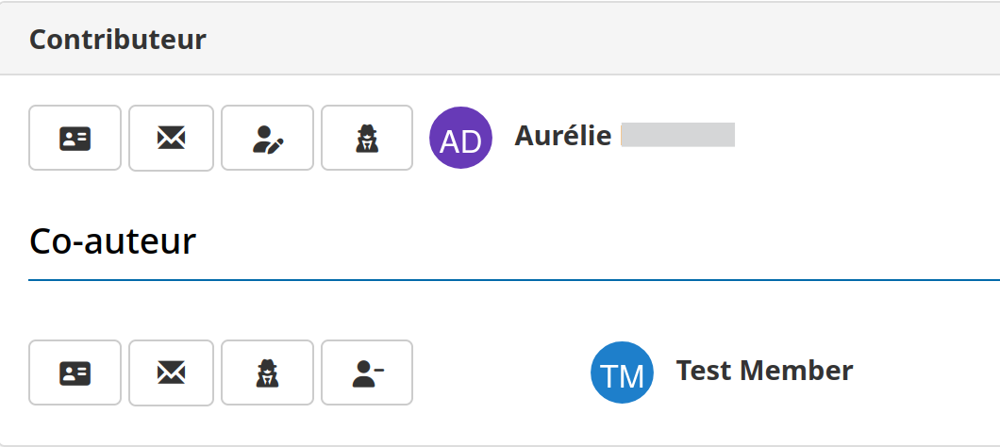

- Il continuera à recevoir des notifications concernant l'article
- Il peut toujours voir l'article dans son espace auteur

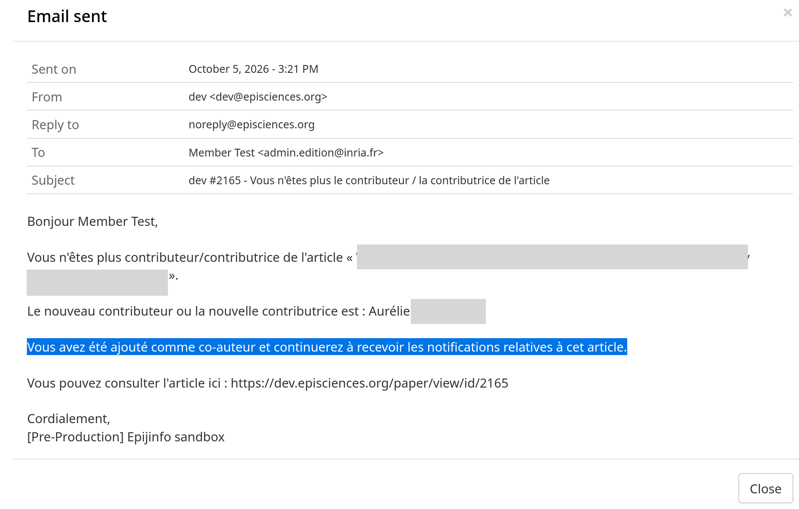

- Notification reçue par le nouveau contributeur :

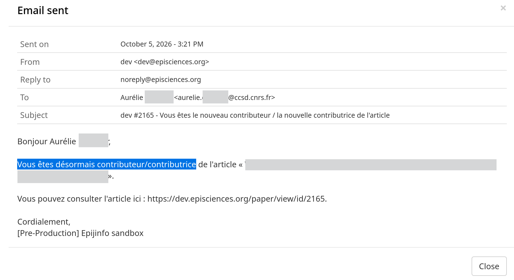

Lorsque cette option est **décochée** :

- L'ancien contributeur n'est pas ajouté comme co-auteur
- L'ancien contributeur reçoit une notification du changement, mais ne recevra plus de notifications concernant cet article par la suite.

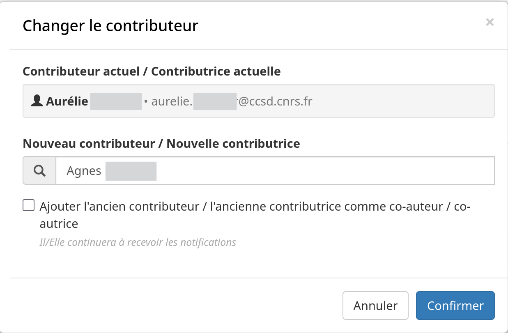

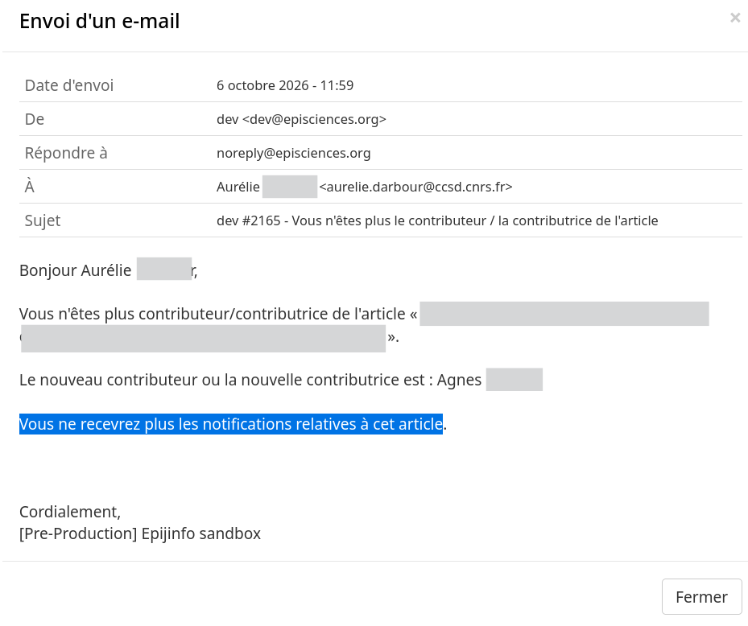

## Co-auteur devenant contributeur

Un co-auteur peut être sélectionné comme nouveau contributeur. Dans ce cas :
- Son rôle de co-auteur est automatiquement supprimé
- Il devient le contributeur principal (propriétaire) de l'article

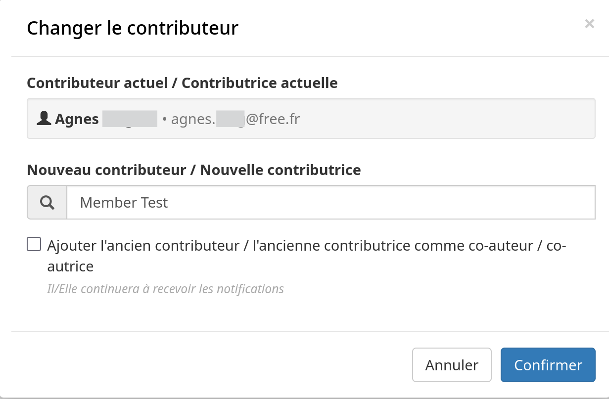

## Journal d'activité

L'action est enregistrée dans l'historique de l'article avec les détails suivants :
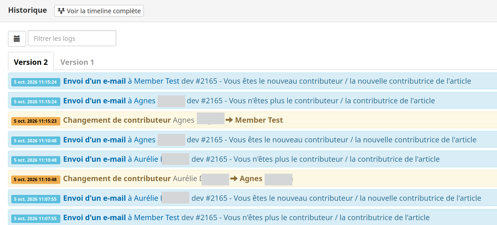

## Affichage dans la chronologie

Dans la chronologie de l'article (panneau historique), le changement de contributeur apparaît comme suit :

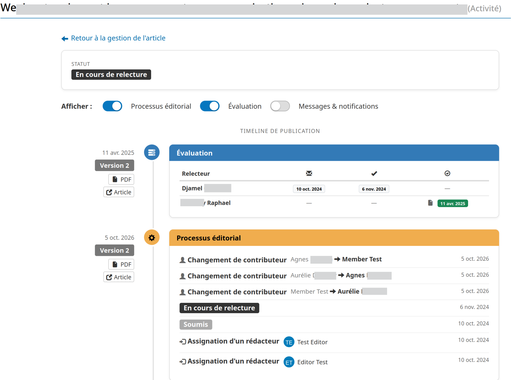

## Notifications par email

Deux notifications par email sont envoyées lors du changement de contributeur, vous pouvez consulter les modèles d'email ici :

- Notification au nouveau contributeur
- Notification à l'ancien contributeur

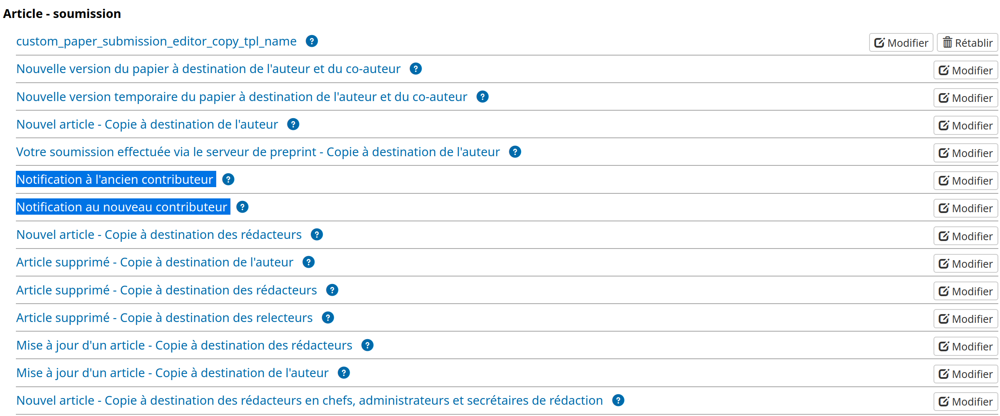

