# Gestion des références bibliographiques

> **Rôles** : administrateur, auteur, rédacteur en chef, secrétaire de rédaction

## L’application “Episciences Citations”
Episciences est dotée d’une application d’extraction des références bibliographiques, “Episciences Citations”. 

### Qu’est-ce que “Episciences Citations” ?
L’application permet d’extraire automatiquement et de gérer manuellement les références bibliographiques contenues dans les documents acceptés pour publication. Une fois validées, ces références sont affichées sur les pages publiques des documents/articles. Elles sont également ajoutées aux exports pour CrossRef et ZbMath Open.

### Fonctionnement
L’application extrait les références bibliographiques du PDF du document via l’outil [Grobid](https://grobid.readthedocs.io/en/latest/ "Grobid") (*GeneRation Of 
BIbliographic Data*).

### Affichage
Voici un exemple d’affichage des références extraites d’un article (source : Stéphane André et Camille Noûs, 
“Solving viscoelastic problems with a Laplace transform approach supplanted by ARX models, suggesting a way to 
upgrade Finite Element or spectral codes”, *Journal of Theoretical, Computational and Applied Mechanics*, publié le 
10 octobre 2023, [https://doi.org/10.46298/jtcam.10304](https://doi.org/10.46298/jtcam.10304 "Visualiser l'article")).

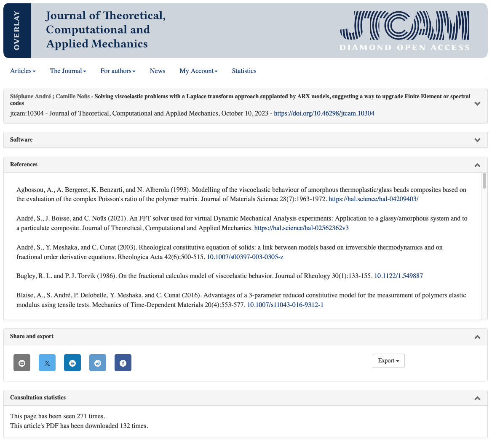

## Gérer les références
Seules les personnes ayant les droits de gérer les documents (rôles : administrateur, auteur, rédacteur, rédacteur en chef, secrétaire de rédaction) ont accès à cette fonctionnalité.

La modification manuelle des références extraites est accessible pour les documents ayant le statut “accepté et prêt à 
publier” ou “publié”.

Pour vérifier et modifier les références, se rendre sur la page de gestion d’un article.

Dans l’onglet “Références bibliographiques”, cliquer sur “Gérer”.

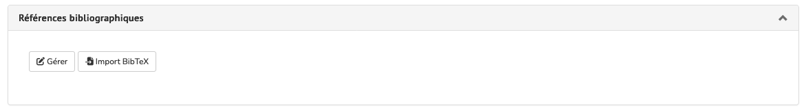

L’application “Episciences Citations” s’ouvre dans un nouvel onglet. Par défaut, l’interface est en anglais : 
cliquer en haut à droite sur “fr” pour afficher celle-ci en français.

L’interface présente deux parties distinctes :

- à gauche, le PDF en mode prévisualisation ;
- à droite, les références identifiées et extraites automatiquement via Grobid.

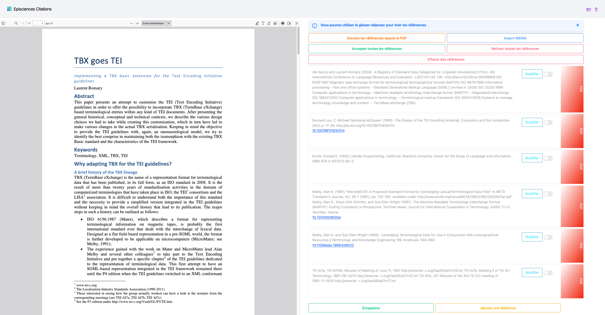

Plusieurs actions sont possibles :

1. Accepter toutes les références
2. Refuser toutes les références
3. Modifier une référence
4. Ajouter une référence
5. Ordonner les références
6. Extraire à nouveau les références
7. Importer un fichier BibTeX

Voyons en détail chacune des actions proposées.

### Accepter toutes les références
Cliquez sur le bouton “Accepter toutes les références”. Les coches à droite de chaque référence passent au vert. Cliquez sur “Enregistrer”.

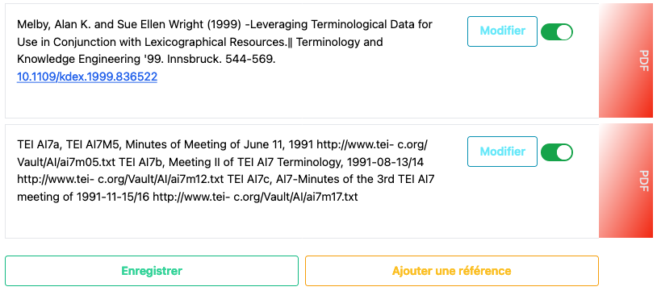

### Refuser toutes les références
Cliquez sur le bouton “Refuser toutes les références”. Les coches à droite de chaque référence se grisent. Cliquez sur “Enregistrer”.

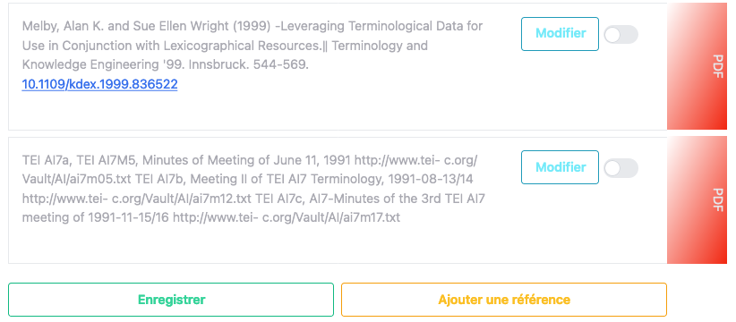

### Modifier une référence
Pour modifier une référence, cliquez sur le bouton “Modifier” en regard de la référence.

Le champ de la référence est désormais éditable ce qui permet de modifier les informations. Un champ dédié permet d’ajouter le DOI du document ou encore une URL.

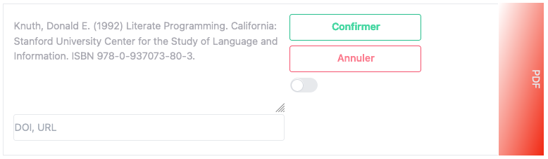

Cliquez sur “Confirmer” pour valider les corrections.

La référence modifiée apparaît désormais en noir et la coche passe au vert pour confirmer la modification.

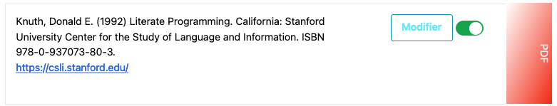

Vous pouvez modifier à nouveau la référence en cliquant sur “Modifier”, autant de fois que nécessaire.

Cliquez ensuite sur “Enregistrer” pour sauvegarder les modifications.

### Ajouter une référence
Il peut arriver que l’extraction automatique manque une référence ou bien fusionne plusieurs références en une (cas ci-dessous).

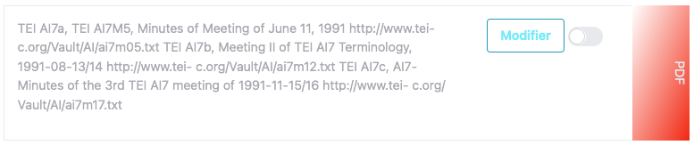

Dans ce cas, l’option “Ajouter une référence” permet de dissocier les références fusionnées.

Cliquez sur le bouton “Ajouter une référence”. Une fenêtre s’ouvre avec deux champs à compléter : “Référence” et “DOI, URL”.
Note : pour que l’URL soit cliquable, il faut qu'elle commence impérativement par http ou https.

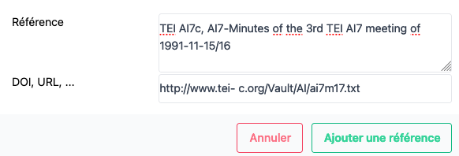

Une fois les champs de la référence renseignés, cliquez sur “Ajouter une référence”.
La nouvelle référence est ajoutée en fin de liste et automatiquement validée. La mention “UTILISATEUR” sur fond vert apparaît sur le côté droit de la référence ce qui permet de la distinguer des références extraites du PDF.

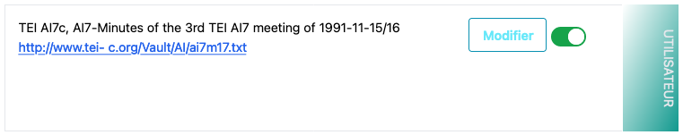

### Ordonner les références
Pour déplacer une référence acceptée, cliquez dans le bloc de celle-ci et maintenez-le appuyé en le glissant vers le haut ou le bas. Relâchez le bloc à l’endroit souhaité puis cliquez sur “Enregistrer”.

### Valider les références
Pour valider votre travail sur les références et retourner à la page de gestion du document, cliquez sur “Enregistrer” puis fermez l’onglet “Episciences Citations”.

Pour faire apparaître les références sur la page de gestion du document, vous devez rafraîchir la page.

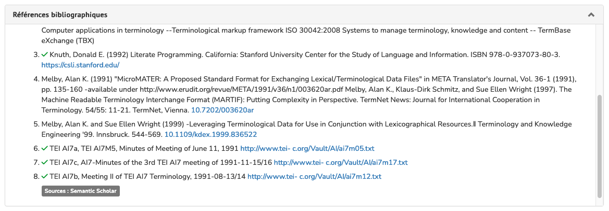

Les références validées sont précédées d’une coche verte. Cela signifie que seules ces références apparaissent sur la page publique du document.

Les liens (DOI, URL) qui ont été ajoutés dans le champ dédié sont cliquables.

### Importer un fichier BibTeX
Sur la page du document, dans l’onglet “Références bibliographiques”, cliquer sur “Import BibTeX”.

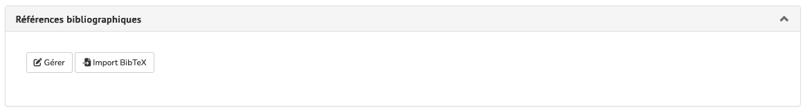

L’application “Episciences Citations” s’ouvre dans un nouvel onglet. Cliquer sur le bouton “Import BibTeX” en haut à droite : une fenêtre s’ouvre permettant de charger un fichier .bibtex

## Visualiser les références
Les références sont désormais visibles dans l’onglet “Références bibliographiques” sur la page publique du document.

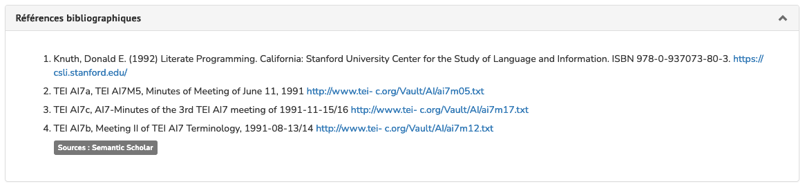
