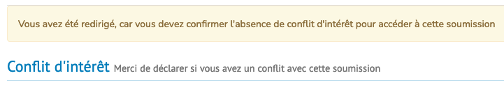
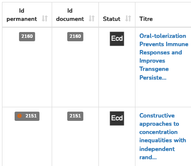
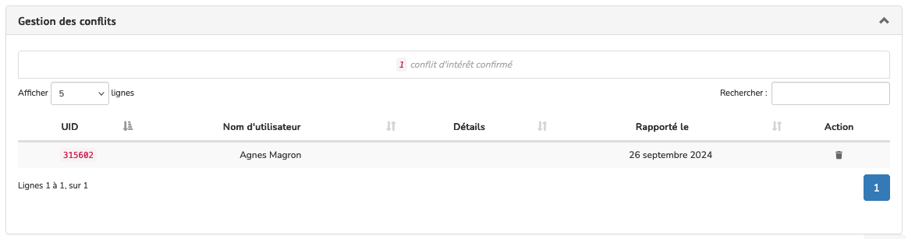

# Conflit d’intérêt

> **Rôle** : administrateur, rédacteur, rédacteur en chef, rédacteur invité, secrétaire de rédaction

Il est possible d’activer une option pour permettre aux rédacteurs de déclarer un conflit d’intérêt avant l’évaluation.

## Paramétrage
Pour activer cette option, aller dans : Gérer la revue > Revue > Paramètres > Paramètres supplémentaires.

Cocher la case “Activer la déclaration CI” puis enregistrer les paramètres.

Cette option doit rester active durant tout le processus éditorial d’un article (il n’est pas possible de l’activer à la demande puis de la désactiver après la soumission).

### À noter
- quand l’option est activée, tous les rédacteurs en chef, rédacteurs et secrétaires d’édition doivent faire cette déclaration à chaque soumission ;
- les noms des relecteurs sont cachés sur la page de management des articles.

## Signaler un conflit d’intérêt
Lorsque la personne chargée de la soumission (rédacteur, rédacteur en chef, rédacteur invité ou secrétaire de rédaction) se rend sur la page de suivi, elle n’a pas immédiatement accès à la page de gestion de la soumission. Elle doit préciser au préalable si elle a un conflit d’intérêt.

Trois possibilités :

1. “Je n’ai pas de conflit d’intérêt” (bouton vert) permet d’accéder à la page complète de soumission.
2. “J’ai un conflit d’intérêt” (bouton orange) empêche d’accéder à la page complète de soumission. Si le rédacteur 
   souhaite préciser la raison du conflit d’intérêt, il doit renseigner le champ “Commentaire facultatif” avant de cliquer sur le bouton.
3. “Décider plus tard” (bouton blanc), permet de revenir sur la page de présentation de la soumission.

Dans le tableau de bord, une icône orange à gauche de l’identifiant permanent indique qu’au moins un conflit a été 
signalé pour l’article.

## Supprimer un conflit d’intérêt
Seuls les rédacteurs en chef, les secrétaires de rédaction ou les administrateurs peuvent supprimer un conflit d’intérêt.

Pour supprimer un conflit d’intérêt sur une soumission, se rendre sur la page de gestion de la soumission. Dans l’onglet “Gestion des conflits”, cliquer sur l’icône poubelle correspondant au conflit d’intérêt que l’on souhaite supprimer.

