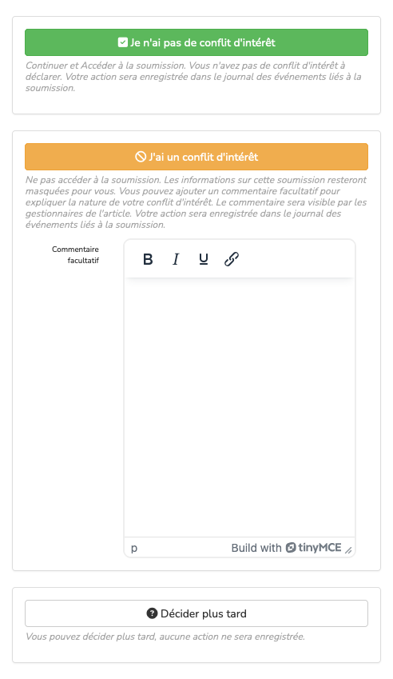

# Conflit d’intérêt

> **Rôle** : administrateur, rédacteur, rédacteur en chef, rédacteur invité, secrétaire de rédaction

Il est possible d’activer une option pour permettre aux rédacteurs de déclarer un conflit d’intérêt avant l’évaluation.

## Paramétrage
Pour activer cette option, aller dans : Gérer la revue > Revue > Paramètres > Paramètres supplémentaires.

Cocher la case “Activer la déclaration CI” puis enregistrer les paramètres.

## Signaler un conflit d’intérêt
Lorsque le rédacteur se rend sur la soumission, il n’a pas immédiatement accès à la page complète de la soumission. Il doit préciser au préalable s’il a un conflit d’intérêt.

Trois possibilités :

1. “Je n’ai pas de conflit d’intérêt” (bouton vert) permet d’accéder à la page complète de soumission.
2. “J’ai un conflit d’intérêt” (bouton orange) empêche d’accéder à la page complète de soumission. Si le rédacteur 
   souhaite préciser la raison du conflit d’intérêt, il doit renseigner le champ “Commentaire facultatif” avant de cliquer sur le bouton.
3. “Décider plus tard” (bouton blanc), permet de revenir sur la page de présentation de la soumission.

## Supprimer un conflit d’intérêt
Seuls les rédacteurs en chef, les secrétaires de rédaction ou les administrateurs peuvent supprimer un conflit d’intérêt.

Pour supprimer un conflit d’intérêt sur une soumission, se rendre sur la page de gestion de la soumission. Dans l’onglet “Gestion des conflits”, cliquer sur l’icône poubelle correspondant au conflit d’intérêt que l’on souhaite supprimer.

