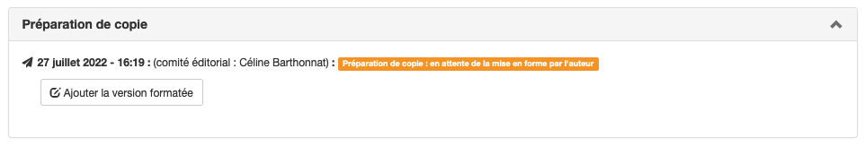

# Préparation de copie
> **Rôles** : auteur, préparateur de copie

La préparation de copie (ou copy editing) est une étape qui intervient après l’acceptation de l’article.

Cette étape permet de confier la mise en forme finale soit :
- à une personne avec un rôle dédié (préparateur de copie) ;
- à l’auteur.

La préparation de copie peut également être faite par les rôles suivants :
- administrateur
- rédacteur en chef
- secrétaire de rédaction
- rédacteur (pour ses articles assignés)

## Le rôle de préparateur de copie
Le rôle de préparateur de copie peut être attribué à une ou plusieurs personnes. Pour ajouter ce rôle à un ou plusieurs utilisateurs, aller dans : Gérer la revue > Utilisateurs > Liste.

La personne disposant du rôle de préparateur de copie doit ensuite être ajoutée aux articles sur lesquels elle doit intervenir.

## Activité du préparateur de copie
Le premier choix à faire sur un article accepté est de sélectionner le type de flux de travail souhaité :
- **Option 1** : la revue se charge de la mise en forme. L’auteur fournit les sources au préparateur de copie qui 
s’occupera de la mise en forme de la version finale ;
- **Option 2** : l’auteur met lui-même en forme la version finale.

### Option 1 : la revue prend en charge la préparation de copie
Choisir l’option “Demander à l’auteur ses sources (À mettre en forme par la revue)”.

Une fenêtre permet de personnaliser le message à envoyer à l’auteur pour lui demander de déposer ses sources sur le site de la revue.

Dès que l’auteur a déposé ses sources, un mail est envoyé au préparateur de copie lui permettant de récupérer les fichiers sur le site. Si les fichiers ne conviennent pas, il est possible de demander d’autres sources à l’auteur. Pour cela, dans “Statut de l’article”, sélectionner “Redemander à l’auteur ses sources (À mettre en forme par la revue)”.

Si tout est correct, télécharger les fichiers, procéder à la mise en forme et valider en sélectionnant “Mise en forme revue terminée, demander la version finale”. Ceci permet d’envoyer un message à l’auteur.

Le message contient un lien permettant à l’auteur de soumettre, après dépôt dans l’archive ouverte, la version finale de son manuscrit qui sera alors publié par la revue.

Le travail de préparation de copie est alors terminé.

#### Ajout des sources par l’auteur
Pour téléverser les fichiers sources, cliquer sur le bouton “Ajouter les fichiers sources”.

Il est possible de modifier le message prédéfini.

Une fois le(s) fichier(s) sélectionné(s), cliquer sur “Envoyer” pour les transmettre. Un récapitulatif du mail et des fichiers envoyés s’affiche alors.

Si besoin, d’autres envois ultérieurs sont possibles avec d’autres fichiers. À chaque fois, une notification est envoyée au préparateur de copie.

### Option 2 : l’auteur prend en charge la préparation de copie
Choisir l’option “Demander la version finale (À mettre en forme par l’auteur)”.

Une fenêtre permet de personnaliser le message à envoyer à l’auteur. Le message est pré-rempli selon un template personnalisable par la revue qui permet d’ajouter automatiquement les informations dont l’auteur a besoin, ainsi que des éléments permettant de styler le manuscrit pour sa version finale.

Les informations présentes dans le message doivent permettre à l’auteur d’avoir accès à toutes les données nécessaires pour mettre en forme son article.

> **Important**
L’administrateur du site doit avoir créé au préalable une archive .zip (nommé selon le format : titre_court_de_la_revue_episciences.zip) dans le répertoire “Ressources” (Gérer la revue > Site web > Ressources). Cette archive contient les fichiers à utiliser pour la mise en forme, par exemple les différents éléments graphiques, la feuille de style etc.

C’est ensuite à l’auteur de téléverser ses sources.

#### Téléversement par l’auteur de sa version formatée
L’auteur téléverse sa version formatée sur le site.

Une fois le fichier sélectionné, cliquer sur “Envoyer” pour le transmettre. Un récapitulatif du mail et du fichier envoyé s’affiche.

Si besoin, d’autres envois ultérieurs sont possibles avec d’autres fichiers. À chaque fois, une notification est envoyée au préparateur de copie.

Le préparateur de copie reçoit une notification par email quand l’auteur a déposé sa version formatée. Il est ensuite possible de passer à l’étape d’acceptation de la version auteur ou à la demande d’une autre version formatée.

### Acceptation
Si la version déposée ne convient pas, le préparateur de copie peut contacter l’auteur pour lui demander des modifications.

Si la version convient, accepter la version de l’auteur : dans “Statut de l’article”, sélectionner  “Accepter comme version finale”.

L’acceptation permet d’envoyer un message à l’auteur pour qu’il dépose cette version validée sur l’archive ouverte.

Le message contient également un lien permettant à l’auteur de soumettre, après dépôt dans l’archive ouverte, la version finale de son manuscrit qui sera alors publié par la revue.

Le travail de préparation de copie est alors terminé.
