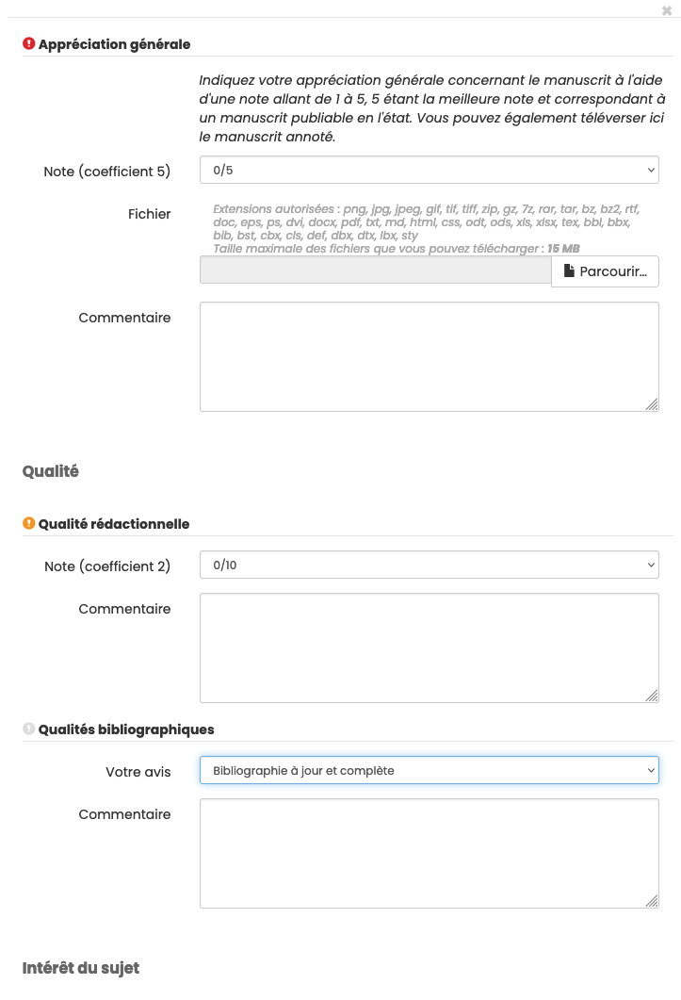
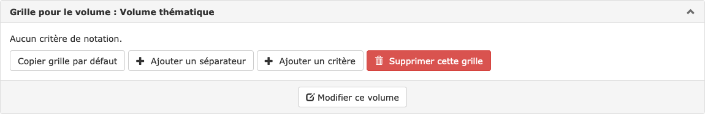

# Grille de relecture

> Rôles : administrateur, rédacteur en chef, secrétaire de rédaction

Une grille de relecture peut être élaborée pour guider les relecteurs grâce à une série de points prédéfinis à examiner. Les résultats des relectures peuvent ainsi être normalisés.

Pour construire une grille de relecture, aller dans : Gérer la revue > Revue > Grille de relecture.

Une grille de relecture est composée d’un nom et d’une série de critères.

## Grille par défaut

Une grille de relecture est proposée par défaut. D’autres grilles peuvent être ajoutées, en fonction des besoins, par exemple pour faire une distinction entre volumes courants et volumes d’actes de conférence.

La grille par défaut est modifiable. Chaque critère peut être modifié ou supprimé.

## Créer une grille de relecture

### Ajouter un critère

Une grille de relecture est composée d’autant de critères que nécessaire. Pour définir un critère, cliquer sur “Ajouter un critère”.

Les champs marqués d’un astérisque sont obligatoires :

- **Nom\*** : si le site de la revue est en plusieurs langues, le nom doit être saisi pour chacune des langues. Cliquer
  sur + pour afficher un champ supplémentaire.
- **Description** : à utiliser pour définir les critères proposés aux relecteurs. Si le site de la revue est en
  plusieurs langues, la description doit être saisie pour chacune des langues. Cliquer sur + pour afficher un champ supplémentaire.
- **Visibilité du critère** : sélectionner Publique/Contributeur/Rédacteurs. Par défaut, le critère n’est visible que
  des rédacteurs.
- **Type d’évaluation** : l’évaluation peut être quantitative, qualitative ou libre. Si “Qualitative” ou “Libre” est
  sélectionné, il conviendra de sélectionner “oui” dans le champ “Commentaires” ou dans “Upload de fichier”.
- **Commentaires** : oui/non. Si le choix est “oui”, le relecteur peut ajouter un commentaire sur ce critère.
- **Upload de fichier** : oui/non. Si le choix est “oui”, le relecteur peut télécharger le texte original annoté.
- **Coefficient** : un coefficient peut être attribué au critère. Le chiffre le plus élevé correspond au niveau de
  pondération le plus haut. La somme des coefficients des différents critères déterminera une note finale.
- **Type de notation** :
  - quand le type d’évaluation sélectionné est “Quantitatif”, trois types de notation sont proposés (notation sur 10,
    sur 5 ou personnalisée)
  - quand le type d’évaluation sélectionné est “Qualitatif”, il est possible de choisir entre une “notation classique
    (oui, non, peut-être)” ou une “notation personnalisée”. Pour cette dernière, différentes valeurs peuvent être ajoutées, par exemple : mauvais, moyen, bon, excellent.

Une fois les champs complétés, cliquer sur “Valider” pour enregistrer le critère.

### Ajouter un séparateur

Pour organiser les critères de la grille, il est possible d’ajouter un ou plusieurs séparateurs. Les séparateurs permettent de structurer la grille en différentes parties, par exemple : “Qualité”, “Intérêt du sujet”, etc. Pour créer un séparateur, cliquer sur “Ajouter un séparateur”.

Les champs marqués d’un astérisque sont obligatoires :

- **Nom\*** : si le site de la revue est en plusieurs langues, le nom doit être saisi pour chacune des langues. Cliquer
  sur + pour afficher un champ supplémentaire.
- **Description** : à utiliser pour définir les critères proposés aux relecteurs. Si le site de la revue est en
  plusieurs langues, la description doit être saisie pour chacune des langues. Cliquer sur + pour afficher un champ supplémentaire.
- **Visibilité du critère** : sélectionner Publique/Contributeur/Rédacteurs. Par défaut, le critère n’est visible que
  des rédacteurs.

Une fois les champs complétés, cliquer sur “Valider” pour enregistrer le séparateur.

### Visualiser la grille

En cliquant sur “Visualiser la grille”, la grille telle qu’elle sera proposée aux relecteurs s’affiche.

Une icône de couleur précise la visibilité du critère :

- rouge : la réponse à ce critère peut être visible publiquement sur la page de l’article
- orange : la réponse à ce critère peut être vue par l’auteur
- gris : la réponse à ce critère ne peut être vue que par les rédacteurs

## Associer une grille à un volume

Il faut d’abord [créer un volume](https://doc.episciences.org/fr/volumes/ "Créer un volume").

Aller ensuite dans Gérer la revue > Revue > Grilles de relecture où se trouvent toutes les grilles existantes.

Se rendre en bas de la page “Créer une grille pour le volume” et choisir le volume concerné parmi ceux de la liste déroulante qui contient tous les volumes qui ne sont pas associés à une grille spécifique (rappel : sans grille spécifique, un volume utilise la grille par défaut).

Cliquer sur le bouton “Créer la grille” : la nouvelle grille apparaît parmi les autres grilles (il peut être nécessaire de scroller dans la page). Par défaut, elle est vide : il faut donc soit ajouter de nouveaux critères, soit copier la grille par défaut. Il est alors possible de modifier cette grille en lui ajoutant ou retranchant des critères, séparateurs de parties, etc.

Attention : la grille qui est utilisée pour évaluer un article est celle qui est en place au moment de la soumission de l’article (les modifications ultérieures sur cette grille ne seront pas prises en compte pour cet article).
