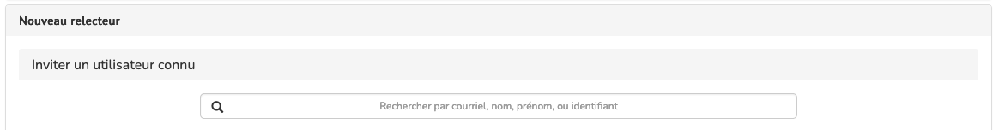

# Inviter un relecteur

> **Rôles** : rédacteur, rédacteur en chef, rédacteur invité, secrétaire de rédaction

Lorsqu’une soumission est déposée, après vérification qu’elle correspond à la ligne éditoriale de la publication, l’étape suivante consiste à la faire évaluer. Pour cela, il convient d’inviter les relecteurs.

Dans la page de gestion de la soumission, se rendre à l’onglet “Relecteurs”.

Cliquer sur le bouton “Inviter un relecteur”.
Avant de sélectionner un relecteur, se référer à l’onglet “Bonnes pratiques”.

En effet, le compte d’authentification est commun à plusieurs plateformes, il faut donc utiliser le compte déjà existant.

**Il est indispensable d’éviter la création de plusieurs comptes pour un même utilisateur.** Pour cela, vérifier que le
relecteur n’a pas déjà un compte relecteur dans la revue.

Dans l’onglet “Relecteurs connus par la revue”, renseigner le nom du relecteur dans le camp “Filtrer les relecteurs”.

## 1. Le relecteur a déjà un compte relecteur sur le site de la revue

Si le relecteur a déjà un compte relecteur, sélectionner son nom pour l’inviter à relire l’article.

Un mail s’ouvre permettant de paramétrer la date limite de la relecture et de personnaliser le message si besoin.

Si la recherche du relecteur ne renvoie aucun résultat, cliquer sur le bouton “Nouveau relecteur” en bas à droite.

## 2. Le relecteur n’a pas de compte sur le site de la revue ou il a un compte sans droits de relecture

Si le nom n’a pas été trouvé parmi les relecteurs de la revue, renseigner son nom ou son adresse mail dans le champ “Inviter un utilisateur connu” pour vérifier qu’il n’a pas déjà un compte dans la revue, mais avec d'autres droits, ou un compte sur une autre plateforme du CCSD (c’est à dire qu’il possède un compte HAL ou Sciencesconf).

### Cas 1. Le compte existe mais avec d’autres droits

Il est possible de vérifier en amont parmi la liste des utilisateurs si le compte existe et quels sont ses droits, et de lui ajouter des droits de relecteur. Alors, le relecteur apparaît automatiquement dans la liste lors de la recherche de l’étape 1.

### Cas 2. Le relecteur a un compte CCSD

Si le relecteur a un ou plusieurs comptes CCSD (pour Hal, Sciencesconf, ou une autre revue sur Episciences), sélectionner le compte choisi. Le mail d’invitation à relire la
soumission s’ouvre.

Un compte pour le relecteur sera créé sur la revue quand celui-ci se connectera sur le site avec ses identifiants CCSD, grâce au lien envoyé avec l’invitation (le relecteur n’aura pas besoin de se créer un nouveau compte).

**Attention !** Si vous sautez cette étape, vous allez créer un compte temporaire. Le relecteur, qui se connectera avec son compte CCSD, ne pourra pas accepter la relecture car le système considérera qu’il s’agit d’une personne différente.

### Cas 3. Le relecteur n’a pas de compte CCSD

Si le relecteur n’a pas de compte CCSD, renseigner le formulaire “Inviter un nouvel utilisateur” avec son adresse mail, son nom complet et la langue choisie pour la correspondance (anglais ou français).

L’invitation d’un nouvel utilisateur, jusqu’alors inconnu du service d’authentification du CCSD, permet la création d’un compte temporaire que l’utilisateur pourra activer en créant un compte sur le site de la revue grâce au lien envoyé avec l’invitation.
