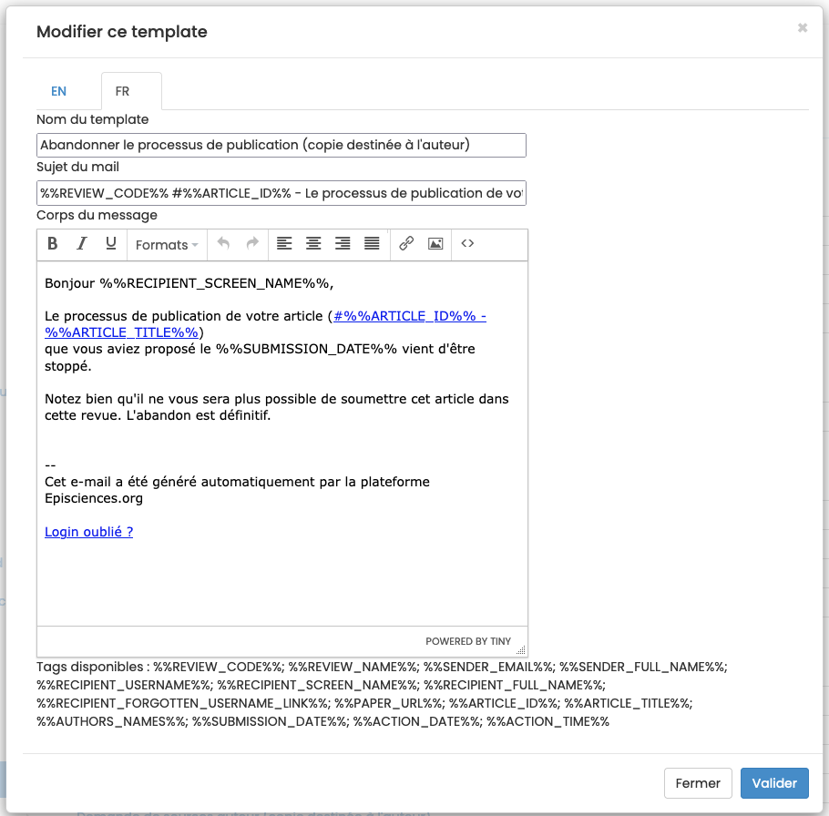

# Module de mail
> **Rôles** : administrateur, rédacteur, rédacteur en chef, secrétaire de rédaction, webmaster

## Mailing
Pour gérer l’envoi de mails à certains rôles, aller dans : Gérer la revue > Mails > Mailing.

Un message peut être envoyé à un destinataire particulier ou à un groupe de destinataires sélectionnés en fonction de leur rôle dans la revue. Les rôles sélectionnables sont : rédacteurs en chef, rédacteurs invités, rédacteurs, secrétaire de rédaction, webmasters, relecteurs.

Pour choisir le ou des destinataires, cliquer sur “À”, “Cc” ou “Bcc” puis sur “Tous les contacts”.

## Templates
Un certain nombre de mails pré-paramétrés (templates) sont disponibles dans le site.

Pour consulter et modifier ces templates, aller dans : Gérer la revue > Mails > Templates.

Pour modifier un template, cliquer sur le bouton “Modifier”.

Le nom du template, son sujet et son contenu peuvent être personnalisés.

Pour personnaliser les modèles, consulter la liste des variables à insérer dans les templates.

## Historique des échanges
Tous les messages envoyés via le site (notifications automatiques comme mails), sont accessibles via l’historique disponible dans Gérer la revue > Mails > Historique.

Par défaut, les échanges sont affichés par date d’envoi, les échanges les plus récents s’affichant en premier.

