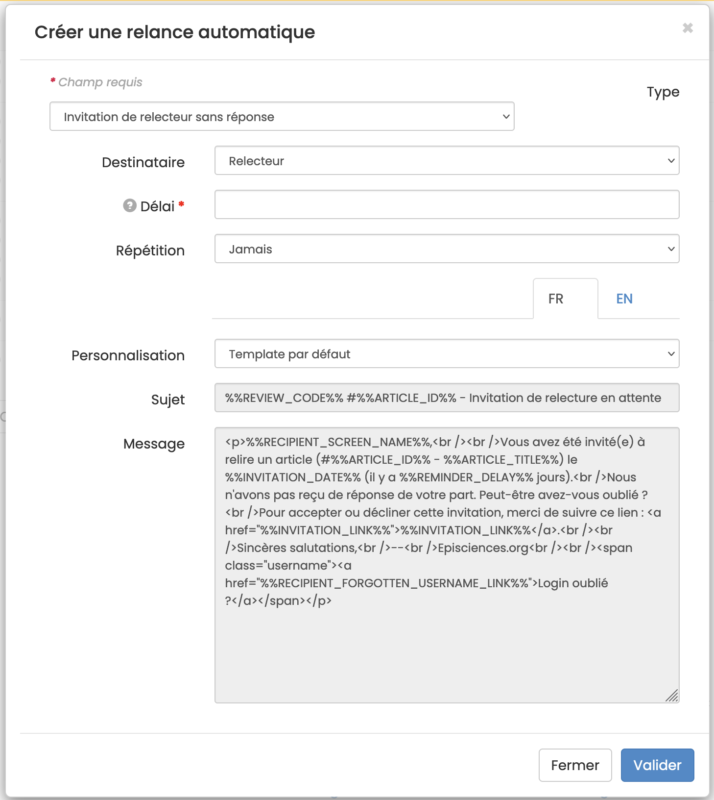

# Relances automatiques
> **Rôles** : administrateur, rédacteur, rédacteur en chef, secrétaire de rédaction

Pour créer et paramétrer les relances, aller dans : Gérer la revue > Mails > Relances automatiques.

Le lancement des relances automatiques fonctionne à partir  :
+ Des délais paramétrés pour la revue (voir Gérer la revue > Paramètres > Paramètres notification) ;
+ Des paramétrages des rappels.

Trois types de relance sont proposés :
1. **Invitation de relecteur sans réponse** : permet de relancer un relecteur qui n’a pas répondu à une invitation.
2. **Rappel avant date de livraison de relecture** : permet de rappeler la date limite à un relecteur qui a accepté l’invitation.
3. **Rappel après date de livraison de relecture** : permet de relancer un relecteur ayant accepté l’invitation mais 
   qui a dépassé le délai.

Pour paramétrer, cliquer sur “Créer une relance automatique”. Un écran s’affiche avec une liste de paramètres à définir pour les types de relances souhaitées.

Les champs marqués d’un astérisque sont obligatoires.

+ **Type** : sélectionner le type de relance dans la liste déroulante. Au choix :
  + Invitation de relecteur sans réponse 
  + Rappel avant date de livraison de relecture 
  + Relance après date de livraison de relecture 
  + Rappel avant date limite de modification 
  + Relance après date limite de modification 
  + Pas assez de relecteurs 
  + Article bloqué à l’état accepté
+ **Destinataire** : sélectionner le rôle concerné dans la liste déroulante. Au choix :
  + Rédacteur en chef 
  + Rédacteur 
  + Relecteur 
  + Auteur
+ **Délai*** : saisir un nombre correspondant au nombre de jours (la relance sera envoyée X jours après l’expiration du délai paramétré dans la revue).
+ **Répétition** : sélectionner la fréquence des relances dans la liste déroulante. Au choix :
  + Jamais 
  + Quotidienne 
  + Hebdomadaire 
  + Toutes les deux semaines 
  + Mensuelles
+ **Personnalisation** : sélectionner “Template par défaut” (non modifiable) ou “Template personnalisé” afin de pouvoir modifier le sujet du mail et le texte du message.

Cliquer sur “Valider” pour enregistrer vos modifications. Une relance automatique est créée. Il est possible de la modifier.

Les envois de rappels automatiques sont effectués tous les jours à 00:00.

Les messages sont consultables dans l’historique des mails : Gérer la revue >  Mails > Historique.