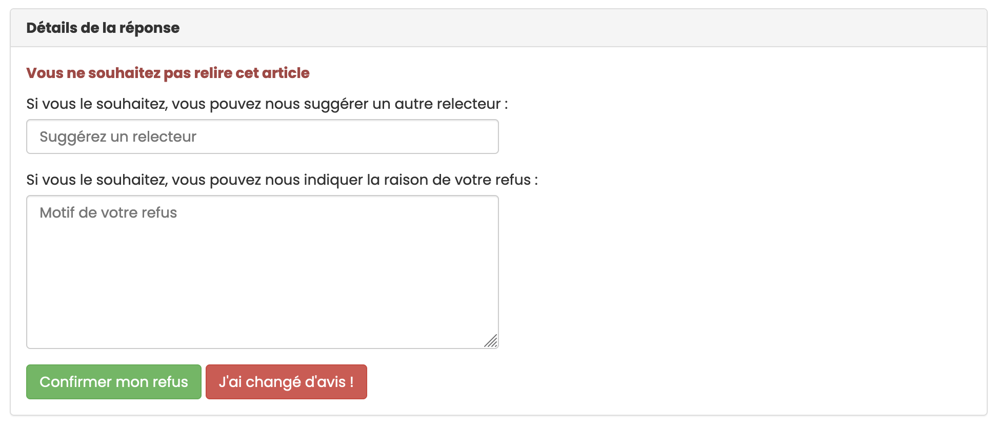

# Relire un article

> **Rôle** : relecteur

## Invitation à la relecture d’un article
Le relecteur reçoit une invitation par mail. Le message contient le titre de l’article, un lien vers l’article dans l’archive ouverte et un lien vers le formulaire de réponse permettant d’accepter ou de refuser l’évaluation de l’article.

L’invitation a une durée limitée : le délai de réponse est précisé dans le mail.

En cliquant sur le lien, le formulaire de réponse à l’invitation s’affiche :

Cliquer sur la réponse souhaitée.

## Refuser l’invitation
Pour décliner l’invitation, cliquer sur “Je refuse de relire cet article”.

Il est alors possible de suggérer le nom d’un autre relecteur ainsi que de préciser les raisons du refus.

Dans certains cas, la revue peut demander de déclarer si le relecteur a des intérêts en concurrence avec l’article en cours de révision. Si tel est le cas, cela est considéré comme un motif de refus.

Cliquer sur “Confirmer mon refus” pour enregistrer la réponse.

Un bouton “J’ai changé d’avis !” permet de revenir au formulaire de réponse à l’invitation.

## Accepter l’invitation
Après avoir cliqué sur “J’accepte de relire cet article”, un mail est envoyé au relecteur lui permettant d’accéder à l’évaluation de l’article sur le site.

## Connexion
Se connecter avec son login et mot de passe sur le site de la revue.

Note : il n’est pas nécessaire d’ouvrir plusieurs comptes sur Episciences si le relecteur est sollicité par plusieurs revues hébergées sur la plateforme.

## Tableau de bord
Le tableau de bord affiche les actions en cours sur le site : les relectures mais également les articles si l’utilisateur en a soumis.

Cliquer sur “Relire les articles” pour accéder aux articles.

La page “Mes relectures” liste les articles pour lesquels l’utilisateur a reçu une invitation. 

Chaque article a un statut : les relectures en attente apparaissent en haut du tableau.

L’utilisateur peut filtrer par statut de l’article, état de relecture, volume, rubrique, rédacteurs et DOI.

## Processus
En cliquant sur le titre de l’article, une nouvelle page s’ouvre permettant d’accéder à l’article à relire et au formulaire à renseigner pour l’évaluation.

Deux moyens sont proposés pour accéder à l’article :
1. **Télécharger le fichier** ;
2. **Visiter la page de l’article** : permet de consulter et de télécharger l’article sur le site de l’archive ouverte où il a été déposé. Il peut y avoir plusieurs versions du texte, ainsi que des documents annexes (jeu de données, fichier vidéo, diaporama, etc.).

### Renseignement de la grille d’évaluation
Chaque revue a sa propre grille d’évaluation dont les différents critères consistent en des notes ou des items à sélectionner dans un menu déroulant.

En fonction des revues, le relecteur peut compléter l’évaluation par un commentaire et télécharger un fichier à destination de l’auteur : ce fichier peut être l’article annoté, ou toute information que le relecteur juge utile de communiquer à l'auteur.

Les échanges entre le relecteur et l’auteur sont sauvegardés sur la plateforme. Par défaut, le relecteur est anonyme. S’il le souhaite, il peut lever l’anonymat en ajoutant son nom dans l’espace “Commentaire”.

### Validation de l’évaluation
Lors de l’évaluation, deux options sont possibles :
1. **Enregistrer l’évaluation** : permet de sauvegarder les informations saisies au cours de la relecture si celle-ci n’est pas terminée. 
2. **Terminer l’évaluation** : permet de valider les informations saisies et de les transmettre au rédacteur en charge de l’article.
