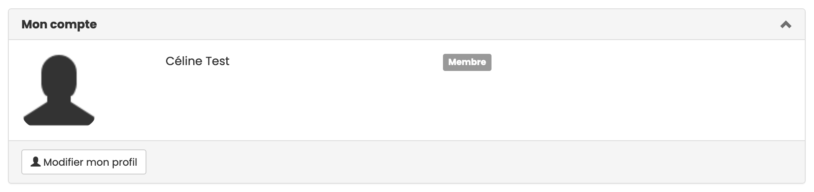
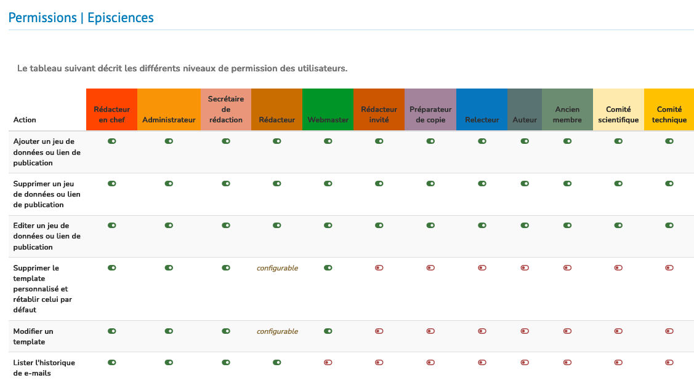

# Rôles

> **Rôles** : administrateur, auteur, membre, préparateur de copie, rédacteur, rédacteur en chef, rédacteur invité, relecteur, secrétaire de rédaction, webmaster

Il existe **dix rôles** dans Episciences, chacun ayant des droits associés à des fonctionnalités.

Les rôles associés au profil s’affichent en haut à droite lorsque l’on passe la souris sur son nom d’utilisateur et dans le Tableau de bord, dans la partie “Mon compte”.

À noter : la sémantique des rôles dans Episciences n’est pas forcément adaptée à l’organisation de chaque revue. Ainsi, un utilisateur peut avoir plusieurs rôles dans une épi-revue, à attribuer en fonction des fonctionnalités qu’il a à utiliser.

Les rôles ayant le plus de droits sont mentionnés par un astérisque.

+ **Auteur** : peut soumettre un article.
+ **Administrateur*** : possède tous les droits sur la revue dont le paramétrage du site.
+ **Membre** : rôle par défaut attribué à toute personne se créant un compte sur le site d’une épi-revue.
+ **Préparateur de copie** : gère le processus de préparation de copie (copy editing), seul ou en relation avec l’auteur, pour aboutir à une version finale qui sera publiée dans la revue.
+ **Rédacteur** : peut affecter un article à une rubrique ou à un volume, assigner des relecteurs, faire des suggestions (accepter ou refuser un article). Ses droits dépendent du paramétrage de la revue.
+ **Rédacteur en chef*** : possède tous les droits sur la revue. Il gère les utilisateurs et leur attribue des rôles. Il gère les relecteurs et les articles. Il peut aussi configurer ou modifier le site web de la revue.
+ **Rédacteur invité** : a les mêmes droits que le rédacteur mais seulement sur une rubrique ou un volume.
+ **Relecteur** : permet de relire l’article pour lequel il a été sollicité et de renseigner une évaluation. En fonction du paramétrage de la revue, ce rôle permet de communiquer avec l’auteur.
+ **Secrétaire de rédaction*** : fait un premier tri dans les articles soumis. Il peut refuser un article (s’il ne correspond pas à la ligne éditoriale de la revue par exemple) mais ne peut pas l’accepter automatiquement. Il peut gérer les utilisateurs (création de compte).
+ **Webmaster** : responsable du site web de la revue. Cela inclut le paramétrage (configuration générale du site) et l’accès à la feuille de styles.

Les fonctionnalités liées à chaque rôle sont mentionnée de façon synthétique dans un tableau, accessible en mode connecté : Mon espace > Permissions

