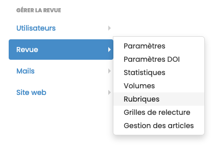
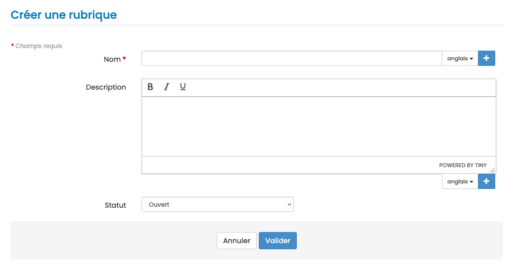

# Rubriques

> **Rôles** : administrateur, rédacteur en chef, secrétaire de rédaction

Pour créer et gérer les rubriques, aller dans Gérer la revue > Revue > Rubriques.

Plusieurs rubriques peuvent être ouvertes en même temps. Un auteur peut soumettre un article dans n’importe quelle rubrique.

Pendant le processus de relecture, un article peut être affecté à une autre rubrique par le rédacteur en chef (impossible après publication).

Un article ne peut être soumis à une rubrique de statut “fermé”.

Le nombre de rubriques n’est pas limité.

Les métadonnées d’une rubrique :

- **Nom** : champ obligatoire
- **Description** : ne sera pas affichée sur le site
- **Statut** : ouvert/fermé

Si le site de la revue est en plusieurs langues, le nom de la rubrique doit être saisi pour chacune des langues. Cliquer sur + pour afficher le champ.