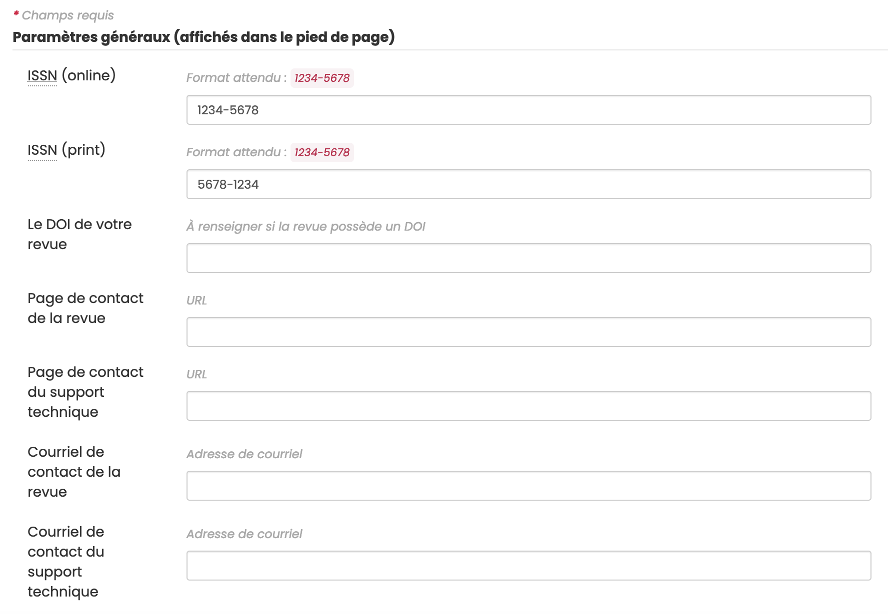
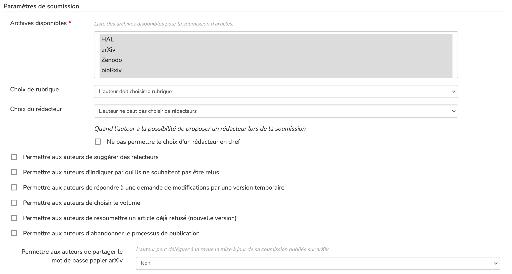
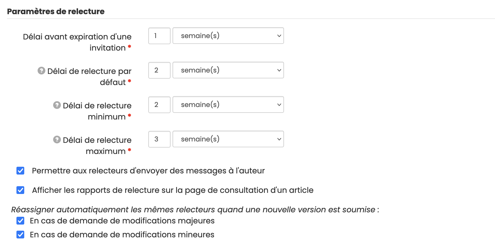

# Paramètres de la revue

> **Rôle** : administrateur

Pour paramétrer la revue, aller dans : Gérer la revue > Revue > Paramètres.

Les champs marqués d’un astérisque sont obligatoires.

## Paramètres généraux (affichés dans le pied de page)

- **eISSN (online)** : compléter avec l’e-ISSN de la revue au format XXXX-XXXX
- **ISSN (print)** : compléter avec l’ISSN de la revue au format XXXX-XXXX
- **Le DOI de votre revue** : à renseigner si la revue possède un DOI
- **Page de la notice dans le catalogue** : URL de la notice dans le catalogue des revues renseignée par l’équipe
  Episciences
- **Éditeur** : nom de l’éditeur de la revue
- **Lieu de publication** : sous la forme “Ville, Pays”
- **Page de contact de la revue** : indiquer ici une URL
- **Page de contact du support technique** : indiquer ici une URL
- **Courriel de contact de la revue** : indiquer ici une adresse de courriel
- **Courriel de contact du support technique** : adresse mail du support renseignée par l’équipe Episciences

## Paramètres de soumission

**Archives disponibles\*** : sélectionner la ou les archives disponibles pour la soumission d’article. Pour en choisir plusieurs : maintenir la touche Ctrl enfoncée et cliquer.

D’autres paramètres peuvent être activés :

**Choix de rubrique** :

- l’auteur **ne peut pas** choisir la rubrique ;
- l’auteur **peut** choisir la rubrique ;
- l’auteur **doit** choisir la rubrique.

**Choix du rédacteur** :

- l’auteur **ne peut pas** choisir de rédacteurs ;
- l’auteur **peut** choisir des rédacteurs ;
- l’auteur **doit** choisir **des** rédacteurs ;
- l’auteur **doit** choisir **un seul** rédacteur.

Il est également possible de permettre aux **auteurs** :

- de **suggérer des relecteurs** (ce paramètre n’assigne pas automatiquement le manuscrit à un relecteur, ce n’est qu’une suggestion) ;
- d’indiquer par qui ils ne souhaitent pas être relus ;
- de répondre à une demande de modifications par une version temporaire ;
- de choisir le volume ;
- de resoumettre un article déjà refusé (nouvelle version) ;
- d’abandonner le processus de publication.

## Paramètres de relecture

- **Délai avant expiration d’une invitation\*** : indiquer ici un nombre de jour(s)/semaine(s)/mois
- **Délai de relecture par défaut\*** : indiquer ici un nombre de jour(s)/semaine(s)/mois
- **Délai de relecture minimum\*** : indiquer ici un nombre de jour(s)/semaine(s)/mois
- **Délai de relecture maximum\*** : indiquer ici un nombre de jour(s)/semaine(s)/mois

Les relances automatiques sont calculées à partir de ces paramètres.

Autres options :

- Permettre aux relecteurs d’envoyer des messages à l’auteur
- Afficher les rapports de relecture sur la page de consultation d’un article

Réassigner automatiquement les mêmes relecteurs quand une nouvelle version est soumise :

- En cas de demande de modifications majeures
- En cas de demande de modifications mineures

## Paramètres des rédacteurs

**Minimum de relectures requis** : indiquer ici le nombre minimum de relectures avant de pouvoir accepter un article

**Autres options** :

Cloisonner les rédacteurs : s’ils sont cloisonnés, les rédacteurs ne peuvent voir que les articles qui leur sont assignés

- Les rédacteurs peuvent accepter les articles
- Les rédacteurs peuvent publier les articles
- Les rédacteurs peuvent refuser les articles
- Les rédacteurs peuvent demander des modifications sur les articles
- Permettre aux rédacteurs de modifier les templates de mails

Lorsqu’un article est soumis, assigner les :

- Rédacteurs en chef
- Rédacteurs de rubrique
- Rédacteurs de volume (hors volume spécial)
- Rédacteurs suggérés par le contributeur
- Rédacteurs de volume spécial

- Permettre aux rédacteurs d’abandonner le processus de publication

## Paramètres de notification

Permettent d’activer des envois de mails à certains rôles (administrateurs, rédacteurs en chef, secrétaires de rédaction) lorsqu’un article est soumis, mis à jour ou refusé.

## Paramètres des volumes spéciaux

Permet d’attribuer un code d’accès afin de permettre la soumission dans les volumes spéciaux et également de cloisonner les relecteurs d’un volume spécial.

## Préparation de copie

Permet de cloisonner les préparateurs de copie, c'est-à-dire de leur donner accès seulement aux articles qui leur sont assignés.

## Conflit d’intérêt

Il est possible d’activer une option pour permettre aux rédacteurs de déclarer un conflit d’intérêt avant l’évaluation.

L’activation du mode conflit d’intérêt a les effets suivants : toutes les informations non publiques concernant une soumission ne sont pas accessibles aux éditeurs en chef et aux éditeurs tant qu’ils n'auront pas déclaré l’absence de tout conflit d’intérêt.

## Article - décision finale

Permet de modifier certaines choses sur un article déjà accepté.
