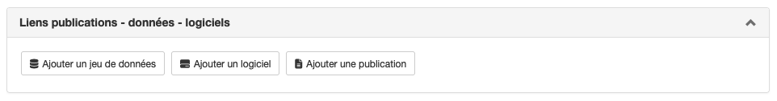
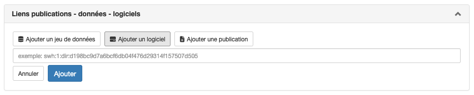
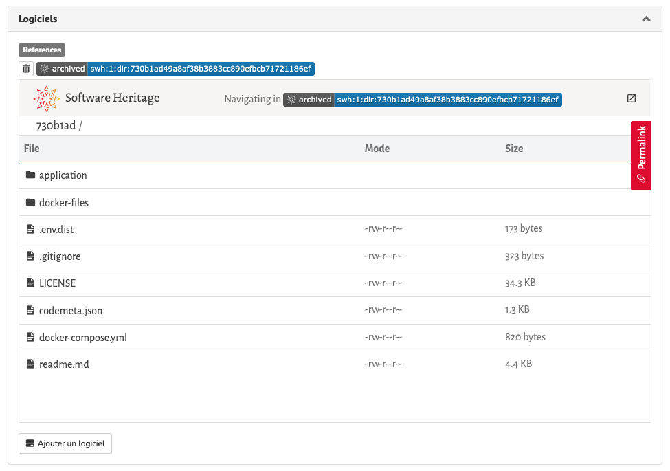

# Lier publications / données / logiciels

> **Rôle** : auteur

Afin de promouvoir et favoriser la reproductibilité de la science, Episciences facilite le lien entre un article et un jeu de données ou un logiciel. L’auteur ou l’autrice qui soumet un document à une revue peut ajouter l’identifiant fourni par la plateforme sur laquelle sont entreposées les données ou le logiciel, facilitant ainsi l’accès à ces ressources, à la fois aux pairs qui évaluent les soumissions, et aux lecteurs et lectrices si l’article est publié.

Cette page de documentation explique pas à pas comment lier un logiciel. La procédure est similaire pour lier un jeu de données ou une publication.

## Lier un logiciel
> L’ouverture des logiciels fait partie intégrante des politiques nationales et européennes de science ouverte 
> ([*Passeport pour la science ouverte. Codes sources et logiciels*](https://www.ouvrirlascience.fr/science-ouverte-codes-et-logiciels/ "Passeport pour la science ouverte. Codes sources et logiciels"), août 2022).

Avant de lier un logiciel à un document soumis à une revue Episciences, il est conseillé de le déposer dans HAL ou dans Software Heritage afin de permettre son archivage pérenne.
Si le logiciel n’est pas disponible dans un entrepôt (github ou autre) ou si l’on souhaite disposer de métadonnées riches pour le décrire, il est possible de le déposer dans HAL. Si le logiciel est déjà disponible dans un entrepôt, il est recommandé d’utiliser Software Heritage.

### Déposer le logiciel dans HAL
Le dépôt d’un logiciel via HAL permet son archivage pérenne dans Software Heritage. La procédure complète du dépôt est détaillée dans la documentation HAL, [Déposer le code source d’un logiciel](https://doc.archives-ouvertes.fr/deposer/deposer-le-code-source/ "Déposer le code source d’un logiciel").

### Déposer le logiciel dans Software Heritage
La procédure (en anglais) pour archiver un logiciel est disponible sur le site de Software Heritage, [Save and reference research software](https://www.softwareheritage.org/save-and-reference-research-software/ "Guide du dépôt sur Software Heritage (English)").

### Lier le logiciel à la publication sur Episciences
Après la soumission du document, vous pouvez lier un logiciel.

Pour cela, se rendre sur “Mon espace” > “Mes articles”.
Cliquer sur le titre du document voulu puis, dans l’onglet “Liens publications - données - logiciels”, cliquer sur “Ajouter un logiciel”.

Indiquer l’identifiant Software Heritage (SoftWare Hash IDentifier, SWHID) puis cliquer sur “Ajouter”.

> Sur Software Heritage, le SWHID se trouve dans l’onglet rouge “Permalinks”, situé à droite de l’écran.

Choisir le code correspondant à “Directory” (qui permettra d’afficher la prévisualisation sur l’article) puis cliquer sur “Copy identifier”.

Une prévisualisation du logiciel tel qu’archivé dans Software Heritage s’affiche (sous réserve d’avoir bien choisi le code correspondant à “Directory”).

> À noter: l’ajout d’un logiciel est possible à tout moment. Il sera visible par les évaluateurs et les évaluatrices 
> qui pourront ainsi évaluer le document en ayant accès au code.

## Citer un logiciel dans sa publication
Vous trouverez sur le site de Software Heritage une documentation complète (en anglais) pour citer un logiciel dans une publication : [Citing software with style](https://www.softwareheritage.org/2020/05/26/citing-software-with-style/ "Citer un logiciel (English)").
