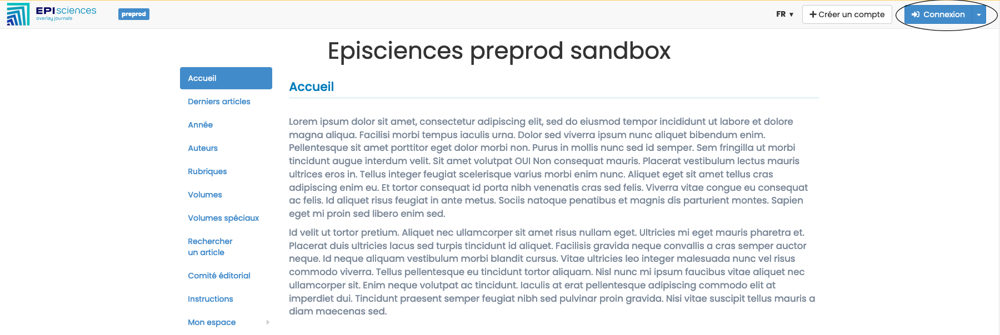
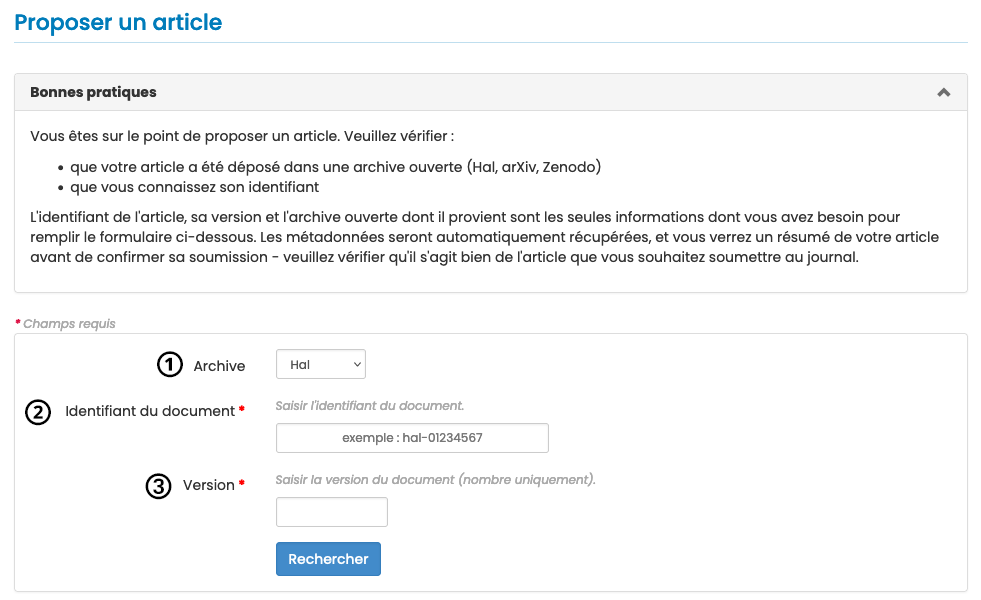
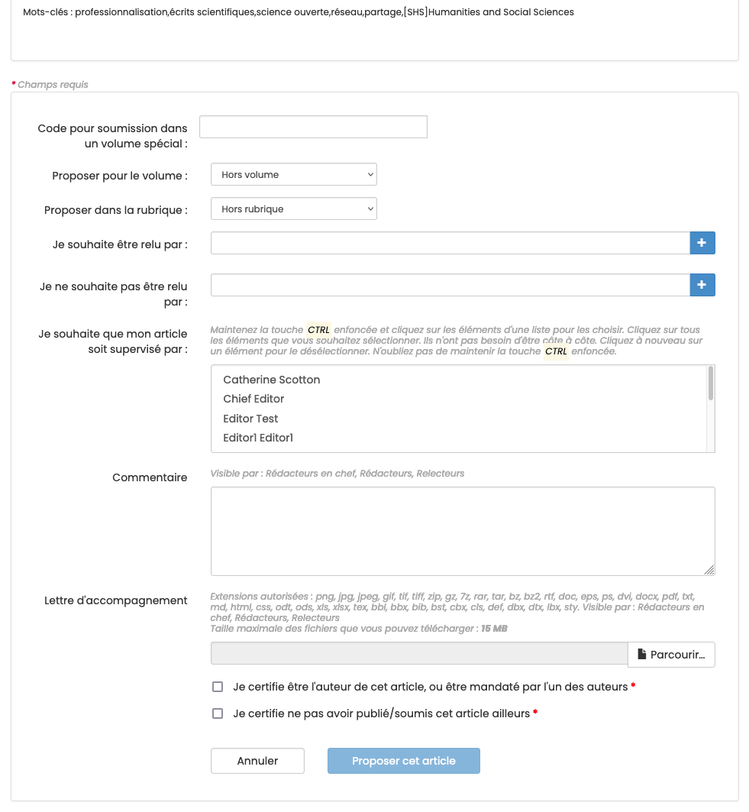
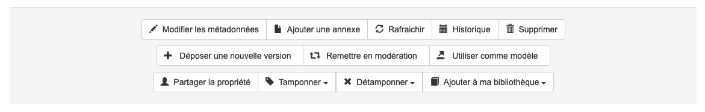
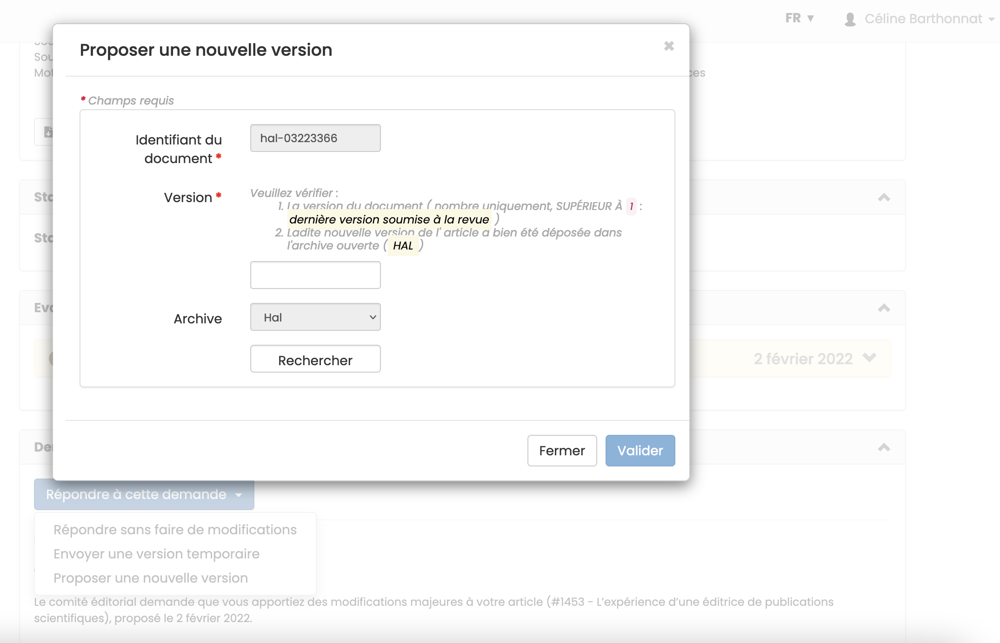
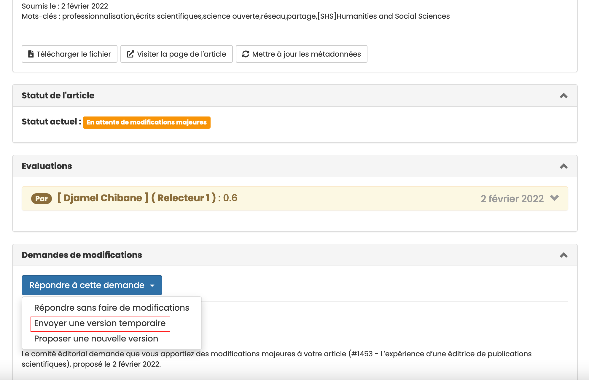
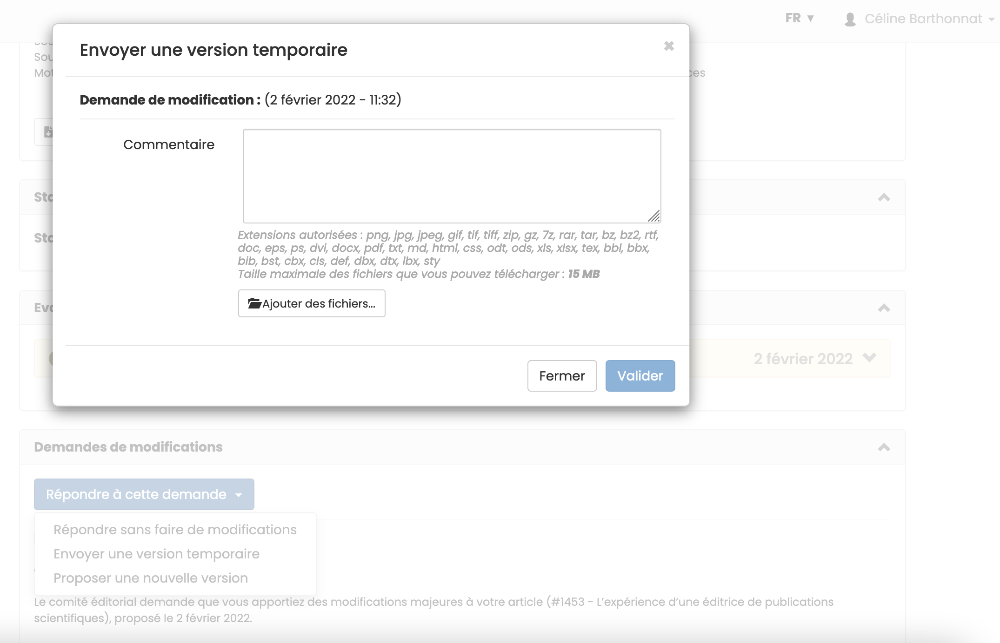

# Soumettre un article

> **Rôle** : auteur

## Préalable
Le compte HAL est utilisé pour se connecter sur les sites des épi-revues. En cas de premier dépôt ou si vous ne disposez pas de compte HAL, vous devez vous créer un compte.

La soumission d’un article à une épi-revue se fait en deux étapes :
1. dépôt de la proposition d’article (pré-print) dans une archive ouverte (arXiv, HAL, Zenodo or CWI) ;
2. soumission du pré-print sur le site Episciences de l’épi-revue.

## Se connecter au site
Pour se connecter au site d’une épi-revue, cliquer sur le bouton “Connexion” en haut à droite.

Une fois connecté, cliquer sur l’onglet “Proposer un article”.

+ **Archive** : sélectionner l’archive ouverte dans lequel se trouve l’article à soumettre à l’épi-revue ;
+ **Identifiant du document** : indiquer l’identifiant du document sur l’archive ouverte (ex : hal-0000000 pour HAL ; 0000.0000 pour arXiv ; 10.5281/zenodo.0000000 ou 0000000 pour Zenodo) ;
+ **Version** : préciser la version du document à soumettre.

Les métadonnées (prénoms et noms des auteurs, titre, résumé et mots-clés) sont récupérées par le système.

Suivant les paramétrages du site, il est possible de proposer l’article pour un volume ou une rubrique dédiée, de suggérer des noms de relecteurs ou encore de joindre une lettre d’accompagnement.

Le champ libre “Commentaire” permet d’ajouter un mot à l’attention de l’équipe éditoriale de la revue (ce commentaire sera visible des rédacteurs en chefs, rédacteurs et relecteurs).

Afin de pouvoir soumettre l’article, il est nécessaire de certifier :
+ être l’auteur de cet article ou bien être mandaté par l’un des auteurs dans le cadre d’un article écrit à plusieurs ; 
+ ne pas avoir publié ou soumis cet article ailleurs.

Cliquer sur “Proposer cet article” pour valider le dépôt de la soumission.

## Soumettre un article dans un volume spécial
Si vous avez été invité-e à contribuer à un volume spécial, un code d’accès vous a été envoyé par mail. La procédure 
est la même que pour soumettre un article mais il faut au préalable saisir le code d’accès dans le champ correspondant.

Après avoir saisi le code d’accès, le volume correspondant s’affiche.

Finaliser la procédure de dépôt en cliquant sur “Proposer cet article”.

## Demande de modifications
Après évaluation de son article, l’auteur peut recevoir une demande de modification de la part de la revue. Il est alors invité à retravailler son article et à soumettre une nouvelle version.
Deux possibilités de dépôt existent :
- Option 1 : dépôt de l’article remanié dans l’archive ouverte

Se connecter sur HAL et se rendre sur le dépôt initial. Cliquer sur le bouton “Déposer une nouvelle version” en bas de page.

Une fois la nouvelle version modérée, se connecter à Episciences, se rendre sur la page de l’article. Dans la partie “Demandes de modifications”, dans “Répondre à cette demande”, sélectionner “Proposer une nouvelle version”.

L’identifiant du document et l’archive de l’article soumis sont proposés par défaut. Indiquer la nouvelle version à prendre en compte.

La nouvelle version est transmise pour relecture.

- Option 2 : soumettre une version temporaire (la version modifiée n’est pas présente dans l’archive)

Cette option est à privilégier en cas de modifications mineures.

Se connecter à Episciences et se rendre sur la page de l’article. Dans la partie “Demandes de modifications”, dans “Répondre à cette demande”, sélectionner “Envoyer une version temporaire”.

Télécharger la version temporaire. Un commentaire peut également être ajouté pour préciser les modifications apportées à cette version.

Cette version est uniquement présente sur Episciences et non visible dans l’archive ouverte. Lorsque l’article sera validé, la version finale devra être téléchargée dans l’archive afin d’obtenir le statut « accepté » (voir option 1).

L’article publié est consultable sur le site de la revue. Ses références bibliographiques sont mises à jour automatiquement dans l’archive ouverte.

En cas de besoin, vous pouvez contacter le support technique à l’adresse suivante : support [at] episciences.org