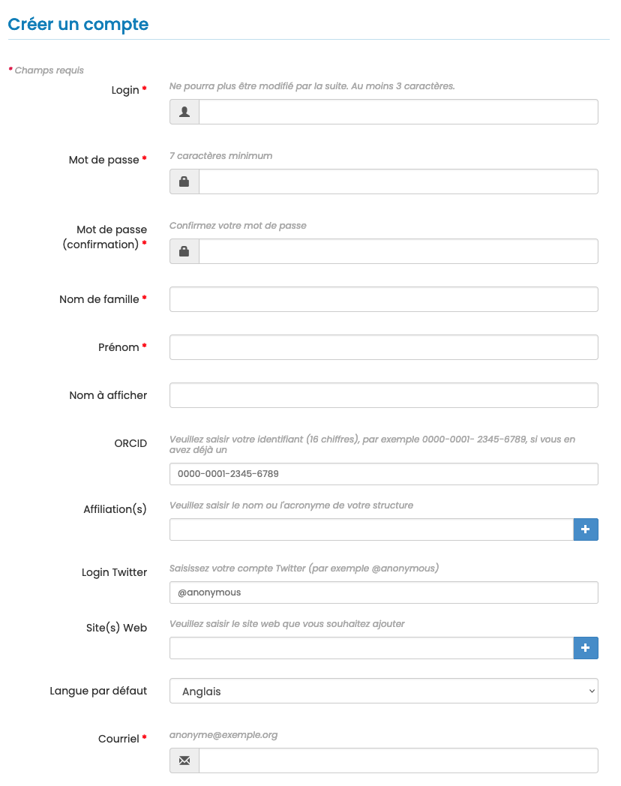

# Gestion des utilisateurs

> Rôles : administrateur, rédacteur en chef, secrétaire de rédaction

Pour gérer les utilisateurs de la revue (création de compte, ajout de rôles, etc.), aller dans : Gérer la revue > Utilisateurs > Liste.

**Bonne pratique**

Avant de créer un compte pour un nouvel utilisateur, veuillez vérifier que celui-ci n’existe pas déjà dans la base des utilisateurs. Pour vérifier que l’utilisateur n’a pas déjà des droits dans la revue, renseignez le nom de la personne dans le champ de recherche situé en haut à droite de la liste des utilisateurs.

Il est possible d’inviter de nouveaux utilisateurs (auteurs, relecteurs ou rédacteurs) sur le site de la revue. Pour cela, indiquez le nom de l’utilisateur à ajouter dans le champ dédié. Si la recherche ne retourne aucun résultat, il est possible de créer un compte pour l’utilisateur en cliquant sur le bouton “Créer un nouveau compte”. 

Champs obligatoires pour la création d’un compte :
- **Login** : au moins 3 caractères. Attention : le login ne peut pas être modifié une fois le compte créé ;
- **Mot de passe** : 7 caractères minimum
- **Nom**
- **Prénom**
- **Courriel** : indiquer ici une adresse mail valide, un courriel de confirmation sera envoyé pour valider la création 
  du compte

Il est recommandé que les utilisateurs créent eux-mêmes leur compte (choix du login et du mot de passe). Une fois le compte créé, l’utilisateur pourra être sélectionné dans la liste.

Par défaut, tout utilisateur a le rôle de *membre*, ce qui lui permet de soumettre un article. D’autres rôles peuvent 
être ajoutés par le rédacteur en chef.

Pour ajouter un ou des rôles, se positionner dans la colonne “Rôles” puis sélectionner le ou les rôles choisis parmi ceux proposés dans la liste.

