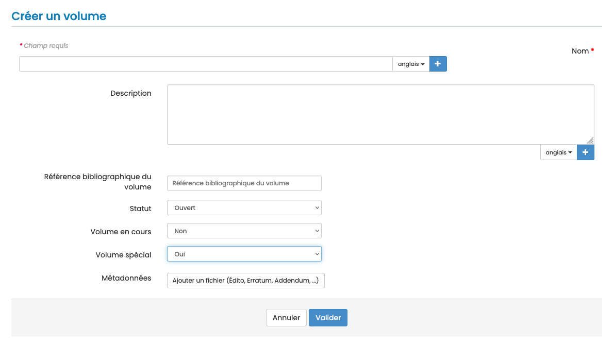

# Volumes

> **Rôles** : administrateur, rédacteur en chef, secrétaire de rédaction

Les volumes s’apparentent à des numéros de revues et permettent de rassembler des articles thématiques.

Il est possible de créer des volumes courants et des volumes spéciaux.

## Volumes courants
Pour créer et gérer les volumes, aller dans : Gérer la revue > Revue > Volumes.

Plusieurs volumes peuvent être ouverts en même temps. Les auteurs peuvent soumettre à n’importe quel volume ouvert. Avant publication, le rédacteur en chef peut modifier le volume d’un article.

Un article ne peut être soumis à un volume fermé.

Après publication, un article ne peut être affecté à un autre volume.

Pour créer un volume, cliquer sur “Créer un volume”.

Un volume est composé de 10 éléments. Les champs marqués d’un astérisque sont obligatoires :

- **Nom*** : titre du volume
- **Description** : description du volume
- **Référence bibliographique du volume** : indiquer ici l’identifiant du volume (ex : 18, vol. 2, vol.24:1). Cette 
  référence est reprise dans les templates de mail.
- **Numéro du volume*** : numéro de la publication (ex : 18, 24:1, XII)
- **Année du volume*** : année de publication du volume au format AAAA (ex : 2024)
- **Statut** (ouvert/fermé) : un statut ouvert permet d’ajouter des articles au fil de l’eau
- **Volume en cours** (oui/non) : en sélectionnant l’option “oui” et le statut “ouvert”, ce volume est proposé lors du 
  dépôt
- **Volume spécial** (oui/non) : volume accessible uniquement avec un code d’accès
  - **Acte de conférence** : voir précisions ci-dessous
- **Métadonnées** : permet d’ajouter un fichier PDF, comme un édito, un erratum, un addendum, des remerciements, un 
  hommage, etc. mais également une image de couverture au format .png ou .jpg

Si le site de la revue est en plusieurs langues, le nom du volume et la description doivent être saisis pour chacune des langues. Cliquer sur + pour afficher le champ.

## Actes de conférences
En cochant la case dédiée, de nouveaux paramètres s’affichent.

- **Nom de la conférence*** : titre de la conférence
- **Thème de la conférence**
- **Acronyme de la conférence**
- **Numéro de la conférence**
- **Lieu de la conférence** : indiquer la ville et le pays (ex : Lyon, France)
- **Date de début de la conférence*** : un calendrier permet de sélectionner la date au format AAAA-MM-JJ
- **Date de fin de la conférence***
- **DOI des actes**

## Volume spécial
Le fonctionnement d’un volume spécial est lié aux paramètres des volumes spéciaux définis dans la rubrique Revue > Paramètres > Paramètres des volumes spéciaux :

- **Protéger la soumission dans les volumes spéciaux par un code d’accès** : si l’item est coché, un code d’accès est 
associé au volume. Ce code est envoyé aux contributeurs pour les inviter à soumettre un article dans le volume spécial.
- **Cloisonner les relecteurs** : si l’item est coché, les relecteurs d’un volume ne seront pas visibles ailleurs 
  dans la revue. Un relecteur cloisonné est un relecteur autorisé à relire uniquement les articles destinés au volume spécial. Il ne voit alors que les articles fléchés vers le volume spécial et pas les autres articles de la revue.
- **Les rédacteurs peuvent réattribuer la gestion de l’article** : un rédacteur, à qui le rédacteur en chef a 
  attribué la 
  gestion d’un article, peut désigner d’autres rédacteurs.

Pour créer un volume spécial, aller dans : Gérer la revue > Revue > Volumes puis “Créer un volume”.

Renseigner les éléments et sélectionner “Oui” pour “Volume spécial”.

Si dans Revue > Paramètres > Paramètres des volumes spéciaux, vous avez sélectionné l’item “Protéger la soumission dans les volumes spéciaux par un code d’accès”, le code s’affiche dans la liste des volumes.

Ce code est envoyé aux contributeurs pour les inviter à soumettre un article dans le volume spécial. 

