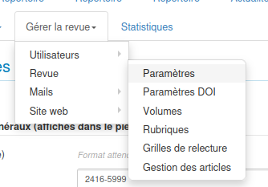
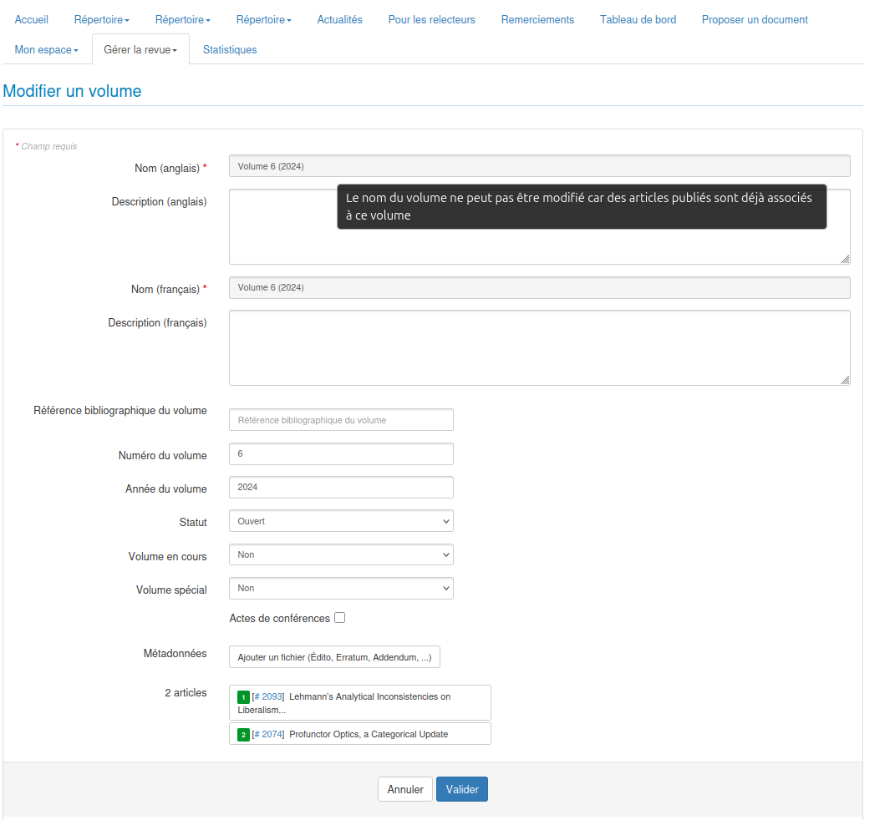
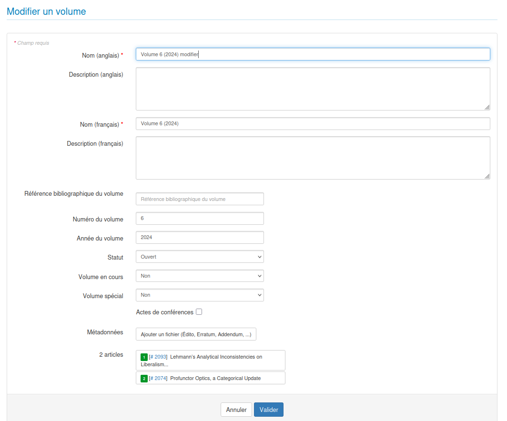

# Paramètres de volume

**Droits :** Administrateur, Secrétaire de rédaction, Éditeur

## Contexte

Auparavant, la modification du titre d'un volume était systématiquement bloquée dès lors que le volume contenait des articles publiés. Cette restriction était rigide et ne permettait pas de s'adapter aux besoins spécifiques de certains journaux.

Désormais, une nouvelle fonctionnalité permet de configurer au niveau du journal si les titres de volumes peuvent être modifiés lorsqu'ils contiennent des articles publiés.

Pour changer le paramètre, allez dans Gérer la revue → Revue → Paramètres

## Fonctionnalité implémentée

### Nouveau paramètre de journal

Deux nouveaux paramètres de configuration ont été ajoutés à la section "Paramètres des volumes" dans l'interface d'administration des journaux :

## 1. Paramètre "Autoriser l'affichage des volumes vides"

### Description
Ce paramètre contrôle l'affichage des volumes vides (sans articles) sur le site public du journal.

### Comportement

#### Lorsque le paramètre est désactivé (valeur par défaut : 0)
- Les volumes sans articles publiés ne sont **pas affichés** sur le site public
- Seuls les volumes contenant au moins un article publié sont visibles
- Évite d'afficher des volumes en cours de préparation ou non utilisés
- Améliore l'expérience utilisateur en ne montrant que du contenu pertinent

#### Lorsque le paramètre est activé (valeur : 1)
- **Tous les volumes** sont affichés sur le site public, même s'ils sont vides
- Permet de montrer la structure complète des volumes du journal
- Utile pour les journaux qui souhaitent annoncer des volumes à venir
- Permet une transparence totale sur l'organisation éditoriale

### Cas d'usage
- **Paramètre désactivé** : Recommandé pour la plupart des journaux qui ne souhaitent afficher que du contenu publié
- **Paramètre activé** : Utile pour les journaux qui organisent leurs publications par numéros thématiques prédéfinis et souhaitent annoncer les volumes futurs

## 2. Paramètre "Autoriser la modification du titre du volume avec des articles publiés"

Ce paramètre permet d'autoriser la modification du titre d'un volume contenant des articles publiés.

### Comportement

#### Lorsque le paramètre est désactivé (valeur par défaut : 0)

- Le titre d'un volume ne peut **pas** être modifié si le volume contient des articles publiés
- Comportement identique à l'ancien système

#### Lorsque le paramètre est activé (valeur : 1)

- Le titre d'un volume peut être modifié même s'il contient des articles publiés
- Permet une flexibilité accrue pour la gestion des volumes

!!! note "Notes importantes"
    - Les paramètres sont **désactivés par défaut** pour maintenir la compatibilité avec le comportement existant
    - Chaque journal peut activer ou désactiver ces paramètres indépendamment

