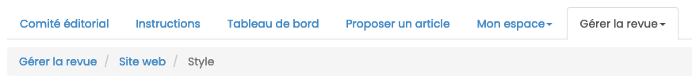
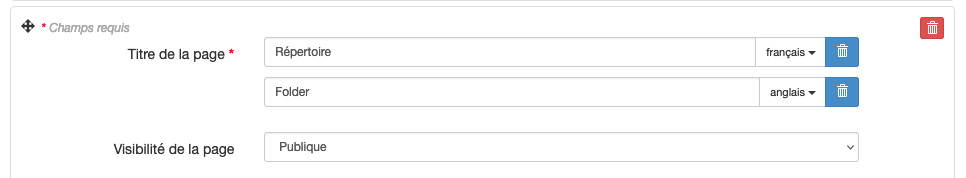
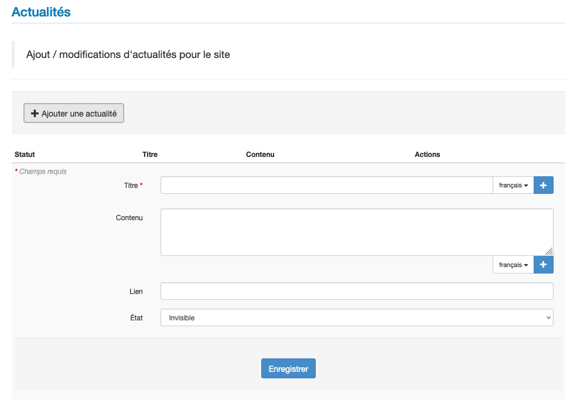

# Gérer le site
> Rôles : administrateur, rédacteur en chef, secrétaire de rédaction, webmaster

L’apparence du site web peut être personnalisée pour donner une identité visuelle spécifique à la revue.

Pour personnaliser la revue, aller dans : Gérer la revue > Site web.

Six options paramétrables sont proposées :

- **Général** : définir les langues de l’interface ;
- **Style** : définir les options d’affichage du site ;
- **En-tête** : ajouter un bandeau ;
- **Menu** : créer et gérer les pages d’information (charte éthique, fonctionnement de la revue, processus d’évaluation,
  crédits, etc.) ;
- **Actualités** : ajouter des informations ponctuelles (appels à contribution, annonce de colloque, recensions de la 
  revue, etc.) ;
- **Ressources** : stockage des différents fichiers textes et images du site (ex : logos, bandeau, contrat de cession 
  de droits d’auteur, etc.) 

## Général
L’option “Général” permet de définir les langues de l’interface. Actuellement, il existe deux choix possibles : français et anglais.

Sélectionnez les langues souhaitées en cliquant sur leur intitulé (cliquez et appuyez sur Ctrl ou Cmd pour sélectionner la seconde langue, si votre site est bilingue).

Cliquez sur “Enregistrer” pour sauvegarder le paramétrage choisi.

À noter : si vous choisissez d’implémenter les deux langues, il conviendra de traduire toute l’interface dans ces deux langues (titres et contenus des pages créées par vos soins).

## Style
L’option “Style” permet de définir l’affichage du site. Vous pouvez choisir :

- l’orientation du menu (horizontal ou vertical) ;
- la largeur de la zone principale ;
- l’affichage ou non du fil d’ariane ;
- le type de personnalisation (en 1 clic, simple ou avancé).

### Orientation du menu
Vous pouvez choisir entre un menu vertical (qui s’affiche à gauche de la page) ou horizontal (qui s’affiche en haut de la page, sous le bandeau de titre).
Vous pouvez également choisir l’option “accordéon” pour chacune de ces deux orientations.

### Largeur de la zone principale
Deux possibilités sont proposées ici :

- Par défaut (fixe 940px) ;
- Fluide (dépend de l’écran).

### Afficher le fil d’ariane
L’affichage du fil d’ariane permet de savoir à tout moment dans quelle page du site on se trouve.

Le fil d’ariane s’affiche en haut de page soit directement sous le bandeau (dans le cas d’un menu vertical), soit sous le menu (dans le cas d’un menu horizontal).

### Type de personnalisation
Il existe trois possibilités pour personnaliser votre site : en 1 clic, simple ou avancé.

En sélectionnant l’**option “En 1 clic”**, vous aurez le choix entre deux modèles prédéfinis (modèle 1 et modèle 2).

En sélectionnant l’**option “Simple”**, vous pouvez configurer les couleurs d’arrière-plan de la page, celle de la zone 
principale, du texte et des liens, choisir la police et la taille du texte, des titres, etc.

En sélectionnant l’**option “Avancé”**, vous pouvez directement éditer la feuille de style CSS.

Vous pouvez faire appel à l’équipe Episciences pour être accompagné dans le choix des polices et des couleurs, afin de permettre l’accessibilité de votre site.

## En-tête
L’option “En-tête” permet de personnaliser le bandeau. Vous pouvez déposer ici les fichiers (images, logos, etc.) qui apparaîtront dans l’en-tête du site.

Cliquez sur le bouton "Ajouter un logo”. Si vous souhaitez saisir un texte dans l’en-tête, sélectionnez “Texte” dans le menu déroulant du champ “Type”. Saisissez le titre de votre revue et son alignement (gauche, centré ou droite). Si votre site est bilingue, pensez à préciser le titre dans les deux langues.

Si vous avez choisi la personnalisation avancée, vous pouvez ajouter un style en précisant les classes et styles CSS à attribuer au titre.

Si vous souhaitez ajouter une image, sélectionnez “Image” dans le menu déroulant du champ “Type” et téléchargez le fichier après l’avoir sélectionné avec “Parcourir”.

Cliquez sur “Enregistrer” pour sauvegarder le paramétrage.

## Menu
L’option “Menu” permet de créer et gérer les pages du site, notamment les pages d’information.

Il y a neuf types de pages :

- **Page d’accueil** : une page unique, Une du site ;
- **Page personnalisable** : pour créer des pages d’information (charte éthique, fonctionnement de la revue, processus 
  d’évaluation, crédits, etc.) ;
- **Lien** : permet de créer un lien vers une page extérieure (ex : le site de l’éditeur, la documentation Episciences, 
  etc.) ;
- **Fichier** : permet d’afficher un document dans le navigateur ou de le relier à une page ;
- **Actualités** : permet d’ajouter des informations ponctuelles ;
- **Flux RSS** : permet d’obtenir le flux des derniers articles publiés (papers.rss) ;
- **Pages de consultation** par auteur, par date, par rubrique, par volumes, par derniers articles publiés, etc.
- **Rechercher un article** : formulaire de recherche d’un article sur le site ;
- **Membres du comité éditorial** : page qui génère automatiquement la liste des membres suivant leur rôle dans le site.

### Créer une page
Pour créer une page, sélectionnez son type dans le menu déroulant puis cliquez sur le bouton “Ajouter la page”.

Donnez un titre court à votre page : celui-ci fera office de permalien (lien permanent) et apparaîtra dans l’URL.

Si votre site est bilingue, pensez à préciser le titre de la page dans les deux langues.

Si vous saisissez “contact” dans le champ “Lien permanent”, le nom de la page sera : nomdelarevue.episciences.org/contact

Vous pouvez décider de définir si les pages sont publiques, privées (réservées aux membres) ou uniquement visibles par certains rôles (personnalisée).

### Créer un dossier
Il est possible de créer des dossiers afin de regrouper plusieurs pages.
 Pour créer un dossier, cliquez sur “Ajouter un dossier”.

Si votre site est bilingue, pensez à préciser le titre du dossier dans les deux langues.

Exemple de menu dont les différentes pages ont été organisées en dossiers : “La revue” pour les pages présentant le 
fonctionnement de la publication (Ligne éditoriale, Comités, Charte de fonctionnement, Processus d’évaluation), “Contribuer” pour les pages destinées aux auteurs qui souhaitent publier dans la revue (Charte éthique, Modalités de soumission, Recommandations aux auteurs) et “Informations” pour les pages de présentation générale de la revue (Appels à contribution, Politiques de publication).

### Éditer une page
Pour ajouter ou modifier du contenu sur une page, aller sur la page et cliquer sur “Modifier le contenu de la page”.

## Actualités
L’option “Actualités” permet d’ajouter des informations sur la page dédiée aux actualités. Celle-ci doit avoir été créée au préalable dans le menu.

Pour ajouter une actualité, cliquer sur le bouton “Ajouter une actualité”.

Le formulaire de saisie d’une nouvelle actualité comporte quatre champs. Les champs marqués d’un astérisque sont obligatoires.

- **Titre*** : titre de votre actualité
- **Contenu** : description de l’actualité
- **Lien** : url de la page permettant d’avoir davantage d’informations
- **État** : invisible / en ligne. Le statut invisible pour permet de désafficher l’actualité sans toutefois la 
  supprimer (pour la conserver en archives par exemple).

## Ressources
L’option “Ressources” liste l’ensemble des ressources (fichiers textes, images, etc.) déposées sur le site.

